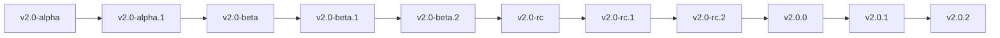

# ✨ WinnerMicro IoT Software Development Kit

* 🌍 [English](README_EN.md)

WM_IoT_SDK 是 WinnerMicro 官方推出的物联网软件开发套件，支持 💻 Windows 和 🐧 Linux 操作系统。


# 🔧 WM_IoT_SDK 支持的芯片

下表总结了 WM_IoT_SDK 对 WinnerMicro 的芯片支持情况。

|  |  |  |  |  |  |  |  |
| :------ | :--------: | :--------: | :--------: | :--------: | :--------: | :--------: | :--------: |
| W800 | 📡 MCU+WiFi+BLE | 📦 QFN32(4*4mm) | 💾 2 MBytes | ❌ 无 | ✅ 有 | 🔌 18 | [详情](https://www.winnermicro.com/html/1/156/158/558.html) |
| W801S | 📡 MCU+WiFi+BLE | 📦 QFN56(6*6mm) | 💾 2 MBytes | ✅ 有 | ✅ 有 | 🔌 43 | [详情](https://www.winnermicro.com/html/1/156/158/628.html) |
| W802 | 📡 MCU+WiFi+BLE | 📦 QFN56(6*6mm) | ❌ 无 | ✅ 有 | ✅ 有 | 🔌 37 | [详情](https://www.winnermicro.com/html/1/156/158/623.html) |
| W803 | 📡 MCU+WiFi+BLE | 📦 QFN32(4*4mm) | 💾 2 MBytes | ✅ 有 | ✅ 有 | 🔌 20 | [详情](https://www.winnermicro.com/html/1/156/158/624.html) |
| W805 | 💻 MCU（无射频） | 📦 QFN32(4*4mm) | 💾 1 MBytes | ❌ 无 | ✅ 有 | 🔌 18 | [详情](https://www.winnermicro.com/html/1/156/248/570.html) |
| W806 | 💻 MCU（无射频） | 📦 QFN56(6*6mm) | 💾 1 MBytes | ✅ 有 | ✅ 有 | 🔌 43 | [详情](https://www.winnermicro.com/html/1/156/248/571.html) |

# 🚀 快速入门

🎉 欢迎来到 WM_IoT_SDK！请参阅 WM_IoT_SDK 在线文档 [快速入门](https://doc.winnermicro.net/w800/zh_CN/latest/get_started/index.html) 了解更多，并参阅文档以开始开发。

### 📥 下载 WM_IoT_SDK 源码

 [](https://github.com/winnermicro/wm_iot_sdk)

```bash
# 克隆仓库
git clone https://github.com/winnermicro/wm_iot_sdk.git

# 默认为 master 分支，若用于产品开发需要量产，请切换到指定 release 版本使用
git checkout release/vx.x (如：git checkout release/v2.2)
```

> 💡 提示：确保您的系统已安装 [Git](https://git-scm.com/)

## 🔍 寻找项目

WM_IoT_SDK 的 examples 目录下带有很多示例项目。

一旦找到了需要的项目，便可以进入该目录，执行配置和构建操作。

如果要基于示例工程开始你自己的项目，请将示例工程复制到 WM_IoT_SDK 目录之外。

## ⚙️ 配置项目

打开一个基于文本的配置菜单对项目进行配置：

执行 `wm.py menuconfig`

## 🛠️ 编译项目

编译应用程序，生成可以烧录的固件镜像文件：

执行 `wm.py build`

## 💾 烧写项目

当构建结束，终端会打印出一条命令告知如何烧写项目到芯片中：

执行 `wm.py flash -p PORT`

将其中的 PORT 替换为系统中实际串口的名字（比如 Windows 下的 `COM1`，或者 Linux 下的 `/dev/ttyUSB0`）。如果省略 `-p` 选项，`wm.py flash` 会尝试使用第一个可用的串口进行烧写。

不必先运行 `wm.py build` 再运行 `wm.py flash`，`wm.py flash` 会根据需要自动重新构建项目。

`wm.py flash` 并不会擦除 flash 上所有的内容，但是有时候我们需要设备恢复到完全擦除的状态。要擦除整块 flash 然后重新烧写请运行：`wm.py flash -e -p PORT`。

## 📊 观察串口输出

显示芯片的串口输出信息，使用命令：

执行 `wm.py monitor -p PORT`

将其中的 PORT 替换为系统中实际串口的名字（比如 Windows 下的 `COM1`，或者 Linux 下的 `/dev/ttyUSB0`）。如果省略 `-p` 选项，`wm.py monitor` 会尝试使用第一个可用的串口。

`wm.py monitor` 运行后，输入 `Ctrl+C` 可退出。

> ℹ️ 说明：`wm.py monitor` 工具仅支持信息显示，其功能较为单一，如有条件，尽量选择更为高级的串口终端工具观察串口输出信息。

## 📖 WM_IoT_SDK 编程指南

点此查看 [WM_IoT_SDK 编程指南](http://doc.winnermicro.net)，该文档是由本仓库 [docs 目录](docs) 构建得到。

## 🌿 分支版本管理

在 WM_IoT_SDK 项目中，我们严格遵循 [语义化版本控制](https://semver.org)（semver）规范，以确保分支和版本管理的清晰性和可预测性。语义化版本控制使我们能够在项目开发中有效管理版本变化，确保开发者能够轻松理解每个版本的变更。

### 🌱 分支策略

| 🌿 分支类型                       | 📝 说明                             | 🔄 来源                                   | ✅ 是否可用于量产 | 🔑 Pull Request 权限 | ⏰ 何时提交                        | ⌛ 维护周期                                       |
| ----------------------------- | --------------------------------- | --------------------------------------- | --------- | ------------------ | ----------------------------- | -------------------------------------------- |
| 🌟 master                     | 开发主分支，包含最新开发代码，用于新功能开发和问题修复       | 最新代码                                    | 否 ❌       | 内外部贡献者             | 内外部贡献者日常开发 (已通过单元测试) + BUG 修复 | 整个生命周期<br/>(不定期同步外部贡献者代码到内部进行 QA 测试，随下个版本发布) |
| 🚀 release/v`MAJOR`.`MINOR`<br>release/v2.2 | 版本发布分支，用于特定版本的发布和维护，包含该版本的所有补丁和修复 | 版本达到发布标准时，从 master 创建 release 分支        | 是 ✅       | 内部贡献者              | QA 测试通过对外版本发布 + 发布后必要的 BUG 修复 | **自发布后的 12 个月之内，之后将不再维护**                    |
| 🔧 others                     | 用于其他用途的分支                         | 基于 master 或 release/v`MAJOR`.`MINOR` 分支 | 否 ❌       | 内部贡献者              | -                             | -                                            |

### 📈 版本管理策略

我们的版本管理采用 "MAJOR.MINOR.PATCH" 格式，并结合标签使用，以确保版本的清晰性和一致性：

- **MAJOR.MINOR.PATCH** (主版本号.次版本号.补丁号)，例如：v3.2.1
  
  - **🔴 主版本号 (MAJOR)**：用于不向后兼容的重大更改，例如 API 重构或核心功能变更，这些更改可能导致旧版本代码无法在新版本中运行。
  - **🟡 次版本号 (MINOR)**：用于添加新功能，这些功能与现有 API 向下兼容，现有代码无需修改即可在新版本中运行。
  - **🟢 补丁号 (PATCH)**：用于修复小错误，这些修复不会影响 API 或功能的兼容性，确保版本的稳定性。

- **🏷️ 标签命名** (使用特定的标签或代号)

  - **🟦 alpha (开发版本)**：这是软件的早期版本，通常只在内部团队中使用。Alpha 版本用于进行初步的功能测试和 bug 修复。在这个阶段，软件可能非常不稳定，包含许多未解决的问题和功能缺陷。开发者会根据测试结果对软件进行调整和优化。

  - **🔵 beta (公开测试版本)**：Beta 版本是软件发布前的公开测试阶段。在这个阶段，软件已经相对稳定，但仍可能存在一些已知或未知的问题。Beta 版本会提供给外部用户，以便他们测试软件并提供反馈。开发者会根据用户的反馈来发现并修复问题，进一步改善软件的稳定性和性能。

  - **🟣 rc (候选发布版本)**：这是软件发布前的最后一个测试阶段。RC 版本非常接近最终的正式版本，通常包含所有计划中的功能，并且已经解决了大部分已知的问题。RC 版本的目的是进行最后的测试，以确保软件在发布前尽可能稳定。如果在这个版本中没有发现重大问题，它就可能成为正式版本。

  - **⚪ 不带标签 (正式稳定版本)**：这是软件的最终发布版本，不带任何标签。正式版本意味着软件已经经过了彻底的测试，并且被认为是稳定和可靠的。在这个版本中，所有的主要功能都已经完成，已知的问题都已经被修复，软件准备好供用户广泛使用。正式版本通常会定期更新，以修复新发现的问题、添加新功能或改进性能。

### 📌 tag 命名规则

- **🟦 vx.x-alpha**: 开发版本，表示开发正在进行中，可能不稳定。
- **🔵 vx.x-beta**: 公开测试版本，表示开发已完成并进入公开测试阶段，适用于外部测试和反馈收集。
- **🟣 vx.x-rc**: 候选发布版本，表示即将发布的版本，经过测试但可能会有小的调整。
- **⚪ vx.x.x**: 正式稳定版本，表示已发布的稳定版本，适合生产环境使用。

### 🔄 内部 SDK 开发工作流程

- 1️⃣ master 分支开发

  - 所有新功能开发和问题修复在内部 master 分支进行
  - 不定期同步外部贡献者代码到内部 master 分支
  - 每个功能/修复需经过代码审阅和自动化测试
  - 通过测试的代码定期同步至外部开源平台
  - 使用 `-alpha` 标签标识开发中状态
    - 示例：`v2.2-alpha`，`v2.2-alpha.1`
    - 重大更新时递增次版本号，如 `v2.3-alpha`

- 2️⃣ 内部测试阶段

  - 功能开发完成后进入内部测试
  - 测试流程:
    - 代码审查
    - 单元测试
    - 集成测试
    - QA 测试
  - 所有发现的问题需及时修复并重新验证
  - 使用 `-beta` 标签标识测试版本
    - 示例：`v2.2-beta`，`v2.2-beta.1`
    - 每次重要修复递增 beta 版本号

- 3️⃣ release 分支创建

  - 版本达到发布标准时，从 master 创建 release 分支
    - 示例：`release/v2.2`
  - 严格控制代码变更:
    - 只接受关键 bug 修复
    - 禁止新功能开发
    - 每个修复必须完整回归测试
  - 通过 QA 测试后同步至开源平台
  - 使用 `-rc` 标签标识候选版本
    - 示例：`v2.2-rc`，`v2.2-rc.1`
    - 修复问题时递增 rc 版本号

- 4️⃣ 正式发布

  - 完成全部测试且无重大问题后:
    - 移除预发布标签
    - 通过最终 QA 验证
    - 同步至开源平台
    - 打正式版本标签
  - 版本号管理:
    - 正式版本示例：`v2.2.0`
    - Bug 修复递增补丁号：`v2.2.1`

版本迁移的典型流程如下，展示了从开发阶段到正式发布的完整过程：



通过这种版本管理策略，我们能够有效跟踪和管理项目的演变，确保每个版本的发布都经过充分准备和测试。

## 🤝 贡献指南

如果您想为 WM_IoT_SDK 贡献代码或文档，请先阅读我们的 [贡献指南](CONTRIBUTING.md)。
