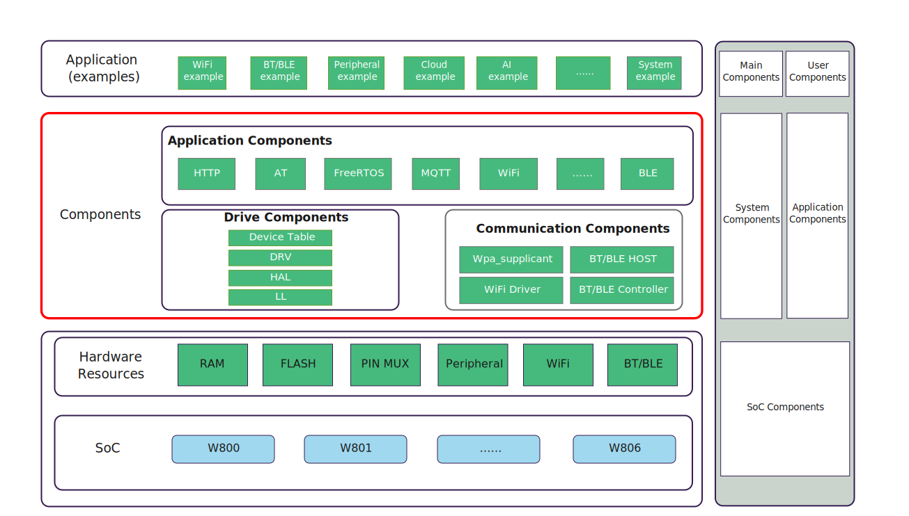
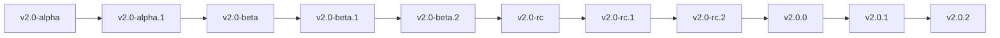

# ✨ WinnerMicro IoT Software Development Kit

* [中文](README.md)

WM_IoT_SDK is the official Internet of Things software development kit from WinnerMicro, supporting 💻 Windows, 🐧 Linux and 🍎 macOS operating systems.



# 🔧 Supported Chips

The following table summarizes the WM_IoT_SDK support for WinnerMicro chips.

|  |  |  |  |  |  |  |  |
| :------ | :--------: | :--------: | :--------: | :--------: | :--------: | :--------: | :--------: |
| W800 | 📡 MCU+WiFi+BLE | 📦 QFN32(4*4mm) | 💾 2 MBytes | ❌ No | ✅ Yes | 🔌 18 | [Details](https://www.winnermicro.com/html/1/156/158/558.html) |
| W801S | 📡 MCU+WiFi+BLE | 📦 QFN56(6*6mm) | 💾 2 MBytes | ✅ Yes | ✅ Yes | 🔌 43 | [Details](https://www.winnermicro.com/html/1/156/158/628.html) |
| W802 | 📡 MCU+WiFi+BLE | 📦 QFN56(6*6mm) | ❌ None | ✅ Yes | ✅ Yes | 🔌 37 | [Details](https://www.winnermicro.com/html/1/156/158/623.html) |
| W803 | 📡 MCU+WiFi+BLE | 📦 QFN32(4*4mm) | 💾 2 MBytes | ✅ Yes | ✅ Yes | 🔌 20 | [Details](https://www.winnermicro.com/html/1/156/158/624.html) |
| W805 | 💻 MCU(No RF) | 📦 QFN32(4*4mm) | 💾 1 MBytes | ❌ No | ✅ Yes | 🔌 18 | [Details](https://www.winnermicro.com/html/1/156/248/570.html) |
| W806 | 💻 MCU(No RF) | 📦 QFN56(6*6mm) | 💾 1 MBytes | ✅ Yes | ✅ Yes | 🔌 43 | [Details](https://www.winnermicro.com/html/1/156/248/571.html) |

# 🚀 Getting Started

🎉 Welcome to WM_IoT_SDK! Please refer to the WM_IoT_SDK online documentation [Getting Started](https://doc.winnermicro.net/w800/zh_CN/latest/get_started/index.html) to learn more and start development.

### 📥 Download WM_IoT_SDK Source Code

[](https://github.com/winnermicro/wm_iot_sdk)

```bash
# Clone repository
git clone https://github.com/winnermicro/wm_iot_sdk.git

# Default is master branch. For product development requiring mass production, please switch to specified release version
git checkout release/vx.x (e.g.: git checkout release/v2.2)
```

> 💡 Tip: Make sure your system has [Git](https://git-scm.com/)

## 🔍 Find Projects

Many example projects can be found in the examples directory of WM_IoT_SDK.

Once you find the project you need, you can enter that directory to perform configuration and build operations.

If you want to start your own project based on an example project, please copy the example project outside the WM_IoT_SDK directory.

## ⚙️ Configure Project

Open a text-based configuration menu to configure the project:

Run `wm.py menuconfig` or `python %WM_IOT_SDK_PATH%\tools\wm\wm.py menuconfig`

## 🛠️ Build Project

Compile the application to generate firmware image files that can be flashed:

Run `wm.py build` or `python %WM_IOT_SDK_PATH%\tools\wm\wm.py build`

## 💾 Flash Project

When the build is complete, the terminal will print a command showing how to flash the project to the chip:

Run `wm.py flash -p PORT` or `python %WM_IOT_SDK_PATH%\tools\wm\wm.py flash -p PORT`

Replace PORT with the actual serial port name on your system (e.g., `COM1` on Windows, `/dev/ttyUSB0` on Linux, or `/dev/cu.usbserial-X` on macOS). If the `-p` option is omitted, `wm.py flash` will attempt to use the first available serial port.

You don't need to run `wm.py build` before `wm.py flash`, as `wm.py flash` will automatically rebuild the project if needed.

`wm.py flash` will not erase all content on the flash, but sometimes we need to restore the device to a completely erased state. To erase the entire flash and then reflash, run: `wm.py flash -e -p PORT`.

## 📊 Monitor Serial Output

To display the chip's serial output information, use the command:

Run `wm.py monitor -p PORT` or `python %WM_IOT_SDK_PATH%\tools\wm\wm.py monitor -p PORT`

Replace PORT with the actual serial port name on your system (e.g., `COM1` on Windows, `/dev/ttyUSB0` on Linux, or `/dev/cu.usbserial-X` on macOS). If the `-p` option is omitted, `wm.py monitor` will attempt to use the first available serial port.

Press `Ctrl+C` to exit `wm.py monitor`.

> ℹ️ Note: The `wm.py monitor` tool only supports information display and has limited functionality. When possible, it's recommended to use more advanced serial terminal tools to observe serial output information.

## 📖 WM_IoT_SDK Programming Guide

Click here to view the [WM_IoT_SDK Programming Guide](http://doc.winnermicro.net), which is built from the [docs directory](docs) in this repository.

## 🌿 Branch and Version Management

In the WM_IoT_SDK project, we strictly follow [Semantic Versioning](https://semver.org) (semver) specification to ensure clarity and predictability in branch and version management. Semantic versioning enables us to effectively manage version changes during project development, ensuring developers can easily understand changes in each version.

### 🌱 Branch Strategy

| 🌿 Branch Type                    | 📝 Description                                                | 🔄 Source                                  | ✅ Production Ready | 🔑 Pull Request Access | ⏰ When to Submit                                | ⌛ Maintenance Period                                                                |
| -------------------------------- | ------------------------------------------------------------ | ----------------------------------------- | ----------------- | -------------------- | ----------------------------------------------- | --------------------------------------------------------------------------------- |
| 🌟 master                        | Main development branch with latest code for new features and fixes | Latest code                                | No ❌             | Internal & External  | Daily development (unit tested) + bug fixes      | Entire lifecycle<br/>(Periodic sync of external code for internal QA, next release) |
| 🚀 release/v`MAJOR`.`MINOR`<br>release/v2.2    | Release branch for specific versions with all patches and fixes | Created from master when ready for release | Yes ✅            | Internal Only       | After QA for release + critical bug fixes        | **12 months after release, then discontinued**                                      |
| 🔧 others                        | Branches for other purposes                                   | Based on master or release/v`MAJOR`.`MINOR`| No ❌             | Internal Only       | -                                               | -                                                                                 |

### 📈 Version Management Strategy

Our version management uses the "MAJOR.MINOR.PATCH" format combined with tags to ensure version clarity and consistency:

- **MAJOR.MINOR.PATCH** (Major version.Minor version.Patch version), e.g.: v3.2.1

  - **🔴 Major Version (MAJOR)**: For backwards-incompatible changes like API restructuring or core functionality changes that may break older code.
  - **🟡 Minor Version (MINOR)**: For new backwards-compatible features that don't require modifications to existing code.
  - **🟢 Patch Version (PATCH)**: For minor bug fixes that don't affect API or feature compatibility.

- **🏷️ Tag Naming** (Using specific tags or codes)

  - **🟦 alpha (Development Version)**: Early version used internally for initial feature testing and bug fixes. Software may be unstable with many unresolved issues. Developers adjust based on test results.

  - **🔵 beta (Public Testing Version)**: Pre-release public testing phase. Software is relatively stable but may have known/unknown issues. Released to external users for testing and feedback.

  - **🟣 rc (Release Candidate)**: Final testing phase before release. RC versions are very close to final release, containing all planned features with most known issues resolved. If no major issues are found, it may become the official release.

  - **⚪ No Tag (Official Stable Release)**: Final release version without tags. Indicates thoroughly tested, stable, and reliable software with all major features complete and known issues fixed. Regular updates for bug fixes, new features, or performance improvements.

### 📌 Tag Naming Rules

- **🟦 vx.x-alpha**: Development version, indicates ongoing development, may be unstable.
- **🔵 vx.x-beta**: Public testing version, indicates completed development ready for external testing and feedback.
- **🟣 vx.x-rc**: Release candidate version, indicates imminent release after testing with possible minor adjustments.
- **⚪ vx.x.x**: Official stable version, indicates released stable version suitable for production use.

### 🔄 Internal SDK Development Workflow

- 1️⃣ Master Branch Development

  - All new feature development and bug fixes occur on internal master branch
  - Periodic synchronization of external contributor code to internal master
  - Each feature/fix requires code review and automated testing
  - Tested code regularly synced to external open source platform
  - Uses `-alpha` tag to indicate development status
    - Example: `v2.2-alpha`, `v2.2-alpha.1`
    - Increment minor version for major updates, e.g., `v2.3-alpha`

- 2️⃣ Internal Testing Phase

  - Internal testing begins after feature completion
  - Testing process:
    - Code review
    - Unit testing
    - Integration testing
    - QA testing
  - All discovered issues must be fixed and re-verified
  - Uses `-beta` tag to indicate testing version
    - Example: `v2.2-beta`, `v2.2-beta.1`
    - Increment beta version for important fixes

- 3️⃣ Release Branch Creation

  - Release branch created from master when version meets release standards
    - Example: `release/v2.2`
  - Strict code change control:
    - Only critical bug fixes accepted
    - No new feature development
    - Complete regression testing for each fix
  - Sync to open source platform after QA testing
  - Uses `-rc` tag to indicate candidate version
    - Example: `v2.2-rc`, `v2.2-rc.1`
    - Increment rc version for fixes

- 4️⃣ Official Release

  - After all testing complete with no major issues:
    - Remove pre-release tags
    - Pass final QA verification
    - Sync to open source platform
    - Tag official version
  - Version number management:
    - Official version example: `v2.2.0`
    - Increment patch number for bug fixes: `v2.2.1`

The typical version migration flow below shows the complete process from development to official release:



Through this version management strategy, we can effectively track and manage the project's evolution, ensuring that each version release is thoroughly prepared and tested.

## 🤝 Contributing Guidelines

If you want to contribute code or documentation to WM_IoT_SDK, please read our [Contributing Guidelines](CONTRIBUTING_EN.md).
