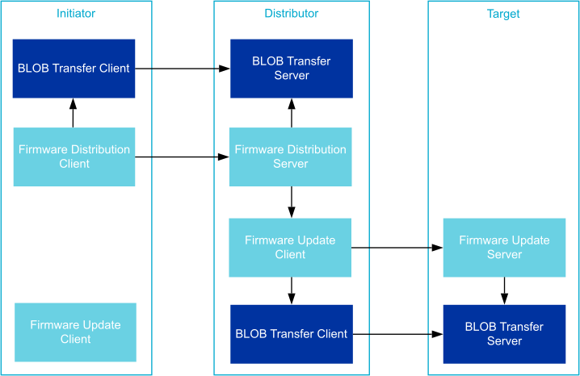
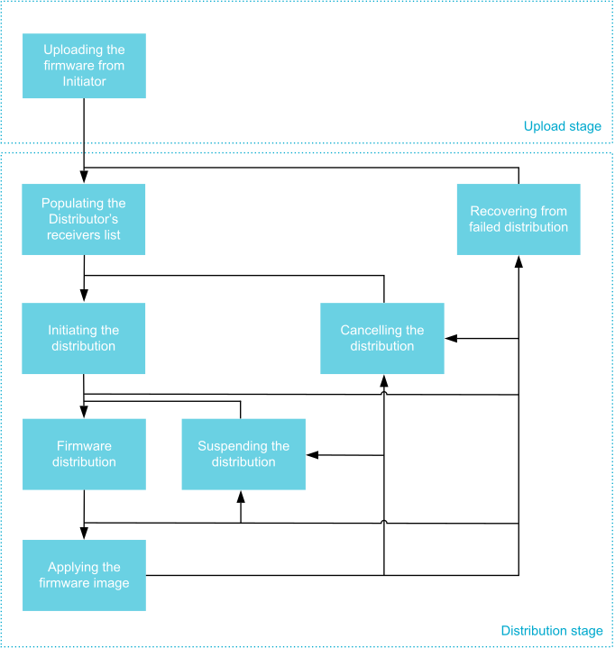

.. _bluetooth_mesh_dfu:

Device Firmware Update (DFU)
############################

Bluetooth Mesh supports the distribution of firmware images across a mesh network. The Bluetooth
mesh DFU subsystem implements the Bluetooth Mesh Device Firmware Update Model Specification version
1.0. The implementation is in experimental state.

The Bluetooth Mesh DFU implements a distribution mechanism for firmware images without any restrictions on the size, format, 
or usage of the images. The primary design goal of the subsystem is to provide a compliant portion of the Bluetooth Mesh DFU specification and leave the usage, 
firmware validation, and deployment to the application.

The DFU specification is implemented in the WM IoT SDK Bluetooth Mesh DFU subsystem as three separate
models:

.. toctree::
   :maxdepth: 1

   dfu_srv
   dfu_cli
   dfd_srv

Overview
********

DFU Roles
=========

The Bluetooth Mesh DFU subsystem defines three different roles the mesh nodes have to assume in the
distribution of firmware images:

Target Node
   Target node is the receiver and user of the transferred firmware images. All its functions are 
   implemented by the :ref:`bluetooth_mesh_dfu_srv` model. The transmission can target any number of target nodes, 
   and they will all update simultaneously.

Distributor
   The Distributor role serves two purposes in the DFU process. Firstly, it's acting as the target
   node in the Upload Firmware procedure, then it distributes the uploaded image to other Target
   nodes as the Distributor. The distributor server does not select the parameters of the transfer, but
   relies on an initiator to give it a list of target nodes and transmission  parameters. The distributor
   functionality is implemented in two models, :ref:`bluetooth_mesh_dfd_srv` and
   :ref:`bluetooth_mesh_dfu_cli`. The :ref:`bluetooth_mesh_dfd_srv` is responsible for communicating
   with the Initiator, and the :ref:`bluetooth_mesh_dfu_cli` is responsible for distributing the
   image to the Target nodes.

Initiator
   The Initiator role is typically implemented by the same device that implements the Bluetooth Mesh
   :ref:`Provisioner <bluetooth_mesh_provisioning>` and :ref:`Configurator
   <bluetooth_mesh_models_cfg_cli>` roles. The Initiator needs a complete overview of the potential
   target nodes and their firmware, and will control (and initiate) all firmware updates. The
   Initiator role is not implemented in the WM IoT SDK Bluetooth Mesh DFU subsystem.

         distribution

   DFU Roles and the Associated Bluetooth Mesh Models

Bluetooth Mesh applications may combine the DFU roles in any way they'd like, and even take on
multiple instances of the same role by instantiating the models on separate elements. For instance,
the distributor and initiator roles can be combined by instantiating the
:ref:`bluetooth_mesh_dfu_cli` on the initiator node and calling its API directly.

It's also possible to combine the initiator and distributor devices into a single device, and
replace the Firmware Distribution Server model with a proprietary mechanism(such as over a serial protocol) that will access the
Firmware Update Client model directly.

.. note::
   All DFU models instantiate one or more :ref:`bluetooth_mesh_blob`, and may need to be spread over
   multiple elements for certain role combinations.

Stages
========

The Bluetooth Mesh DFU process is designed to act in three stages:

Upload Stage
   Firstly, the image is uploaded from an external entity (such as a phone or gateway, which acts as the initiator) to a distributor in the mesh network. 
   During the upload stage, the initiator transfers the firmware image and all its metadata to the distributor node within the mesh network. The distributor permanently stores the firmware image and its metadata and waits for further instructions from the initiator. 
   The time required to complete the upload process depends on the size of the image. Once the upload is complete, 
   the initiator can disconnect from the network during the more time-consuming distribution stage. Once the firmware is uploaded to the distributor, the initiator can trigger the distribution stage at any time.

Firmware Capability Check Stage (Optional)
   Before initiating the distribution stage, the initiator can optionally choose to check if the target nodes can accept the new firmware. 
   Nodes that do not respond or respond that they cannot receive the new firmware will be excluded from the firmware distribution process.

Distribution Stage
   Before the firmware image can be distributed, the Initiator transfers the list of Target nodes
   and their designated firmware image index to the Distributor. Next, it tells the Distributor to
   start the firmware distributon process, which runs in the background while the Initiator and the
   mesh network perform other duties. Once the firmware image has been transferred to the Target
   nodes, the Distributor may ask them to apply the firmware image immediately and report back with
   their status and new firmware IDs.

Firmware Images
===============

All updatable parts of a mesh node's firmware should be represented as a firmware image. Each Target
node holds a list of firmware images, each of which should be independently updatable and
identifiable.

Firmware images are represented as a BLOB (the firmware itself) with the following additional
information attached to it:

Firmware ID
   The firmware ID is used to identify a firmware image. The Initiator node may ask the target nodes
   for a list of its current firmware IDs to determine whether a newer version of the firmware is
   available. The format of the firmware ID is vendor specific, but generally, it should include
   enough information for an initiator node with knowledge of the format to determine the type of
   image as well as its version. The firmware ID is optional, and its maximum length is determined by
   ``CONFIG_BT_MESH_DFU_FWID_MAXLEN``.

Firmware Metadata
   Target nodes use firmware metadata to determine whether to accept an incoming firmware update and the effects of the update. 
   The metadata format is vendor-specific and should contain all the information required by the target node to validate the image, 
   as well as any preparations that the target node must perform before applying the image. 
   Typical metadata information can be image signatures, changes to the node's composition data, and the format of the BLOB. 
   The target node can perform a metadata check before accepting an incoming transfer to determine whether the transfer should be initiated. 
   After the metadata check, the target node can discard the firmware metadata since other nodes will never request metadata from the target node. 
   Firmware metadata is optional, and its maximum length is determined by``CONFIG_BT_MESH_DFU_METADATA_MAXLEN``.

   The Bluetooth Mesh DFU subsystem in WM IoT SDK provides its own metadata format
   (:c:struct:`bt_mesh_dfu_metadata`) together with a set of related functions that can be used by
   an end product. The support for it is enabled using the
   ``CONFIG_BT_MESH_DFU_METADATA`` option. The format of the metadata is presented in
   the table below.

+------------------------+--------------+----------------------------------------+
| Field                  | Size (Bytes) | Description                            |
+========================+==============+========================================+
| New firmware version   | 8 B          | 1 B: Major version                     |
|                        |              | 1 B: Minor version                     |
|                        |              | 2 B: Revision                          |
|                        |              | 4 B: Build number                      |
+------------------------+--------------+----------------------------------------+
| New firmware size      | 3 B          | Size in bytes for a new firmware       |
+------------------------+--------------+----------------------------------------+
| New firmware core type | 1 B          | Bit field:                             |
|                        |              | Bit 0: Application core                |
|                        |              | Bit 1: Network core                    |
|                        |              | Bit 2: Applications specific BLOB.     |
|                        |              | Other bits: RFU                        |
+------------------------+--------------+----------------------------------------+
| Hash of incoming       | 4 B          | Lower 4 octets of AES-CMAC             |
| composition data       | (Optional)   | (app-specific-key, composition data).  |
|                        |              | This field is present, if Bit 0 is set |
|                        |              | in the New firmware core type field.   |
+------------------------+--------------+----------------------------------------+
| New number of elements | 2 B          | Number of elements on the node         |
|                        | (Optional)   | after firmware is applied.             |
|                        |              | This field is present, if Bit 0 is set |
|                        |              | in the New firmware core type field.   |
+------------------------+--------------+----------------------------------------+
| Application-specific   | <variable>   | Application-specific data to allow     |
| data for new firmware  | (Optional)   | application to execut some             |
|                        |              | vendor-specific behaviors using        |
|                        |              | this data before it can respond        |
|                        |              | with a status message.                 |
+------------------------+--------------+----------------------------------------+

Firmware URI
   The firmware URI gives the Initiator information about where firmware updates for the image can
   be found. The URI points to an online resource the Initiator can interact with to get new
   versions of the firmware. This allows Initiators to perform updates for any node in the mesh
   network by interacting with the web server pointed to in the URI. The URI must point to a
   resource using the ``http`` or ``https`` schemes, and the targeted web server must behave
   according to the Firmware Check Over HTTPS procedure defined by the specification. The firmware
   URI is optional, and its max length is determined by
   ``CONFIG_BT_MESH_DFU_URI_MAXLEN``.

   .. note::

      The out-of-band distribution mechanism is not supported.

.. _bluetooth_mesh_dfu_firmware_effect:

Firmware Effects
-----------------

A new image can have a different composition data page than Composition Data Page 0 assigned on the target node.
This may affect the node's configuration data and how the distributor terminates DFU. 
Depending on the availability of the Remote Configuration Server model on both the old and new images, the device may start unconfigured after applying the new firmware or may require reconfiguration. 
The full list of available options is defined in :c:enum:`bt_mesh_dfu_effect`:

:c:enum:`BT_MESH_DFU_EFFECT_NONE`
   After programming the new firmware, the device remains provisioned. 
   This effect is selected if the composition data of the new firmware has not changed.
:c:enum:`BT_MESH_DFU_EFFECT_COMP_CHANGE_NO_RPR`
   This effect is chosen when the composition data changes and the device doesn't support the remote
   provisioning. The new composition data takes place only after re-provisioning.
:c:enum:`BT_MESH_DFU_EFFECT_COMP_CHANGE`
   This effect is chosen when the composition data changes and the device supports the remote
   provisioning. In this case, the device stays provisioned and the new composition data takes place
   after re-provisioning using the Remote Provisioning models.
:c:enum:`BT_MESH_DFU_EFFECT_UNPROV`
   This effect is chosen if the composition data in the new firmware changes, the device doesn't
   support the remote provisioning, and the new composition data takes effect after applying the
   firmware.

When the Target node receives the Firmware Update Firmware Metadata Check message, the Firmware
Update Server model calls the :c:member:`bt_mesh_dfu_srv_cb.check` callback, the application can
then process the metadata and provide the effect value. If the effect is
:c:enum:`BT_MESH_DFU_EFFECT_COMP_CHANGE`, the application must call functions
:c:func:`bt_mesh_comp_change_prepare` and :c:func:`bt_mesh_models_metadata_change_prepare` to
prepare the Composition Data Page and Models Metadata Page contents before applying the new
firmware image. See :ref:`bluetooth_mesh_dfu_srv_comp_data_and_models_metadata` for more
information.

DFU Procedure
**************

The DFU protocol is implemented as a set of procedures that must be performed in a certain order.

The Initiator controls the Upload stage of the DFU protocol, and all Distributor side handling of
the upload subprocedures is implemented in the :ref:`bluetooth_mesh_dfd_srv`.

The Distribution stage is controlled by the distributorand implemented in the
:ref:`bluetooth_mesh_dfu_cli`. The target nodes implements all handling of these procedures in the
:ref:`bluetooth_mesh_dfu_srv`, and notifies the application through a set of callbacks.

   DFU stages and procedures as seen from the Distributor

Uploading the Firmware
======================

The Upload Firmware procedure uses the :ref:`bluetooth_mesh_blob` to transfer the firmware image
from the Initiator to the Distributor. The Upload Firmware procedure works in two steps:

1. The Initiator generates a BLOB ID, and sends it to the Distributor's Firmware Distribution Server
   along with the firmware information and other input parameters of the BLOB transfer. The Firmware
   Distribution Server stores the information, and prepares its BLOB Transfer Server for the
   incoming transfer before it responds with a status message to the Initiator.
#. The Initiator's BLOB Transfer Client model transfers the firmware image to the Distributor's BLOB
   Transfer Server, which stores the image in a predetermined flash partition.

When the BLOB transfer finishes, the firmware image is ready for distribution. The Initiator may
upload several firmware images to the distributor, and ask it to distribute them in any order or at
any time. Additional procedures are available for querying and deleting firmware images from the
distributor.

The following functions related to firmware images can be configured with configuration options:

* ``CONFIG_BT_MESH_DFU_SLOT_CNT``: The number of image slots available on the device.
* ``CONFIG_BT_MESH_DFD_SRV_SLOT_MAX_SIZE``: The maximum size allowed for each image.
* ``CONFIG_BT_MESH_DFD_SRV_SLOT_SPACE``:  The available space for all images.

Populating the Distributor's Receivers List
===========================================

Before the Distributor can start distributing the firmware image, it needs a list of Target nodes to
send the image to. The Initiator gets the full list of Target nodes either by querying the potential
targets directly, or through some external authority. The Initiator uses this information to
populate the Distributor's receivers list with the address and relevant firmware image index of each
Target node. The Initiator may send one or more Firmware Distribution Receivers Add messages to
build the distributor's receivers list, and a Firmware Distribution Receivers Delete All message to
clear it.

The maximum number of receivers that can be added to the Distributor is configured through the
``CONFIG_BT_MESH_DFD_SRV_TARGETS_MAX`` configuration option.

Initiating the Distribution
===========================

Once the distributor has stored the firmware image and received the list of target nodes, the initiator can start the distribution process. The BLOB transfer parameters for the distribution, along with the update strategy, are passed to the distributor. 
The update strategy determines whether the distributor should request the application of the firmware on the target nodes. The distributor stores the transfer parameters and starts distributing the firmware image to its list of target nodes.

Firmware Distribution
---------------------

The firmware update client model of the distribution server communicates with all target nodes using its BLOB transfer client model's broadcast subsystem. 
Firmware distribution is executed through the following steps:

1. The firmware update client model of the distribution server generates a BLOB ID and sends it to the firmware update server model of each target node, along with other BLOB transfer parameters, 
   the target node firmware image index, and firmware image metadata. Each target node performs a metadata check, prepares its BLOB transfer server model for the transfer, 
   and then sends a status response to the firmware update client indicating whether the firmware update will have any impact on the node's Bluetooth Mesh state.
#. The BLOB transfer client model of the distribution server transfers the firmware image to all target nodes.
#. Once the BLOB transfer is received, the application at the target nodes validates the firmware by performing checks such as signature verification or image checksum 
   on the image metadata.
#. The firmware update client model of the distribution server queries all target nodes to ensure they have validated the firmware image.

If the distribution process completes and at least one target node reports having received and validated the image, the distribution process is considered successful.

.. note::
   The firmware distribution procedure only fails if *all* Target nodes are lost. It is up to the
   Initiator to request a list of failed Target nodes from the Distributor and initiate additional
   attempts to update the lost Target nodes after the current attempt is finished.

Suspending Distribution
---------------------------

The initiator can also request the distribution server to suspend the firmware distribution. In this case, the distribution server will stop sending any messages to the target nodes. 
When the firmware distribution is resumed, the distribution server will continue sending firmware from the last successfully transferred block.

Applying Firmware Image
===========================

If requested by the initiator, the distribution server can initiate the process of applying the firmware on the target nodes at all target nodes that have successfully received and validated the firmware image. 
The process of applying firmware on target nodes requires no parameters and, to avoid ambiguity, should be executed before initiating a new transfer. 
The process of applying firmware on target nodes consists of the following steps:

1. The firmware update client model of the distribution server instructs all target nodes with validated firmware images to apply them. 
   The firmware update server model at the target nodes responds with status messages before invoking its application's ``apply`` callback.
#. The application at the target nodes performs any required preparations before applying the transfer, 
   such as taking snapshots of stored synthetic data or clearing its configurations.
#. The application at the target nodes swaps the current firmware with the new image and updates its
   firmware image list with the new firmware ID.
#. The firmware update client model of the distribution server requests a complete list of firmware 
   images from each target node and scans the list to ensure that the new firmware ID has replaced the old one.

.. note::
   During metadata checks during the distribution process, target nodes may report that they will become unconfigured after applying the firmware image. 
   In this case, the firmware update client model of the distribution server will send a request for the complete firmware image list and expects no response..

Cancelling Distribution
===========================

The firmware distribution can be cancelled at any time by the Initiator. In this case, 
the distribution server initiates the cancellation process by sending cancel messages to all target nodes. 
The distribution server waits for responses from all target nodes. Once all target nodes have responded or the request has timed out, 
the distribution process is canceled. After this, the distribution process can be initiated again from the  ``Firmware Distribution`` section.

API Reference
*************

This section lists the types common to the Device Firmware Update mesh models.

.. doxygengroup:: bt_mesh_dfd
   :project: wm-iot-sdk-apis
   :members:

.. doxygengroup:: bt_mesh_dfu
   :project: wm-iot-sdk-apis
   :members:

.. doxygengroup:: bt_mesh_dfu_metadata
   :project: wm-iot-sdk-apis
   :members:
