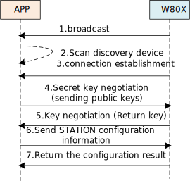

.. _bluetooth-wifiprov-proto:

:orphan:

Bluetooth: WIFIPROV Protocol
##################################

Overview
============

WIFIPROV is a protocol that utilizes the Low Energy Bluetooth (BLE) channel to implement WiFi network configuration functionality, suitable for w80X chips. It transmits WiFi configuration and certificate information to w80X via BLE, enabling w80X to connect to an AP based on this information. WIFIPROV supports key negotiation between the mobile phone and the device, and configuration information can be transmitted in an encrypted manner, making it a secure configuration protocol. WIFIPROV also supports data fragmentation, checksum, and retransmission, enhancing configuration efficiency and ensuring information integrity.

Network Configuration Process
======================================

The WIFIPROV configuration process primarily includes steps such as broadcasting, connecting, service discovery, key negotiation, data transmission, and indication results.

1. w80X activates GATT Server functionality and sends broadcast packets containing specific information.
2. The mobile phone APP scans for BLE devices, discovering the w80X device by filtering the specific information in the broadcast packets.
3. The mobile phone APP, acting as a GATT Client, establishes a connection with the w80X, which acts as a GATT Server.
4. After a successful GATT connection, the mobile phone APP and w80X enter the key negotiation process. If the configuration process uses plaintext transmission, the key negotiation process can be skipped directly, proceeding to step 6. Initially, the mobile phone APP sends the asymmetric algorithm RSA public key to w80X.
5. Upon receiving the RSA public key, w80X first generates a random 16-byte key for the symmetric algorithm AES-128, then encrypts this key with the RSA public key, and returns the encrypted result to the mobile phone APP.
6. If encrypted transmission is required, the mobile phone APP, upon receiving the key from w80X, first decrypts it using the RSA private key to obtain the key, then encrypts the PAYLOAD part of the configuration information with AES-128, and sends it to w80X. If plaintext transmission is used, the mobile phone APP directly sends the plaintext of the configuration information as the PAYLOAD to w80X.
7. After receiving the configuration information, w80X returns the final result to the mobile phone APP via indication.

Frame Definition
==================

.. list-table:: 
   :widths: 25 25 25 25 25 25
   :header-rows: 0
   :align: left

   * - cmd
     - seq-no
     - flag
     - frag-no
     - payload
     - crc

- **<cmd>**: operation code, occupying 1 byte.
- **<seq-no>**: sequence number, 1 byte, starting from 0. When a frame is sent, the sequence number is automatically incremented by 1 to prevent replay attacks (Replay Attack). The sequence number is reset to zero upon reconnection, and it restarts from 0 after overflow.
- **<flag>**: specific meanings are as follows,

.. list-table:: 
   :widths: 25 125
   :header-rows: 0
   :align: left

   * - BIT
     - Description
	 
   * - [7]
     - Whether encryption is used. 1 indicates encryption, 0 indicates no encryption.
	 
   * - [6]
     - Whether an acknowledgment is required. 1 indicates required, 0 indicates not required.
	 
   * - [5]
     - Whether there is another frame fragment.	

   * - [4:0]
     - Reserved.	

	 
- **<frag-no>**: frame fragment number, 1 byte, starting from 0. If the application layer retransmits, the Sequence value is incremented by 1, and the NO remains unchanged.
- **<payload>**: message content, encapsulated using TLV.
- **<crc>**: CRC checksum value of the payload content, 1 byte. CRC = CRC8 (cmd + seq-no + flag + frag-no + payload).

Instruction Definition
===========================

APP Configures STATION Network Parameters Instruction
-----------------------------------------------------------

This instruction is used to configure the parameters for w800 to connect to an AP. w800 starts the networking operation after receiving all the configuration data.
  
- **<cmd>**: configure station instruction 0x0A.
- **<payload>**: payload content definition,
 
  .. list-table:: 
    :widths: 25 25 25
    :header-rows: 0
    :align: left

    * - type-id
      - content
      - description
     
    * - 0x01
      - ssid
      - SSID information of the router or soft AP
     
    * - 0x02
      - password
      - Password of the router or soft AP
	 
    * - 0x03
      - bssid	
      - BSSID information of the router or soft AP	

w80X Reports STATION Network Connection Results
-------------------------------------------------------

This instruction is used to report the STATION network connection results to the APP.
  
- **<cmd>**: configure station instruction 0x8A.
- **<payload>**: payload content definition,
 
  .. list-table:: 
    :widths: 25 25 25
    :header-rows: 0
    :align: left

    * - type-id
      - content
      - description
     
    * - 0x81
      - error-info
      - 0x00 indicates successful network connection. For more error code definitions, refer to 'wm_wifi_reason_code_t'
     
    * - 0x02
      - ip4-address
      - Obtained IPV4 address
	 
    * - 0x03
      - mac	
      - WiFi MAC address of w80X	

APP Sends Key Negotiation Instruction to w80X
--------------------------------------------------

The mobile phone APP sends this instruction to transmit the asymmetric algorithm public key used for key negotiation to w800. This instruction does not support encrypted transmission.

- **<cmd>**: key negotiation instruction 0x0F.
- **<payload>**: payload content definition,
 
  .. list-table:: 
    :widths: 25 25 25
    :header-rows: 0
    :align: left

    * - type-id
      - content
      - description
     
    * - 0x09
      - public-key
      - Asymmetric algorithm public key
     
w80X Reports Key Negotiation Results
--------------------------------------

w80X sends this instruction to return the symmetric algorithm key encrypted with the public key to the APP. This instruction does not support encrypted transmission.

- **<cmd>**: key negotiation result instruction 0x8F.
- **<payload>**: payload content definition,
 
  .. list-table:: 
    :widths: 25 25 25
    :header-rows: 0
    :align: left

    * - type-id
      - content
      - description
     
    * - 0x81
      - error-info
      - 0x00 indicates success; 0x01 indicates negotiation failure.
     
    * - 0x87
      - aes-key
      - AES key encrypted with the RSA public key.
	
APP Sends Acknowledgment Instruction
--------------------------------------

If the instruction sent by w80X requires an acknowledgment from the APP, the APP replies with this instruction.

- **<cmd>**: key negotiation result instruction 0x10.
- **<flag>**: fixed at 0.
- **<frag-no>**: fixed at 0.
- **<payload>**: a one-byte seq-no, from the seq-no in the instruction sent by w80X.

w80X Sends Acknowledgment Instruction
-----------------------------------------

If the instruction sent by the APP requires an acknowledgment from w80X, w80X replies with this instruction.

- **<cmd>**: key negotiation result instruction 0x90.
- **<flag>**: fixed at 0.
- **<frag-no>**: fixed at 0.
- **<payload>**: a one-byte seq-no, from the seq-no in the instruction sent by the APP.

GATT Parameters
===================

- **<GATT Service UUID>**: 0x1824
- **<APP -> w80X>**: Write Characteristic UUID with acknowledgment 0x2ABC
- **<w80X -> APP>**: Indication Characteristic UUID 0x2ABC
