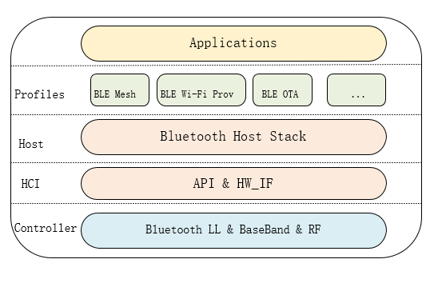

.. _bluetooth-arch:

Bluetooth Protocol Stack Architecture
****************************************

The WM IoT SDK Bluetooth protocol stack adopts a layered architecture design, with its layered structure illustrated in the following diagram:

* Applications

  * The application layer is at the top of the entire Bluetooth protocol stack, where users develop their own applications based on the host protocol stack API and profiles.

* Profiles

  * Profiles sit on top of the host protocol stack and include standard profiles provided by Bluetooth host stack as well as general profiles developed by WM IoT SDK .

    * :ref:`Standard Profiles <bluetooth_services>` include Battery Service, Heart Rate Service, Immediate Alert Service, and Object Transfer Service.
    * :ref:`BLE-Mesh <bluetooth_mesh>` includes basic functionalities of the Mesh protocol and several general model instances developed by WM IoT SDK .
    * :ref:`BLE Wi-Fi Prov <ble_wifi_provision_en>`  is an example implemented by WM IoT SDK to provide configuration parameters for Wi-Fi network provisioning via BLE, enabling the device to quickly connect to a router or soft AP. Details see :ref:`Wi-Fi Protocol <bluetooth-wifiprov-proto>`.
    * :ref:`BLE OTA <ble_ota_sample_en>` is an example implemented by WM IoT SDK  to provide online firmware upgrade functionality for WM IoT SDK  devices via BLE.

* Host

  * The Bluetooth host stack provides a complete Low Energy Bluetooth (BLE) protocol stack and part of the Classic Bluetooth (BR/EDR) host.

* Host Controller Interface

  * The Bluetooth Specification defines the HCI protocol for communication between the host and controller. The HCI protocol can be implemented over different physical transport channels, such as UART, SPI. For systems where the host and controller protocol stacks are implemented on a single chip, communication between the host and controller often uses direct API calls.

* Controller

  * The Bluetooth controller is at the bottom of the entire architecture, integrating modem, baseband, link control, link management, and HCI management. The Bluetooth controller in WM IoT SDK  is released as a library.