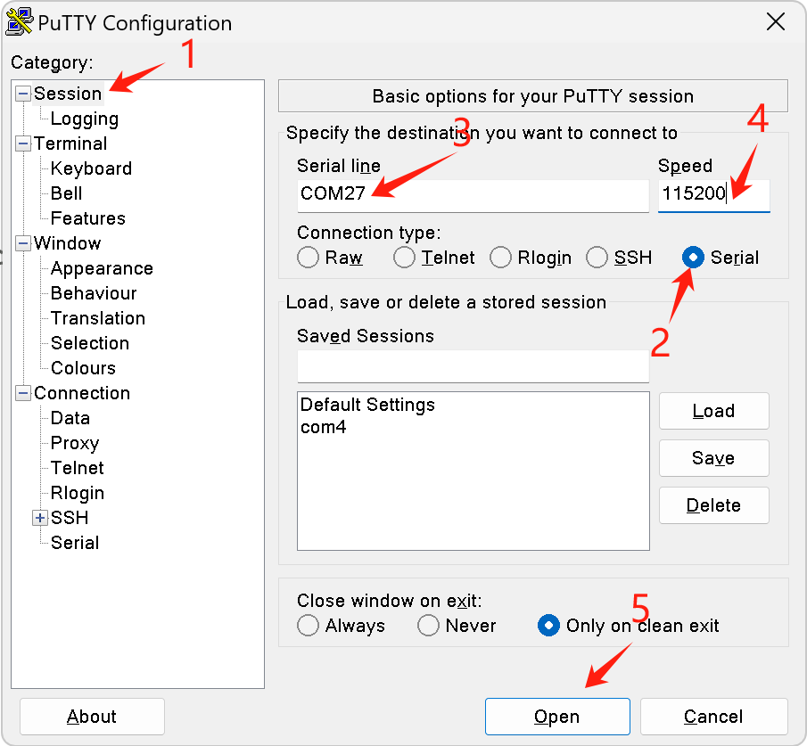
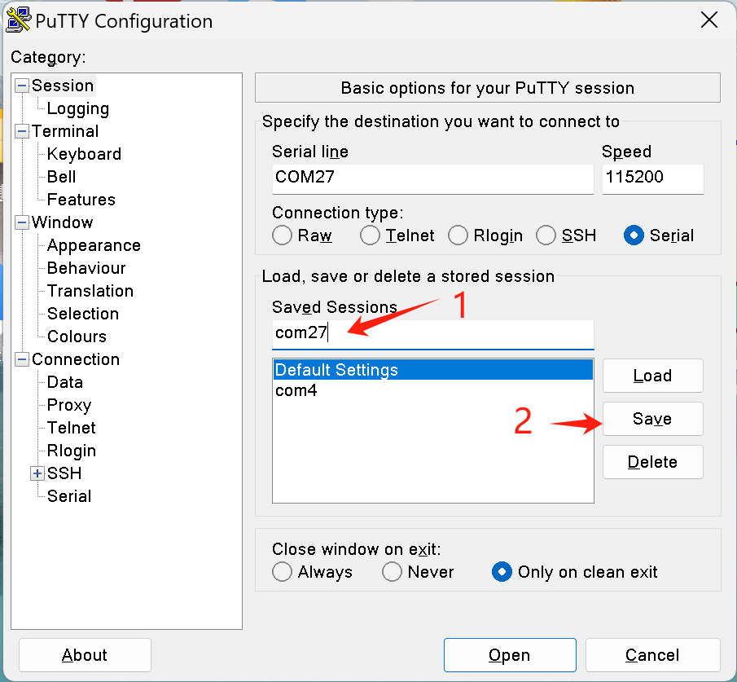
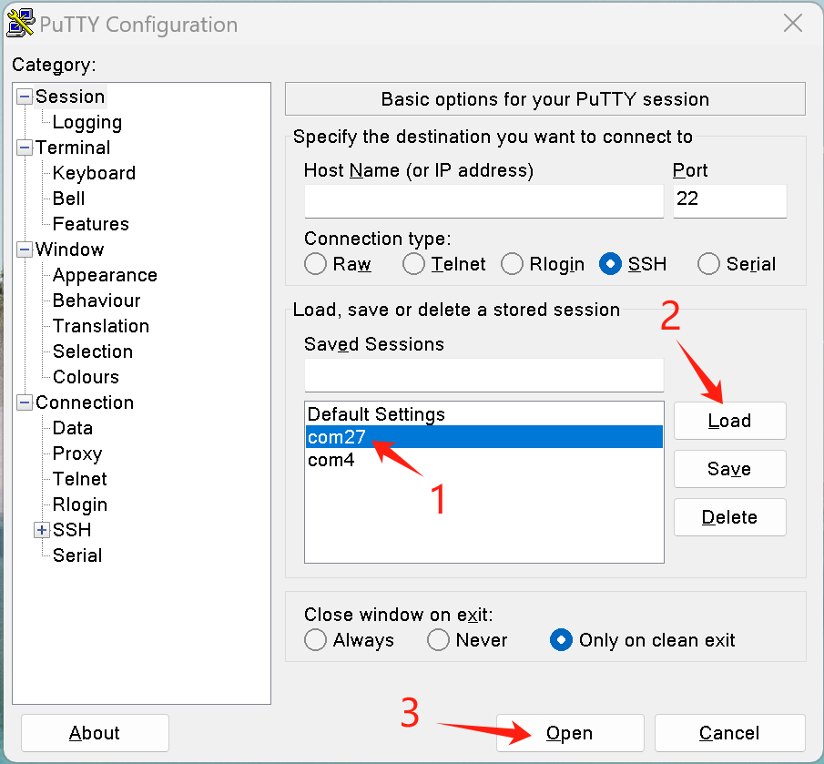
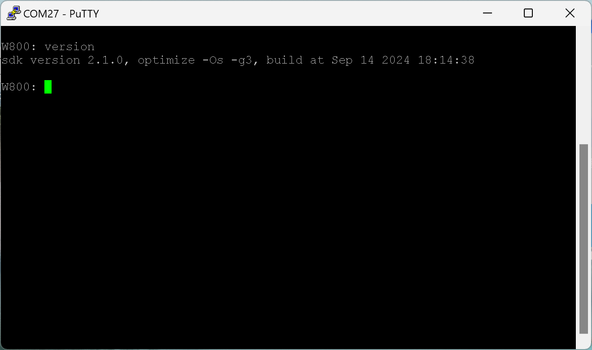

.. _cli:

CLI
=======

Overview
----------

CLI (Command Line Interface) is a method for interacting with devices or chips through a command line interface. Users can execute various operations by entering specific commands.

Basic Principle
----------------

The core of WM_CLI is the open-source project `Letter-shell <https://github.com/NevermindZZT/letter-shell>`_. Letter-shell is a shell written in C language that can be embedded in programs and called by the command lines to run functions within the program. Its main functions include:

- Support for **tab** key auto-completion;
- Support for **help** to display command usage;
- Command handling functions similar to Linux command line functions;
- Easy to add and place anywhere;
- Support for feature and partial command trimming.
- Support for selecting any serial port (default UART0, baud rate 115200, 8 data bits, 1 stop bit, no parity, no flow control)

Defining CLI Commands
------------------------

A command is defined using ``WM_CLI_CMD_DEFINE`` , with the following usag:
::
    
    WM_CLI_CMD_DEFINE(cmd, handler, description, usage)

Where ``cmd`` is the command name, ``handler`` is the command handling function,  ``description`` is the command description, and ``usage`` is the detailed  explanation of the command. To reduce firmware size, the ``usage``  feature can be disabled by ``menuconfig``.

To output information in the command processing function  ``handler`` , use the function  ``int wm_cli_printf(const char *fmt, ...)`` , which has the same usage as the printf function.

Usage Example
----------------

Adding a command named ``test``:
::
  
    static void cmd_test(int argc, char *argv[])
    {
        /* do somethings... */
	  wm_cli_printf("somethings\r\n");
    }

    WM_CLI_CMD_DEFINE(test, cmd_test, Display test information, test -- Display test information)

Its processing function is ``cmd_test``. Executing the ``help``command will display its ``description`` as Display test information, and executing ``help test`` command will show its detailed ``usage`` as test -- Display test information.
In the handler function,  ``argc`` represents the number of arguments, and ``argv`` is an array of argument pointers, pointing to the argument strings passed to the function. For example, argv[0] is the command name, argv[1] is the first argument, and argv[2] is the second argument.

Introduction to Use
-----------------------
After entering a command, press the Enter key to execute it, the Backspace key to delete characters, the left and right arrow keys on the keyboard to change the cursor position, and the up and down arrow keys to select historical commands. After entering the first character of a command, press the Tab key for autocompletion, or press the Tab key directly to display all CLI commands.

Currently, CLI only supports basic characters, numbers, Enter, Backspace, and arrow keys, and does not support special functions and combination keys such as ctrl + c.

When encountering unfamiliar commands, you can view help in the following ways:
Enter help and press Enter to display all commands along with their brief help information.
- Enter ``help`` and press Enter to display all commands along with their brief help information.
- Enter ``help command`` and press Enter to display the detailed help information for the `command` command, which can be tailored.
- View the help parameters provided by the command itself, such as  ``command --help``、``command -h``、``command help``， which are provided by the specific command.

To use CLI, you must choose a serial port tool that supports shell terminal functionality, such as  `PuTTY <https://putty.org/>`_、`XSHELL <https://www.xshell.com/zh/xshell>`_、`SecureCRT <https://www.vandyke.com/products/securecrt>`_ .

.. attention::
   Tools like sscom and xcom, which are commonly used in embedded systems, do not support full shell terminal features,so using them will not fully experience CLI features.
   This also includes `Upgrade Tools  <http://isme.fun/?log=blog&id=34>`_、VS Code and Serial Monitor plugins installed in VS Code.

Using PuTTY as an example，

To directly open a serial port, you can follow these steps：

First, save a serial port configuration, then load it to open the serial port for use：

The effect of opening a serial port is as follows：

