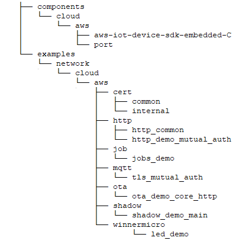

.. _aws:

AWS IoT
=============

Introduction
----------------

    AWS IoT is a comprehensive Internet of Things (IoT) platform provided by Amazon Web Services. It is designed to assist enterprises and developers in easily connecting, managing, and analyzing data from billions of IoT devices. Through a series of powerful services and features, AWS IoT supports various application scenarios, ranging from industrial automation to smart homes, enabling customers to rapidly deploy and efficiently operate IoT solutions.

Feature List
---------------

    1. :ref:`Functional Overview <functional_overview>`
    2. :ref:`Account Registration <account_registration>`
    3. :ref:`IAM Permission Control <iam_permission_control>`
    4. :ref:`Create Products (Overseas Regions) <create_overseas_products>`
    5. :ref:`AWS in WM SDK <aws_in_wm_sdk>`
    6. :ref:`AWS Code Structure Explanation <aws_code_structure_explanation>`
    7. :ref:`AWS IoT Recommended Links <aws_iot_recommended_links>`

.. _functional_overview:

Functional Overview
----------------------

    The core component of AWS IoT is AWS IoT Core, a managed cloud platform that enables devices to securely connect to the cloud and communicate with each other. IoT Core supports multiple communication protocols, such as MQTT(S) and HTTP(S), ensuring that devices can transmit data efficiently with low latency. Additionally, it offers the following key features:

    **Device Management:** An identity is created for each device through the device registry, and its metadata is tracked.

    **Device Shadow:** A virtual copy is generated for each device, which can store the device's latest state information even when it is offline.

    **Security and Authentication:** It provides multi-layer security mechanisms, covering device authentication, data encryption, and access control.

    **OTA:** By leveraging the AWS IoT Over-the-Air (OTA) update library, you can choose MQTT or HTTP as the protocol to manage the notification, download, and verification processes of FreeRTOS device firmware updates.

.. _account_registration:

AWS Account Registration
------------------------------

    **Overseas Region Account Registration:**

    Both personal and enterprise accounts are supported for registration. A credit card is required for binding during the registration process.

    `Overseas Region Registration Address <https://portal.aws.amazon.com/billing/signup#/start/email>`_

    `How to Create an Overseas Region Account <https://docs.aws.amazon.com/zh_cn/accounts/latest/reference/manage-acct-creating.html>`_

    In some cases, using AWS may incur certain costs. For specific pricing details, please refer to
    `Billing and Cost Optimization Basics <https://aws.amazon.com/cn/getting-started/cost-optimization-essentials>`_

    **China Region Account Registration:**

    Personal registration is not supported. Relevant information such as a business license is required during registration.

    `China Region Registration Address <https://signin.amazonaws.cn/signup?request_type=register>`_

    `How to Create a China Region Account <https://www.amazonaws.cn/about-aws/china/faqs/signup-process>`_

    **Multi-Factor Authentication:**

    Initially, AWS did not mandate the use of multi-factor authentication. However, approximately two months after registration, MAF will be made mandatory. Users can install the following applications on their mobile phones for authentication. Since the Android system depends on Google Play, it is recommended to use the iOS system preferentially.

    Android:Twilio Authy Authenticator、Duo Mobile、Microsoft Authenticator、Google Authenticator、Symantec VIP

    iOS:Twilio Authy Authenticator、Duo Mobile、Microsoft Authenticator、Google Authenticator、Symantec VIP

.. _iam_permission_control:

IAM Permission Control
------------------------------

    AWS Identity and Access Management is an important service used to manage and control access to AWS services and resources.

    `IAM Permission Control <https://console.aws.amazon.com/iam>`_

    **Adding an IAM Role:**

    When choosing a service or use case, select EC2. Check the "AWSIoT1ClickFullAccess" permission policy, enter a role name, and then create the role. This IAM role will be used when creating JOBs in the subsequent process.

.. _create_overseas_products:

Create Products (Overseas Regions)
------------------------------------------

    `AWS IoT Console <https:// console.aws.amazon.com/console>`_

    **Selecting the Account Usage Region:**
    Users can select the account usage region based on the actual deployment location of the product. Here, the Asia Pacific (Seoul) region is taken as an example.

    **Domain Configuration:**
    The system will automatically create a domain name named "iot:Data-ATS", which will serve as the device access address.

    **Creating an Thing:**
    The creation path is (AWS IoT → Management → Things → Create Thing → Create a Single Thing). When entering the item name, it is recommended to check "Unnamed Shadow (Classic)". This item name needs to be filled in when the device accesses. When configuring the device certificate, it is advisable to choose to automatically generate a new certificate. After the device is created, a certificate and key download page will pop up. Three certificates need to be downloaded here: the device certificate xxxx.certificate.pem.crt, the device certificate private key xxxx.private.pem.key, and the root certificate AmazonRootCA1.pem.

.. _aws_in_wm_sdk:

AWS in WM SDK
-----------------

.. figure:: ../../../_static/component-guides/network/cloud/aws/aws_arch.svg
    :align: center
    :alt: AWS Arch
..

    **Demo:** WM SDK provides multiple AWS IoT application examples that cover most common application scenarios.

    **aws-iot-device-sdk-embedded-C:** This is the official library code of AWS IoT Core, which includes various components such as parsing and protocols.

    **WM component:** These are components exclusive to WM SDK, including BSD socket, mbedTLS, WiFi stack, etc.

.. _aws_code_structure_explanation:

AWS Code Structure Explanation
------------------------------------------

..

    **components/cloud/aws/aws-iot-device-sdk-embedded-C:** The official source code of AWS IoT.

    **components/cloud/aws/port:** The adaptation layer for AWS IoT Core.

    **examples/network/cloud/aws/cert/common:** This is for externally released certificates. Although the certificate format is correct, it cannot be connected to the server. Users need to replace it with valid certificates.

    **examples/network/cloud/aws/http/http_common:** Common components for the HTTP demo.

    **examples/network/cloud/aws/http/http_demo_mutual_auth:** The HTTP demonstration demo, sourced from AWS official examples.

    **examples/network/cloud/aws/job/jobs_demo:** The Job demonstration demo, transformed from the AWS official example jobs_demo_mosquitto.

    **examples/network/cloud/aws/mqtt/tls_mutual_auth:** The MQTT demonstration demo, sourced from AWS official examples.

    **examples/network/cloud/aws/ota/ota_demo_core_http:** The OTA (HTTP) demo, sourced from the AWS Branch_202211.00 branch. It was removed in the 202412 version.

    **examples/network/cloud/aws/shadow/shadow_demo_main:** The Shadow demonstration demo, sourced from AWS official examples.

    **examples/network/cloud/aws/winnermicro/led_demo:** A demonstration example program suitable for the Winsemi Arduino development board. It is transformed from the Shadow example and can control the on-board three-color LED through MQTT messages.

.. _aws_iot_recommended_links:

AWS IoT Recommended Links
--------------------------------------

    `Amazon IoT Core <https://docs.amazonaws.cn/en_us/iot/latest/developerguide/what-is-aws-iot.html>`_

    `FreeRTOS Over-the-Air Updates <https://docs.amazonaws.cn/en_us/freertos/latest/userguide/freertos-ota-dev.html>`_

    `aws-iot-device-sdk-embedded-C github <https://github.com/aws/aws-iot-device-sdk-embedded-C>`_

    `AWS IoT Console Home <https:// console.aws.amazon.com/console>`_
