Development Assistant
=========================

Overview
----------------

The Development Assistant is primarily used to assist with project development based on the WM IOT SDK.  It involves tasks such as code organization structure reference, task attribute definition management, stack information querying, and more.

1. Code Structure
-------------------------------

.. figure:: ../../_static/component-guides/dev_asst_en/sdk_code_structure_overview.svg
    :align: center
    :alt: code sturcture

In the actual development process, users need to pay attention to the fact that the WM SDK has provided common definitions and components for reference.

2. Task attribute Definition
-------------------------------

Code Path: components/wm_system/include/wm_task_config.h

.. figure:: ../../_static/component-guides/dev_asst_en/sdk_code_structure_task_config.svg
    :align: center
    :alt: task configure

3. Interactive Features
-------------------------------

The interactive module categories involved in the development assistant are as follows:

3.1 AT Module
^^^^^^^^^^^^^^^^^

To use the AT feature, you first need to enable the AT module and the required sub-features in menuconfig.

.. figure:: ../../_static/component-guides/dev_asst_en/at_command_menuconfig1.svg
    :align: center
    :alt: AT Enable Menu 1

Then, select the corresponding AT command set based on your requirements.

.. figure:: ../../_static/component-guides/dev_asst_en/at_command_menuconfig2.svg
    :align: center
    :alt: AT Enable Menu 2

For more information, refer to the AT command list: :doc:`AT <AT/index>`

3.2 CLI Module
^^^^^^^^^^^^^^^^^

If you need to use the CLI, you must first enable the CLI module and the required sub-functions in menuconfig.

.. figure:: ../../_static/component-guides/dev_asst_en/cli_command_menuconfig1.svg
    :align: center
    :alt: CLI Enable Menu 1

Then select the CLI command set as required

.. figure:: ../../_static/component-guides/dev_asst_en/cli_command_menuconfig2.svg
    :align: center
    :alt: CLI Enable Menu 2

CLI interaction is by default through UART0 (i.e., the log output port). To view the CLI commands supported by the current system, you can use the 'help' command, as shown in the figure.

.. figure:: ../../_static/component-guides/dev_asst_en/cli_command_help_overview.svg
    :align: center
    :alt: CLI help

For example, you can use the 'task' command to list all tasks in the current system along with their resource usage, as shown in the figure.

.. figure:: ../../_static/component-guides/dev_asst_en/cli_command_task_overview.svg
    :align: center
    :alt: CLI task

For details about new commands, see CLI commands: :doc:`CLI <cli>`

4. Storage Management
------------------------

The WM IOT SDK contains multiple storage mechanisms, such as:

- NVStore: Used for storing small amounts of data, such as Bluetooth and Wi-Fi connection parameters, 
  user configuration parameters, etc. Its storage location is Flash. :ref:`NVStore <nvs>`.
- FT Region: Used for storing factory parameters of the chip, such as RF calibration values, ADC calibration values, 
  MAC addresses, etc. Its storage location is on Flash or OTP (one time program), depending on the hardware design 
  of different chips. In principle, each of parameter in this area can only be written once. After being written, 
  it will be locked and cannot be physically written again.
- File Systems: Used for storing large amounts of data content, such as audio, pictures, etc. And it is managed by 
  various file system mechanisms (FATFS, LittleFS...), and its storage location may be an SD card or Flash.

Although the missions of each storage mechanism are clear, in actual use, there are still some scenarios that are easy 
to be confused.
For example, MAC address storage and acquisition may be stored in both NVStore and FT Region at the same time, and 
developers may have their own read and write strategies.

Here is an introduction to the MAC management mechanism of the WM IOT SDK.

4.1 MAC Address Management
^^^^^^^^^^^^^^^^^^^^^^^^^^

The MAC management mechanism of the WM IOT SDK follows the following principles:

- Provide unified MAC Get/Set APIs for users or other modules to use. The APIs are declared as weak attributes 
  and users can re-implement and override them in their own projects.
- There are differences in the storage methods and types of MAC addresses.

  + NVStore stores three different types of MAC addresses including Wifi Station, WiFi SoftAP, and BT.
  + FT Region only stores two types of MAC addresses including WiFi and BT.
  + There is also a Default MAC in the code, which is used for MAC address import in scenarios where the  
    contents of NVStore and FT Region are unreliable.

- Read operation flow of native MAC API:

  + At power-on, if there is a valid MAC address in NVStore, then the value obtained by future Get MAC will be 
    from NVStore.
  + If the MAC address in NVStore is invalid, the value obtained by Get MAC will be taken from FT Region and 
    MAC address conversion will be performed.
  + If the MAC address in FT Region is also invalid, the value obtained by Get MAC will be taken from the code 
    Default MAC and MAC address conversion will be performed.

- Write operation flow of native MAC API:

  + It can only be written to NVStore.
  + If NVStore is disabled, Set MAC will return an error.

- Default system behavior:

  + After the system is powered on, it will check whether there is a valid MAC address stored in NVStore.
  + If there is no valid MAC address, call the unified Get MAC API to obtain or generate a MAC address.
  + The obtained MAC address will be stored back in NVStore.

Unified MAC Get/Set APIs:

- These two APIs are of weak attributes. If users have their own MAC management mechanism, they can re-implement
  these two functions in their own projects, such as in main.c in the project.
- During compilation and linking, the linker will directly link to the new functions implemented by the user.

.. code-block::

    ATTRIBUTE_WEAK int wm_sys_set_mac_addr(wm_mac_type_t mac_type, uint8_t *mac_addr, uint8_t mac_addr_len);
    ATTRIBUTE_WEAK int wm_sys_get_mac_addr(wm_mac_type_t mac_type, uint8_t *mac_addr, uint8_t mac_addr_len);

