.. _pwm_drv:

PWM Driver
=============

Introduction
--------------

| Pulse Width Modulation (PWM) is a control technique that is increasingly being applied in the field ofthe Internet of Things(IOT). PWM controls voltage or power by adjusting the duty cycle of pulse signals, making it an efficient means of analog signal control.
| PWM is widely used in smart homes, industrial automation, medical equipment, smart agriculture, and other fields.

- **Smart Homes**: In smart lighting systems，PWM technology is used in smart lighting systems to adjust the brightness and color temperature, enhancing energy efficiency. Meanwhile,In smart audio equipment, PWM is used to control volume and sound quality, providing a better user experience.
- **Industrial Automation**: In the industrial field, PWM is widely used in motor control systems to precisely regulate motor speed and torque, enhancing the efficiency and accuracy of production lines.
- **Medical Equipment**: The application of PWM technology in medical equipment is mainly seen in ventilators, infusion pumps, and other devices. By precisely controlling output parameters, it ensures the stable and reliable operation of these devices.
- **Smart Agriculture**: In smart agriculture, PWM is used to control irrigation system water flow, fertilizer concentration in fertilization systems, and other parameters, aiding in the development of precision agriculture.

Function List
----------------

- Supports 2-channel input signal capture (PWM0/PWM4).
- Supports 5-channel PWM signal generation.
- Supports 5-channel brake function.

Function Overview
-------------------

Output Modes
^^^^^^^^^^^^^

- **Independent Output**: Independent PWM waveform output for each channel

  .. figure:: ../../../_static/component-guides/driver/pwm_indp.svg
      :align: center
      :alt: PWM Independent Output

- **Dual-Channel Synchronous Output**: ch0+ch1 or ch2+ch3 synchronous output.

  .. figure:: ../../../_static/component-guides/driver/pwm_2sync.svg
      :align: center
      :alt: PWM Dual-Channel Synchronous Output

- **All-Channel Synchronous Output**: All channels output synchronously.

  .. figure:: ../../../_static/component-guides/driver/pwmallsync.svg
      :align: center
      :alt: PWM All-Channel Synchronous Output

- **Dual-Channel Complementary Output**: ch0+ch1 or ch2+ch3 output complementary waveforms.

  .. figure:: ../../../_static/component-guides/driver/pwm_2complement.svg
      :align: center
      :alt: PWM Dual-Channel Complementary Output

Brake Modes
^^^^^^^^^^^^^

Depending on GPIO configuration, the following two brake modes can be implemented:

- When the brake input GPIO detects a low level, the corresponding channel outputs a specified high/low level.
- When the brake input GPIO detects a high level, the corresponding channel outputs a specified high/low level.
- The input signal level for braking is determined during the GPIO initialization configuration. If it is pulled up is enabled, a low level triggers the brake; otherwise, a high level triggers it..

  .. figure:: ../../../_static/component-guides/driver/pwm_brake.svg
      :align: center
      :alt: PWM Brake

.. note::
   If you need to output a PWM waveform when triggering (raising the brake trigger pin), you need to specify the period and clkdiv. Set the frequency according to the formula in the documentation. Setting these to 0 results in level mode.

.. note::
   PWM output behavior is based on period and duty cycle conditions (autoload = true, inverse = false). Actual output refers to the following table.

.. list-table:: PWM Output Behavior
   :header-rows: 1

   * - period
     - duty
     - period_num == 0
     - period_num > 0
   * - period = 0
     - duty > period
     - output high level
     - output high level
   * - period > 0
     - duty >= period
     - output high level
     - output a high level pulse
   * - period = 0
     - duty = 0
     - output high level
     - output high level
   * - period > duty
     - duty >= 0
     - output PWM
     - output period_num PWM

Capture Mode
^^^^^^^^^^^^^

Monitor input signals from the ch0 or ch4 channel. The sampling range is 3 ~16K.

  .. figure:: ../../../_static/component-guides/driver/pwm_capture.svg
      :align: center
      :alt: PWM Capture

.. note::
    Set the period and clkdiv parameters to higher values in capture mode to sample lower frequencies; conversely, set them to smaller values to sample higher frequencies.

Function Configuration 
---------------------------

PWM Channel Configuration
^^^^^^^^^^^^^^^^^^^^^^^^^^^^

| Configure channels using the the ``wm_drv_pwm_channel_init``  function.
| Channel configuration requires passing a configuration structure ``wm_drv_pwm_channel_cfg_t`` to the channel configuration function.
|  At this point，use the function ``wm_drv_pwm_channels_start`` to start the configured PWM channel and ``wm_drv_pwm_channels_stop`` to stop the configured PWM channel.

PWM Frequency Configuration
^^^^^^^^^^^^^^^^^^^^^^^^^^^^^^^^^^^^

PWM frequency is the number of times within one second that the signal transitions from high to low and back to high, or the number of PWM cycles in one second. We provide two methods to change the PWM frequency:

- Call ``wm_drv_pwm_set_channel_freq`` to set the frequency of a specific PWM channel.
- Call ``wm_drv_pwm_set_channel_period_clkdiv`` to set the frequency of a PWM channel based on the given period and clock divider value.
- Call ``wm_drv_pwm_get_channel_freq`` to get the current frequency of a specific PWM channel.

.. note::
    Frequency Setting Strategy:
    
    1. Frequency must be within the range [WM_DRV_PWM_FREQ_MIN(3Hz), WM_DRV_PWM_FREQ_MAX(160KHz)] 
    
    2. First try to achieve target frequency by adjusting clkdiv while keeping current period value
     
       Frequency calculation formula: freq = master_clock / (period + 1) / clkdiv
       
       Where:
       
       - master_clock is PWM clock frequency (typically 40MHz)
       
       - period remains unchanged from current configuration
       
       - clkdiv is automatically calculated, range is [1, 65535]
       
    3. If target frequency cannot be achieved by adjusting clkdiv alone, function will try to adjust both period and clkdiv to achieve target frequency
    
    4. If it is not possible to calculate an appropriate period and clkdiv, the setting will fail

PWM Duty Cycle Configuration
^^^^^^^^^^^^^^^^^^^^^^^^^^^^^^^^

The PWM duty cycle is the ratio of the high-level time to the total period time within one pulse cycle. By adjusting the duty cycle, the pulse width can be adjusted. The duty cycle range is from 0 to 255 (default: 40).

- Call ``wm_drv_pwm_set_channel_duty`` to set the duty cycle of a PWM channel.
- Call ``wm_drv_pwm_get_channel_duty`` to get the duty cycle of a PWM channel.

.. note::
    A setting of 10 represents 10%, and fractional forms are not supported.
.. note::
    Duty cycle = (duty + 1) / (period + 1).

PWM Period Configuration
^^^^^^^^^^^^^^^^^^^^^^^^^^

| The PWM period is the time of one pulse signal,and the number of periods per cycle, ranging from [0 to 255] (default: 199).
| When the  period number is 0, this function is disabled. A value greater than 0 stops output after the specified  number of periods.

- Call ``wm_drv_pwm_set_channel_period_num`` to set the number of  periods to be generated  before generating an interrupt for a specific PWM channel.
- Call ``wm_drv_pwm_get_channel_period_num`` to get the period number interrupt setting for a specific PWM channel.

PWM Clock Divider Configuration
^^^^^^^^^^^^^^^^^^^^^^^^^^^^^^^^^^^

The Clock divider indicates the number of clock signal cycles per second.

- Call ``wm_drv_pwm_get_channel_period_clkdiv`` to get the clock division value of the PWM channel.

.. note::
    clkdiv values of 0 and 1 indicate no division.

.. note::
    The period is affected by the frequency.

Main Functions
--------------------

Output Function
^^^^^^^^^^^^^^^^^^

Initial Condition:

- Define and initialize the ``wm_drv_pwm_channel_cfg_t`` structure. Set the basic parameters of the PWM channel, choose the output mode, and initialize the PWM channel.

Related Timing APIs:

- Call ``wm_drv_pwm_init`` to initialize the PWM device and obtain the device pointer.
- Use ``wm_drv_pwm_channel_init`` to initialize the PWM channel according to the configuration structure.
- Call ``wm_drv_pwm_channels_start`` to start the PWM channel and begin generating the PWM signal.
- Dynamically set the channel's duty cycle using ``wm_drv_pwm_set_channel_duty`` as needed .
- Set the period, frequency, etc., as needed.

Result:

- Outputs a waveform with the set duty cycle.

Brake Function
^^^^^^^^^^^^^^^^

Initial Condition:

- Define and initialize the ``wm_drv_pwm_channel_cfg_t`` structure. Set the basic parameters of the PWM channel, choose the brake mode, and initialize the PWM channel.

Related Timing APIs:

- Call ``wm_drv_pwm_init`` to initialize the PWM device and obtain the device pointer.
- Use ``wm_drv_pwm_set_channel_brake_level`` to set the  high/low level output of the PWM channel in brake mode.
- Use ``wm_drv_pwm_channel_init`` to initialize the PWM channel according to the configuration structure.
- Call ``wm_drv_pwm_channels_start`` to start the PWM channel.

Result:

- When the brake input GPIO detects a low level, the corresponding channel outputs the specified high/low level.
- When the brake input GPIO detects a high level, the corresponding channel outputs the specified high/low level.

Capture Function
^^^^^^^^^^^^^^^^^^

Initial Conditions:

- Define and initialize the ``wm_drv_pwm_channel_cfg_t`` structure. Set the basic parameters of the PWM channel, choose the capture mode, and initialize the PWM channel.

Related Timing APIs:

- Call ``wm_drv_pwm_init`` to initialize the PWM device and obtain the device pointer.
- Use ``wm_drv_pwm_channel_init`` to initialize the PWM channel according to the configuration structure.
- Call ``wm_drv_pwm_channels_start`` to start the PWM channel.

Result:

- Captures the pulse.

Application Example
-------------------------

For a basic example of using PWM, please refer to :ref:`examples/peripheral/pwm<peripheral_example>`

.. code:: C

    int main(void)
    {
        wm_drv_pwm_channel_cfg_t cfg = { 0 };

        wm_device_t *pwm_device = wm_drv_pwm_init("pwm");
        if (pwm_device == NULL) {
            WM_PWM_DEMO_LOG_E("PWM driver init Failed!\n");

            return WM_ERR_FAILED;
        }

        cfg.channel      = WM_PWM_CHANNEL_0;
        cfg.mode         = WM_PWM_OUT_ALLSYNC;
        cfg.clkdiv       = WM_PWM_CLKDIV_DEFAULT;
        cfg.period_cycle = WM_PWM_PERIOD_DEFAULT;
        cfg.duty_cycle   = WM_PWM_DUTY_CYCLE_DEFAULT;
        cfg.autoload     = true;

        if (wm_drv_pwm_channel_init(pwm_device, &cfg) != WM_ERR_SUCCESS) {
            WM_PWM_DEMO_LOG_E("PWM driver channel init failed!\n");
        }

        if (wm_drv_pwm_channels_start(pwm_device)) {
            WM_PWM_DEMO_LOG_E("PWM driver channel start failed!\n");
        }
        /* After PWM initialization is complete, call various functional functions, such as wm_drv_pwm_set_channel_duty, to set the duty cycle */

        return WM_ERR_SUCCESS;
    }

API Reference
-----------------

    To find PWM-related APIs, please refer to:

    :ref:`label_api_pwm`
