.. _label_component_driver_spis:

.. _spislave:

SPI Slave
=================

Introduction
-----------------

SPI is a high-speed, full-duplex synchronous serial communication protocol. 
In SPI communication, devices are categorized as Masters and Slaves. The SPI-Slave acts as a subordinate device, passively responding to communication processes initiated by the master device, receiving clock signals and data transfer requests controlled by the master. 
It plays a subordinate role in SPI communication, capable of exchanging data only under the master device's control and cannot actively initiate communication, but can prepare data for the master device to read.

Function List
-----------------

1. :ref:`Initialization <spis_init>` — Initialize the SPI driver.
2. :ref:`Synchronous Data Transfer <spis_trans_sync>` — Ends transmission upon completion or timeout of data transfer.
3. :ref:`Asynchronous Data Transfer <spis_trans_async>` — Ends transmission after data transfer is complete and enters a callback function.
4. :ref:`Send Command and Get Result <TX_CMD>`—— Sends instructions to the peer user and retrieves the execution result.
5. :ref:`Endianness <spis_big_endian>`—— When hardware sends data in word units, it determines whether to send the contents of the high address or low address of the word first.

Function Overview
-------------------
**Full-Duplex Communication**: SPI supports simultaneous data sending and receiving, allowing data transmission and reception to occur within each clock cycle.

**Clock Synchronization**: SPI Slave receives the serial clock signal (SCLK) provided by the master device for data transmission synchronization.

**Chip Select Response**: SPI Slave monitors the chip select signal (CS) and activates to participate in communication when selected by the master device.

**Data Transfer Response**: SPI Slave passively sends and receives data according to the master device's control and cannot initiate communication actively.

**High Transmission Rate**: Compared to interfaces like I2C, SPI offers higher transfer rates, suitable for applications requiring high-speed data transmission.

**SPI has four transmission modes as shown in the table below**

================ ======== ======== ==================================================================
SPI Mode          CPOL     CPHA     Description
================ ======== ======== ==================================================================
Mode 0            0        0        SCLK is low when idle, data sampled on the rising edge
Mode 1            0        1        SCLK is low when idle, data sampled on the falling edge
Mode 2            1        0        SCLK is high when idle, data sampled on the falling edge
Mode 3            1        1        SCLK is high when idle, data sampled on the rising edge
================ ======== ======== ==================================================================

SPI Slave Hardware Wiring
-----------------------------

.. _spis_init:

Initialization of SPI
--------------------------------
Before using SPI, you need to call the ``wm_drv_spis_init()`` function to allocate resources for SPI and use the ``wm_device_t`` structure to receive the SPI device identifier. An example is as follows:

.. code:: c

     wm_device_t *spi_dev;
     spi_dev = wm_drv_spis_init("spis");

During initialization, only the ``"spis"`` string needs to be passed in.

.. note::

     1. If SPI is already initialized, you can also directly call ``wm_dt_get_device_by_name`` to obtain the SPI device pointer.
     2. SPI-related configurations can be changed in the device tree.

.. _spis_trans_sync:

SPI Synchronous Transmission
---------------------------------

Setting Transmission Parameters
^^^^^^^^^^^^^^^^^^^^^^^^^^^^^^^^^^^^^

  - The API will return after the transmission and reception are complete. The user can set the maximum waiting time. If transmission and reception are not completed within this time, it will return immediately.
  - SPI uses 4 default GPIO pins: PIN_CS: GPIO20, CLK: GPIO17, MISO: GPIO16, and MOSI: GPIO7. If modifications are needed, these can be modified in the device tree.

Use synchronous transmission by calling ``wm_drv_spis_transceive_sync()`` and passing the ``wm_dt_hw_spis_dev_cfg_t`` and ``spis_transceive_t`` structures.

  **1. SPI Device Parameter Configuration**

    The transmission frequency, mode, and pins of SPI can be configured in the ``wm_dt_hw_spis_dev_cfg_t`` structure. Example:

    .. code:: c

        wm_device_t *spi_dev;
        spi_dev = wm_drv_spis_init("spis");

        wm_dt_hw_spis_dev_cfg_t config = {
        .mode = 0,  // SPI mode
        };

  **2. SPI Transmission Parameter Configuration**

     - For SPI data sending and receiving, you need to set tx_buffer and rx_buffer. The data to be sent is stored in tx_buffer, and the received data is stored in rx_buffer.
     - It supports both tx_buffer and rx_buffer being non-empty for simultaneous transmission and reception.
     - It supports tx_buffer being empty and rx_buffer being non-empty for receiving data only.
     - It supports rx_buffer being empty and tx_buffer being non-empty for sending data only.
   
     Configuration example:

     .. code:: c

        uint32_t tx_len   = 8;
        uint8_t *tx_buf   = NULL;
        uint32_t rx_len   = 8;
        uint8_t *rx_buf   = NULL;

        tx_buf = malloc(tx_len);
        rx_buf = malloc(rx_len);

        spis_transceive_t desc = {
        .tx_buf = tx_buf,
        .tx_len = tx_len,
        .rx_buf = rx_buf,
        .rx_len = rx_len,
        };
	 
Starting Synchronous Data Transmission
^^^^^^^^^^^^^^^^^^^^^^^^^^^^^^^^^^^^^^^^^^

After completing the synchronous transmission parameter configuration, you can call ``wm_drv_spis_transceive_sync()`` for synchronous transmission. You need to pass in the device descriptor, SPI device parameters, transmission parameters, and timeout time (in milliseconds).

.. code:: c

            // Set TX data
            for (int i = 0; i < tx_len; i++) {
                tx_buf[i] = 0xAA;
            }

            wm_drv_spis_transceive_sync(spi_dev, &config, &desc, 1000);

Deinitializing SPI
^^^^^^^^^^^^^^^^^^^^

If SPI is no longer needed for data transmission, you can call ``wm_drv_spis_deinit()`` to remove the driver and release the allocated resources.

.. _spis_trans_async:

SPI Asynchronous Transmission
-------------------------------

Setting Transmission Parameters
^^^^^^^^^^^^^^^^^^^^^^^^^^^^^^^^^^^^^^^

 - After calling this interface and giving the relevant parameters to the driver, the API will return immediately. The underlying layer will invoke the user-registered callback function after the transmission and reception are complete.
 - SPI uses 4 default GPIO pins: PIN_CS: GPIO20, CLK: GPIO17, MISO: GPIO16, and MOSI: GPIO7. If modifications are needed, these can be modified in the device tree.
 - To use synchronous transmission, you can call ``wm_drv_spis_transceive_sync()`` and pass the ``wm_dt_hw_spis_dev_cfg_t`` and ``spis_transceive_t`` structures to it.

  **1. SPI Device Parameter Configuration**

    The transmission frequency, mode, and pins of SPI can be configured in the ``wm_dt_hw_spis_dev_cfg_t`` structure. Example:

    .. code:: c

        wm_device_t *spi_dev;
        spi_dev = wm_drv_spis_init("spis");

        wm_dt_hw_spis_dev_cfg_t config = {
        .mode = 0,
        };

   **2. SPI Transmission Parameter Configuration**

     - For SPI data sending and receiving, you need to set tx_buffer and rx_buffer. The data to be sent is stored in tx_buffer, and the received data is stored in rx_buffer.
     - It supports both tx_buffer and rx_buffer being non-empty for simultaneous transmission and reception.
     - It supports tx_buffer being empty and rx_buffer being non-empty for receiving data only.
     - It supports rx_buffer being empty and tx_buffer being non-empty for sending data only.

     Configuration example:

     .. code:: c

        uint32_t tx_len   = 8;
        uint8_t *tx_buf   = NULL;
        uint32_t rx_len   = 8;
        uint8_t *rx_buf   = NULL;

        tx_buf = malloc(tx_len);
        rx_buf = malloc(rx_len);

        spis_transceive_t desc = {
        .tx_buf = tx_buf,
        .tx_len = tx_len,
        .rx_buf = rx_buf,
        .rx_len = rx_len,
        };

    **3. Configure SPI Callback Function**

    After the asynchronous transmission is completed, the callback function will be invoked. This function will pass an integer ``result`` and user data ``data``. The returned data type is ``wm_spis_callback_t``. Example:

    .. code:: c

        void example_spis_async_callback(int result, void *data) {
            printf("SPI callback: transmit result: %d\n", result);
        }

Starting Asynchronous Data Transmission
^^^^^^^^^^^^^^^^^^^^^^^^^^^^^^^^^^^^^^^^^^^^

After completing the asynchronous transmission parameter configuration, you can call ``wm_drv_spis_transceive_async()`` to perform asynchronous transmission. It requires passing in the device descriptor, SPI device parameters, transmission parameters, callback function, and user data.

.. code:: c

            // Set TX data
            for (int i = 0; i < tx_len; i++) {
                tx_buf[i] = 0xAA;
            }

            wm_drv_spis_transceive_async(spi_dev, &config, &desc, example_spis_async_callback, NULL);

Deinitializing SPI
^^^^^^^^^^^^^^^^^^^^

If SPI is no longer needed for data transmission, you can call ``wm_drv_spis_deinit()`` to uninstall the driver and release the allocated resources.

.. _spis_big_endian:

Endianness
-----------------

Function Introduction
^^^^^^^^^^^^^^^^^^^^^^^
  
The W800 SPI hardware supports little-endian and big-endian transmission functions.
  
Little-Endian Mode:
     - Transmission Direction: When sending data in word units, the SPI controller hardware will transmit the content of the low address of the word first.
     - Reception Direction: The SPI controller hardware will store the received byte stream into the FIFO first, with the storage unit being a word. The storage order is to store into the low address space of the word first.
  
Big-Endian Mode:
     - Transmission Direction: When sending data in word units, the SPI controller hardware will transmit the content of the high address of the word first.
     - Reception Direction:  The SPI controller hardware will store the received byte stream into the FIFO first, with the storage unit being a word. The storage order is to store into the high address space of the word first.

The driver layer provides a flag bit: SPI_TRANS_BIG_ENDIAN, allowing users to choose between big-endian and little-endian modes when calling the SPI transmission and reception API each time.

TX Direction Example:
^^^^^^^^^^^^^^^^^^^^^^

Assume the user wants to send: 0x11, 0x22, 0x33, 0x44, 0x55, 0x66, 0x77, 0x88, 0x99, 0xAA, 0xBB.

The way data is stored in the TX FIFO is shown in the figure below:

In Little-Endian Mode: The HW will start sending from the low address of a word, so 0x11 will be sent first, followed by: 0x11(first), 0x22, 0x33, 0x44, 0x55, 0x66, 0x77, 0x88, 0x99, 0xAA, 0xBB.

In Big-Endian Mode: The HW will start sending from the high address of a word, so 0x44 will be sent first, followed by: 0x44(first), 0x33, 0x22, 0x11, 0x88, 0x77, 0x66, 0x55, 0xBB, 0xAA, 0x99.

RX Direction Example:
^^^^^^^^^^^^^^^^^^^^^
Assume the data sent by the opposite end is: 0x11, 0x22, 0x33, 0x44, 0x55, 0x66, 0x77, 0x88, 0x99, 0xAA, 0xBB.

In Little-Endian Mode: The order of data delivered to the user is: 0x11(first), 0x22, 0x33, 0x44, 0x55, 0x66, 0x77, 0x88, 0x99, 0xAA, 0xBB.

In Big-Endian Mode: The order of data delivered to the user is: 0x44(first), 0x33, 0x22, 0x11, 0x88, 0x77, 0x66, 0x55, 0x99, 0xAA, 0xBB.

Notes
------------------

.. note::

    1. If the starting address for sending or receiving is not 4-byte aligned, the underlying layer will not use DMA for transmission.
    2. The transmission length should preferably not be less than the reception length, otherwise the master device may receive some invalid data.
    3. Supports send-only or receive-only operations.
    4. The data transmission and reception length must not exceed 65535.
    5. The maximum transmission rate is 4.5 MHz. Lower system clock (80MHz) may cause data loss in non-4-byte synchronous reception scenarios.
    6. CS, CLOCK, MISO, and MOSI pins are configured in the SPI driver. If users want to modify the default pins, they can do so in the DT (Device Table).
    7. Since SPI Master and SPI Slave share the same hardware controller, only one mode can be used at a time.

Application Example
----------------------

For basic SPI usage examples, refer to :ref:`examples/peripheral/spi_slave <spi_slave_example>`

API Reference
------------------
For related SPI APIs, refer to:

:ref:`label_api_spi_slave`