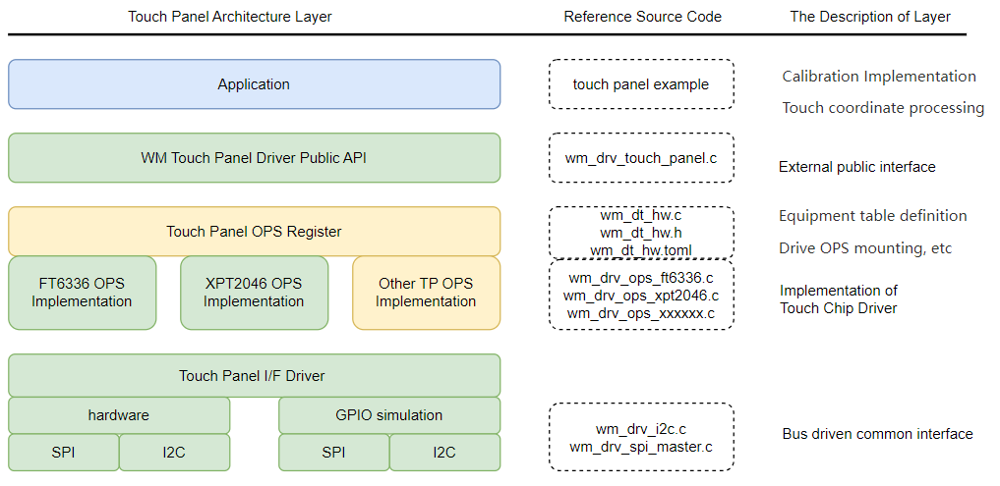

.. _touch_panel:

Touch_Panel
=============

Introduction
---------------

Touch Panel is an input device that enables human-computer interaction by directly touching the screen, widely used in fields such as smartphones, tablets, industrial control equipment, 
and automotive central control. Its core function is to detect the user's touch position and transmit the signal to the processor to achieve precise operation. According to the working 
principle, touch panels are mainly divided into two categories: resistive and capacitive, each with its own characteristics in structure, sensitivity, cost, and application scenarios.

- Resistive type: composed of two layers of conductive thin films (ITO) separated by tiny insulating dots in the middle. When the user presses the screen,  
  the two layers of film come into contact, and the controller detects the voltage change and calculates the touch coordinates (X/Y)

  - Advantages: Low cost, strong anti-interference, suitable for industrial environments.
  - Disadvantages: Single touch, prone to aging, requiring regular calibration.

- Capacitive: Using the human electric field to change the surface capacitance (self capacitance) or mutual capacitance between electrodes (mutual capacitance).  
  The controller accurately locates touch points by scanning changes in capacitance.

  - Advantages: High sensitivity, support for multi touch, no need for calibration.
  - Disadvantages: High cost and susceptibility to interference.

Touch Panel Architecture
---------------------------

The Touch Panel module of WM IOT SDK is divided into four functional layers:

  1. Application layer (applications developed by users based on the middle layer or directly based on the driver layer).
  2. Intermediate layer (integrating LVGL to implement functions such as points and lines).
  3. Driver layer (used for device driver implementation of each touch chip).
  4. Communication layer (such as SPI, I2C, etc.)

Driver Layer Feature List
^^^^^^^^^^^^^^^^^^^^^^^^^^^^^^^^^^^^^

- Support Touch Panel parameter configuration through Device Table (including Bus, screen length and width, pin configuration, etc.).
- Support parameter configuration function (configurable rotation, calibration, calibration parameters).
- Support parameter acquisition function (can obtain screen length and width, calibration parameters).
- Support obtaining touch point coordinates.

Driver usage method
^^^^^^^^^^^^^^^^^^^^^^^^^

At present, the driver layer supports two types: XPT2046 (resistive) and FT6336 (capacitive). Select the touch driver controller from ``menuconfig ->PERIPHERALS ->Touch driver ->touch device.``
Refer to the example below for the touch panel basic readme instructions, connect the hardware pins of the touch chip and development board properly. 
`Touch Panel Basic <../../examples_reference/examples/peripheral/touch_panel/touch_panel_basic/README.html>`_。

API call sequence:

- Call ``wm_drv_touch_panel_init`` to initialize
- Call ``wm_rrv_touch_manel_det_config`` to set parameters
- Call ``wm_rrv_touch_manel_get-config`` to obtain parameters
- Call ``wm_rrv_touch_manel_get_comrds`` to read coordinates

Result:

- LOG will print user touch coordinates

.. note::

  If it is a resistive screen, calibration is required. The calibration process requires screen display coordination. 
  `Polling guide <../../examples_reference/examples/peripheral/tft_lcd/tft_lcd_polling/README.html>`_。
  Refer to the readme instructions for the tft_lcd_rolling example and connect the hardware pins of the screen and development board. 
  `Calibration guide <../../examples_reference/examples/peripheral/touch_panel/touch_panel_calibration/README.html>`_。  

  Result:

  - The calibration coordinates will be displayed sequentially on the TFT LCD screen, and the user will complete the calibration by clicking on them one by one.
    Subsequent LOG printing of calibrated pixel coordinates.

Method for Adding Touch Panel Device driver
----------------------------------------------

The following figure is the TFT LCD device driver framework.

If you want to add a device driver for a new Touch Panel device, it is recommended to maintain the current hierarchical structure. 
In most cases, only the yellow-related levels need to be modified.

Step 1: Create a device in the device table ``wm_iot_sdk/components/wm_dt/config/w80x/wm_dt_hw.c``  

Define OPS

.. code-block:: c

    typedef struct wm_drv_ops_structure wm_drv_touch_driver_ops_t;
    extern const wm_drv_touch_driver_ops_t wm_drv_ft6336_ops;
    extern const wm_drv_touch_driver_ops_t wm_drv_xpt2046_ops;

Define device information

.. code-block:: c

    #if CONFIG_COMPONENT_XPT2046_DRIVER
    const static wm_dt_hw_touch_panel_t dt_hw_xpt2046 = {
        .init_cfg     = { .init_level = 0, .init_priority = 0 },
        .if_dev_name  = "spim_soft",
        .irq_pin      = { .pin_num  = WM_GPIO_NUM_16,
                        .pin_mux  = WM_GPIO_IOMUX_FUN5,
                        .pin_dir  = WM_GPIO_DIR_INPUT,
                        .pin_pupd = WM_GPIO_FLOAT },
        .mirror_image = 0,
        .width        = 480,
        .height       = 272,
        .spi_cfg  = { .freq   = 2 * 1000000,
                        .mode   = 0,
                        .pin_cs = { .pin_num  = WM_GPIO_NUM_27,
                                      .pin_mux  = WM_GPIO_IOMUX_FUN5,
                                      .pin_dir  = WM_GPIO_DIR_OUTPUT,
                                      .pin_pupd = WM_GPIO_FLOAT } }
    };
    #endif

Mount device

.. code-block:: c

    #if CONFIG_COMPONENT_XPT2046_DRIVER
        { .dev_name = "xpt2046",      .hw_addr = (void *)&dt_hw_xpt2046,      .ops_addr = (void *)&wm_drv_xpt2046_ops          },
    #endif
    #endif  /* CONFIG_COMPONENT_DRIVER_TOUCH_PANEL_ENABLED */

.. note:: 

   - The modification of the equipment table can refer to relevant chapters :ref:`pinmux`  and  :ref:`lable_device_table`
   - The above steps are for a C-style Device Table , Toml-style refer to :ref:`lable_device_table`
   - The ``pin_num`` configuration in the device table must strictly match the IO selected by the development board you are using. 
     The IO of if_dev-name used must also strictly match. As seen here, spim_soft

  .. code-block:: c

    const static wm_dt_hw_pin_cfg_t dt_spim_soft_pin_cfg[] = {
      { .pin_num  = WM_GPIO_NUM_24,
      .pin_mux  = WM_GPIO_IOMUX_FUN5,
      .pin_dir  = WM_GPIO_DIR_OUTPUT,
      .pin_pupd = WM_GPIO_FLOAT                                                                                           }, //clock

      { .pin_num = WM_GPIO_NUM_25,  .pin_mux = WM_GPIO_IOMUX_FUN5, .pin_dir = WM_GPIO_DIR_INPUT, .pin_pupd = WM_GPIO_FLOAT }, //miso

      { .pin_num  = WM_GPIO_NUM_26,
      .pin_mux  = WM_GPIO_IOMUX_FUN5,
      .pin_dir  = WM_GPIO_DIR_OUTPUT,
      .pin_pupd = WM_GPIO_FLOAT                                                                                           }, //mosi
    };

Step 2: Related header file operations

- Create header files for new devices ``wm_iot_sdk/components/driver/include/touch_panel/xxxx.h``

This file mainly stores the Touch Panel device's command set, which is presented in macro definition format

.. code-block:: c

    // The command definitions for XPT2046 must strictly match those in the XPT2046 Datasheet.
    #define XPT2046_TEMP0_CMD    0x86 // Get temperatur of temp0
    #define XPT2046_TEMP1_CMD    0xF6 // Get temperatur of temp1
    #define XPT2046_VBAT_CMD     0xA6 // Get spannung
    #define XPT2046_AUXIN_CMD    0xE6 // Get hilfseingang
    #define XPT_CMD_X_COORDINATE 0XD0 // Get x coordinate
    #define XPT_CMD_Y_COORDINATE 0X90 // Get y coordinate
    #define XPT_CMD_PRESSURE_Z1  0XB0 // Get the pressure of z1
    #define XPT_CMD_PRESSURE_Z2  0XC0 // Get the pressure of z2

- List Touch Panel device names ``wm_iot_sdk/components/driver/include/touch_panel_cfg.h``

.. code-block:: c

    /** List all the device names of touch panel devices that
    *  exactly match the device names defined in the device table. */
    #define DEV_NAME_FT6336_I2C        "ft6336"
    #define DEV_NAME_XPT2046_SPIM_SOFT "xpt2046"

    #if defined(CONFIG_COMPONENT_XPT2046_DRIVER)
    #define WM_CFG_TOUCH_PANEL_NAME DEV_NAME_XPT2046_SPIM_SOFT

    #elif defined(CONFIG_COMPONENT_FT6336_DRIVER)
    #define WM_CFG_TOUCH_PANEL_NAME DEV_NAME_FT6336_I2C

    #endif

Step 3: Create the driver body file for the new device

For the new device main driver, you can copy an existing Touch Panel device driver file, such as ``wm_rrv_ops_xpt2046.c`` , and rename it.
According to the data manual of one's own chip, implement basic read functions according to the timing requirements. 
Then implement your own ``Ops`` function and check if the logic of the implemented function differs from the expected behavior of the new device.

.. code-block:: c

    static int xpt2046_read(wm_device_t *xpt2046_device, uint8_t cmd, uint16_t *data)
    {
        wm_drv_xpt2046_dev_t *dev = (wm_drv_xpt2046_dev_t *)xpt2046_device;
        spim_transceive_t desc    = { .flags = SPI_TRANS_BIG_ENDIAN };

        uint8_t tx_buf[XPT_CMD_SWAP_NUM] = { cmd, 0, 0 };
        uint8_t rx_buf[XPT_CMD_SWAP_NUM] = { 0, 0, 0 };

        desc.rx_buf = rx_buf;
        desc.rx_len = XPT_CMD_SWAP_NUM;
        desc.tx_buf = tx_buf;
        desc.tx_len = XPT_CMD_SWAP_NUM;

        WM_DRV_XPT2046_CHECK_FAIL(dev->drv->drv_mutex);
        WM_DRV_XPT2046_CHECK_FAIL(dev->drv->spi_controler);
        WM_DRV_XPT2046_CHECK_FAIL(dev->drv->spi_config);

        WM_DRV_XPT2046_LOCK(dev->drv->drv_mutex);
        wm_drv_spim_transceive_sync(dev->drv->spi_controler, dev->drv->spi_config, &desc, 10000);
        WM_DRV_XPT2046_UNLOCK(dev->drv->drv_mutex);
        *data = (((rx_buf[1] << 8) | rx_buf[2]) >> 3);
        return WM_ERR_SUCCESS;
    }

.. code-block:: C

    /*
    XPT2046 api ops
    */
    const wm_drv_touch_panel_ops_t wm_drv_xpt2046_ops = {
        .init       = xpt2046_touch_init,
        .deinit     = xpt2046_touch_deinit,
        .set_cfg    = xpt2046_touch_set_config,
        .get_cfg    = xpt2046_touch_get_config,
        .get_coords = xpt2046_touch_get_coords,
    };

Step 4: Complete the configuration file

After adding the new Touch Panel driver, information needs to be added to these files. 
Used to enable selection of newly added Touch Panel Devices through the menuconfig UI during compilation.

file : ``components\driver\Kconfig``

  - This file is used to manage the Compile Options for all Touch Panel Devices.

.. code-block:: c

    choice COMPONENT_TOUCH_PANEL_OPTIONS
        prompt "touch panel"
        depends on COMPONENT_DRIVER_TOUCH_PANEL_ENABLED
        help
            "Select the touch panel for the screen"

        config COMPONENT_FT6336_DRIVER
            bool "ft6336_i2c"
            select COMPONENT_DRIVER_I2C_ENABLED
            help
                "touch panel FT6336"

        config COMPONENT_XPT2046_DRIVER
            bool "xpt2046_spi_soft"
            select COMPONENT_DRIVER_SPIM_SOFT_ENABLED
            help
                "touch panel XPT2046"

    endchoice