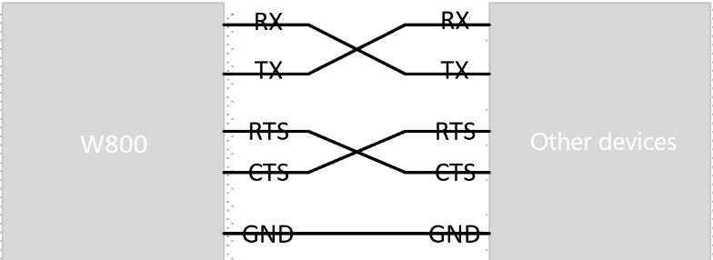

.. _uart:

UART
=============

Introduction
----------------

UART (Universal Asynchronous Receiver/Transmitter) is a hardware module used for serial communication. It is a common interface for data transmission between computers, embedded systems, microcontrollers, and other devices. UART allows two devices to exchange data over a serial port at a certain baud rate, making it a common and cost-effective way to achieve full-duplex or half-duplex data exchange between different devices.

The W800 chip supports up to 6 UART ports (the 32-pin package supports only 5 UART ports). Each UART controller can independently configure parameters such as baud rate, data bit length, bit order, number of stop bits, and parity bits, making it compatible with UART devices from different manufacturers.

The maximum baud rate supported by the UART port is 2M.

Function List
----------------

1. :ref:`Initialization <uart_init>` — Initialize the driver.
2. :ref:`Set Communication Parameters <uart_set>` — Configure baud rate, parity, hardware flow control, and stop bits.
3. :ref:`Data Write <uart_write>` — Write data to the serial port driver's buffer or send it directly through the serial port.
4. :ref:`Data Read <uart_read>` — Read data from the serial port buffer.
5. :ref:`Data Receive <uart_receive>` —  Obtain a pointer to the data block and its size from the serial port driver.
6. :ref:`Hardware Flow Control <uart_flowCtrl_func>` — Hardware flow control.

Function Overview
-----------------------

**Port**: The W800 supports up to 6 UART channels simultaneously (the 32-pin chip supports 5 UARTs).

**Parameter Configuration**: Supports commonly used baud rates, stop bits, parity, hardware flow control, with a maximum baud rate of 2Mbps.

**Supports DMA**: UART supports DMA mode, but only one UART channel can use DMA.

**Receive Buffer**: The driver uses a buffer to receive data. Upper-layer applications can read from the buffer or directly obtain pointers to data blocks and their sizes for processing.

**Transmit Buffer**: The TX buffer for sending can be initialized to 0, meaning no buffer is used, or specified as needed. Configuring it can reduce blocking time when writing to the interface.

**Events**: Supports receive and send events. Receiving an event before reading data can avoid blocking the read interface.

**Flow Control**: Supports hardware CTS and RTS flow control.

UART Hardware Connections
-----------------------------

The main connections for Uart are as follows:

.. _uart_set:

Setting Communication Parameters
----------------------------------

UART communication parameters are configured in the device table, with default parameters as shown in the table below.

=========================          ==========================
Variable                            Value
=========================          ==========================
baudrate                           WM_UART_BAUDRATE_B115200
data bits                          WM_UART_DATA_BIT_8
stop bits                          WM_UART_STOP_BIT_1
parity                             WM_UART_PARITY_NONE
flow_ctrl                          WM_UART_FLOW_CTRL_DISABLE
=========================          ==========================

UART communication parameters can also be configured dynamically by calling the ``wm_drv_uart_set_config()`` function.

Setting All Parameters at Once
^^^^^^^^^^^^^^^^^^^^^^^^^^^^^^^^^^

Call the ``wm_drv_uart_set_config()`` function and pass it a ``wm_drv_uart_config_t`` struct, which should contain all necessary parameters. Please refer to the following example:

.. code:: c

    wm_device_t *dev = wm_dt_get_device_by_name("uart2");
    wm_drv_uart_config_t uart_config={
        .baudrate=115200,
        .data_bits=WM_UART_DATA_BIT_8,
        .stop_bits=WM_UART_STOP_BIT_1,
        .parity=WM_UART_PARITY_NONE,
        .flow_ctrl=WM_UART_FLOW_CTRL_DISABLE,
    };
    wm_drv_uart_set_config(dev, &uart_config);

Configuring Each Parameter Step-by-Step
^^^^^^^^^^^^^^^^^^^^^^^^^^^^^^^^^^^^^^^^^^^^^^^^

============================== =================================== ===================================
Query/Configure Parameters             Query Function                      Configure Function
============================== =================================== ===================================
Baud Rate                        ``wm_drv_uart_get_baudrate()``       ``wm_drv_uart_set_baudrate()``
Data Bits                        ``wm_drv_uart_get_data_bits()``      ``wm_drv_uart_set_data_bits()``
Stop Bits                        ``wm_drv_uart_get_stop_bits()``      ``wm_drv_uart_set_stop_bits()``
Parity                           ``wm_drv_uart_get_parity()``         ``wm_drv_uart_set_parity()``
Flow Control Mode                ``wm_drv_uart_get_flow_ctrl()``      ``wm_drv_uart_set_flow_ctrl()``
============================== =================================== ===================================

Call the dedicated functions in the table above to configure specific parameters individually. To reconfigure a parameter, use these functions as well.

Each function in the table can use the corresponding ``wm_drv_uart_get_xxx`` function to view the current setting value. For example, to check the current baud rate value, call ``wm_drv_uart_get_baudrate()``.

.. _uart_setpin:

Communication Pin Configuration
^^^^^^^^^^^^^^^^^^^^^^^^^^^^^^^^^^^^^^^^^^

UART pins are configured by default and are currently set in the device table.

DMA Mode Configuration
^^^^^^^^^^^^^^^^^^^^^^^^^

UART supports the use of DMA, but only one port can use DMA. When configuring UART in the device table, specify the DMA controller name to enable DMA transmission.

- Interrupt Mode

    In interrupt mode, the UART module hardware RX fifo generates an interrupt request when it receives half of the data or when the TX fifo is nearly finished sending. The CPU responds to the interrupt and executes the corresponding interrupt service routine to handle data reception or transmission. Since CPU is required to move data, this method occupies CPU resources to some extent.

- DMA Mode

    DMA (Direct Memory Access) mode allows the UART module to exchange data directly with memory through the DMA controller without direct CPU intervention. During data reception,  DMA transfers data received by the UART hardware RX FIFO directly to the specified memory address. During data transmission, DMA transfers data from memory to the UART hardware TX FIFO buffer, which then sends the data out. This method uses DMA hardware to move data, eliminating the need for CPU involvement and reducing CPU load, especially when handling large amounts of data.

Main Functions
----------------

.. _uart_init:

Initializing UART
^^^^^^^^^^^^^^^^^^^

    Before using UART, call the ``wm_drv_uart_init()`` function to allocate resources for UART, using the ``wm_device_t`` struct to receive the UART device identifier. Example:

    .. code:: c

        wm_device_t *uart_dev;
        uart_dev = wm_drv_uart_init("uart2", 1024, 0);

    The first parameter specifies the device name, defined in the device table, ranging from uart0 to uart5.

    The second parameter is the size of the RX receive buffer, ranging from 128 to 65535. The driver divides the buffer into 4 blocks for alternate reception. The size of this value needs to be determined based on the application of the corresponding UART port. Generally, between 512 and 4K, when receiving a lot of data and processing may block, a larger size is needed.

    The third parameter is the TX buffer, which can be set to 0 or a value within the range of 128 to 65535. When set to 0, the driver directly uses the data buffer in the API interface for transmission and returns after completion. When not 0, the driver copies the data that the application needs to transmit into the buffer, returns immediately if copying is complete, and initiates DMA or interrupt mode transmission if not. Using a TX buffer involves an additional copy, increasing CPU load and memory usage, but the buffer allows the wm_drv_uart_write interface to return quickly, reducing interface call blocking time.

    .. warning:: After initializing UART, if ``wm_drv_uart_deinit`` is not called, calling ``wm_drv_uart_init`` again will return ``NULL``.

.. _uart_write:

Sending Data
^^^^^^^^^^^^^^^

After the data is ready for transmission, call the ``wm_drv_uart_write`` function to send the data through the serial port. If the TX buffer was set to 0 during initialization, the driver  uses the data in the interface for direct transmission and returns after complete transmission. If the TX buffer is not 0 during initialization, the data provided by the parameters will be copied to the buffer after calling this interface. It returns immediately if copying is complete, otherwise, it waits for buffer changes to continue copying and returns after all copying is complete. At the same time, the driver also synchronously sends the data in the buffer. 

Code example:

.. code:: c

    char* test_str = "This is a test string.\n";
    wm_drv_uart_write(uart_dev, (const char*)test_str, strlen(test_str));

.. _uart_read:

Receiving Data in Read Method
^^^^^^^^^^^^^^^^^^^^^^^^^^^^^^^^

  The read method uses the ``wm_drv_uart_read`` function to read data. This interface copies data from the driver buffer to the specified buffer. If the received data is insufficient, it waits for a timeout and returns when one of the following conditions is met:

- The specified length is read.
- The specified wait timeout is reached.
- The other end has stopped sending.

Example:

.. code:: c

    uint8_t buf[32];
    int len;

    len = wm_drv_uart_read(uart_dev, (uint8_t *)buf, (uint32_t)sizeof(buf), 1000);
    if (len > 0) {
        printf("%.*s\n", (int)len, (char*)buf);
    }

.. _uart_receive:

Receiving Data in receive_data  Method
^^^^^^^^^^^^^^^^^^^^^^^^^^^^^^^^^^^^^^^^^^^^^^^^^^

   In receive_data mode, use the ``wm_drv_uart_receive_data``interface function to directly obtain the data pointer and data block length from the driver buffer. After obtaining , it can directly process the data or copy it away. 
   After processing, call the ``wm_drv_uart_release_data`` interface to release the pointer,ensuring a complete match between acquisition and release. Compared to reading data using the ``wm_drv_uart_read()`` interface, this method does not require copying and allows direct processing of data processing.

   Example:

   .. code:: c

       uint8_t* pbuf;
       uint32_t len;

       if (wm_drv_uart_receive_data(uart_dev, &pbuf, &len) == WM_ERR_SUCCESS) {
           printf("%.*s\n", (int)len, (char*)pbuf);
           wm_drv_uart_release_data(uart_dev, pbuf, len);
        }

Events
^^^^^^^^^^^^^

   UART events include TX events, RX events, and error events, defined as follows:

   .. code:: c

    typedef enum {
        WM_DRV_UART_TX_DONE,  /**< If tx_buf_size is specified, the Uart driver has sent some buffer data to the hardware fifo.
                                The user can now write another packet to the uart buffer.
                                If tx_buf_size is not specified, the Uart driver has sent the written data to the hardware fifo.*/
        WM_DRV_UART_RX_READY, /**< RX data ready ,some data is cached in uart buffer, The user can read it now */
        WM_DRV_UART_RX_ERROR, /**< RX error           */
    } wm_drv_uart_evt_type_t;

 To receive RX events, you need to register a callback function by calling the the ``wm_drv_uart_register_callback`` interface. Receiving and processing events is not mandatory, but if non-blocking data reception is needed, register the callback and receive events. Normally, calling the ``wm_drv_uart_read()`` interface may block if there is no data in the driver buffer. However, receiving the ``WM_DRV_UART_RX_READY`` event first and then reading will avoid blocking.

.. _uart_flowCtrl_func:

Hardware Flow Control Mode
^^^^^^^^^^^^^^^^^^^^^^^^^^^^^^^

=========================          ===================
flow_ctrl                          Mode
=========================          ===================
WM_UART_FLOW_CTRL_DISABLE          Disabled
WM_UART_FLOW_CTRL_RTS              Enable RTS
WM_UART_FLOW_CTRL_CTS              Enable CTS
WM_UART_FLOW_CTRL_RTS_CTS          Enable RTS and CTS
=========================          ===================

W800 UART supports hardware flow control using RTS/CTS. The main purpose of flow control is to prevent data in the UART fifo from being lost due to software not processing it in time. RTS and CTS are used in pairs.

The UART module supports hardware flow control functionality, automatically adjusting the data transmission rate through the RTS (Request To Send) and CTS (Clear To Send) signal lines. When the receive buffer is near full, the CTS signal is raised to notify the sender to pause data transmission. When the receiver is ready to accept more data and the hardware FIFO data is below the set value, the CTS signal is lowered. This mechanism effectively prevents data loss and receiver buffer overflow.

In UART communication, additional signal lines are used to control the transmission of data flow, preventing data loss or overflow. Hardware flow control is achieved using **RTS (Request To Send)** and **CTS (Clear To Send)** signals, typically controlled directly by the UART hardware module. If hardware flow control is disabled, software flow control can be set using the ``uart_set_flow_ctrl()`` function by passing the UART device identifier and flow control parameters.

Hardware flow control is disabled by default. It can be enabled by calling ``wm_drv_uart_set_flow_ctrl`` or ``wm_drv_uart_set_config``.

.. _uart_deinit:

Deinitializing UART
^^^^^^^^^^^^^^^^^^^^^^^^^^^

If UART communication is no longer needed, call the ``wm_drv_uart_deinit()`` function to remove the driver and release allocated resources.

Notes
----------------------------

.. note:: DMA mode is configured in the device table, and only one UART can use DMA. If both uart2 and uart3 are configured for DMA, only the first initialized port will use DMA mode for transmission.

.. warning:: In DMA mode, if the TX buffer size is set to 0 during initialization, the ``wm_drv_uart_write`` interface does not support sending data from flash addresses, such as variables defined as const and string constants.

Application Example
-------------------------

For basic examples of using UART, refer to :ref:`examples/peripheral/uart<uart_example>`

API Reference
-----------------
For related UART APIs, refer to:

:ref:`label_api_uart`
