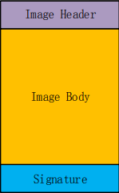
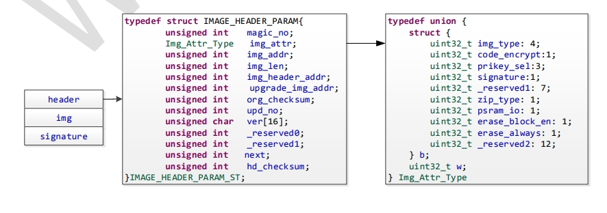

.. _firmware_format:

Firmware Format
=====================================

Firmware can be divided into single .img file and .fls file composed of multiple.img files:

- .img file is the smallest programming unit, and a single .img file can be programmed to a specific address in flash memory.

- .fls file represents a complete firmware package, which is flatly composed of multiple .img files without requiring any specific order among them.

Generally speaking, it is recommended to use .fls files for programming due to their simplicity.

.img File Format
------------------

An image consists of three parts: Header, Body, and Digital Signature (as shown in the figure).

Image Header
>>>>>>>>>>>>>>>>>>>>>>>>

    The W800 Image Header contains information such as the magic number, Image attributes, Image start address, Image length, Image header location, Image upgrade address, Image CRC check, Image decryption information, digital signature, and compression information.

Description of Each Field in the Image Header 
::::::::::::::::::::::::::::::::::::::::::::::::::::::

.. list-table::
   :widths: 20 30
   :align: center

   * - Field
     - Description

   * - magic_no
     - Magic Word, Fixed value 0xA0FFFF9F

   * - img_attr
     - Img_Attr_Type, IMAGE Attribute

   * - img_addr
     - The running position of the Image area in flash memory

   * - img_len
     - The byte length of the Image area

   * - img_header_addr
     - The position of the IMAGE header in flash memory

   * - upgrade_img_addr
     - The upgrade area address, which is the storage position of the upgrade IMAGE header in flash memory

   * - org_checksum
     - The crc32 result of the Image body

   * - upd_no
     - Upgrade version number, with a larger value indicating a newer version;
       when the version number is 0xFFFFFFFF, any version of the firmware can be upgraded

   * - ver
     - Image version number,in string format

   * - next
     - The position of the next image header in flash memory (optional)

   * - hd_checksum
     - The crc32 value of the above fields in the Image header

Image Attribute
::::::::::::::::::::::::::::::::::::::::::::

.. list-table:: 
   :widths: 10 10 50
   :align: center

   * - Field
     - Bit
     - Description

   * - img_type
     - 4
     - 0x0: Bootloader;
       0x1: User Image;
       0xE: Factory Test (FT) Program;
       other values: User-defined

   * - code_encrypt
     - 1
     - 0: Firmware is stored in plaintext;
       1: Firmware is encrypted by the customer before storage

   * - pricey_sel
     - 3
     - The chip has 8 built-in RSA private keys for decrypting the encrypted firmware key,
       The user can select any one to use, with a value range of 0 to 7.

   * - signature
     - 1
     - 0: IMAGE does not contain a signature section;
       1: IMAGE contains a 128-byte signature

   * - reserved
     - 7
     - Reserved

   * - gzip_enable
     - 1
     - 0: GZIP compression is not enabled;
       1: The image area is a GZIP compressed file (currently not supported, only XZ with higher compression rates is supported)

   * - erase_block_en
     - 1
     - 0: Does not support 64KB Block erasure; 1: Supports Block erasure

   * - erase_always
     - 1
     - 0: Before erasing a Sector or Block, check if the flash is all F, If the Sector or Block is all F, no erasure operation is performed; 1: Always erase before writing

   * - compress_type
     - 2
     - 0: No compression 1: The image area is part of the XZ compressed file; (Currently only supports XZ with a higher compression ratio)

   * - reserved
     - 10
     - Reserved

Image Body
>>>>>>>>>>>>>>>>>>>>>>>>

.. list-table:: 
   :widths: 30 30 30 30
   :align: center

   * - Encryption
     - Compression
     - Image Body Content 
     - Purpose

   * - X
     - X
     - Original Image Content
     - Bootloader, User Image

   * - X
     - √
     - Compressed Original Image Content
     - User Image

   * - √
     - X
     - Original Image Content after Encryption + Encryption Information (Applicable to) Bootloader
     - Bootloader

   * - √
     - √
     - Compressed and Encrypted Original Image Content + Encryption Information(Applicable to) Bootloader
     - User Image

**Digital Signature**
>>>>>>>>>>>>>>>>>>>>>>>>

    If the signature attribute in the Image Header is set, it indicates that the firmware contains a digital signature.
    
    The digital signature is for the file composed of both the Image Header and Image Body.

.fls File Format
-------------------

.. figure:: ../../_static/component-guides/firmware_format/fls_format.png
    :align: center
    :width: 40% 
    :alt: Figure 5-1

The SoC distinguishes the current burning location based on the header.
