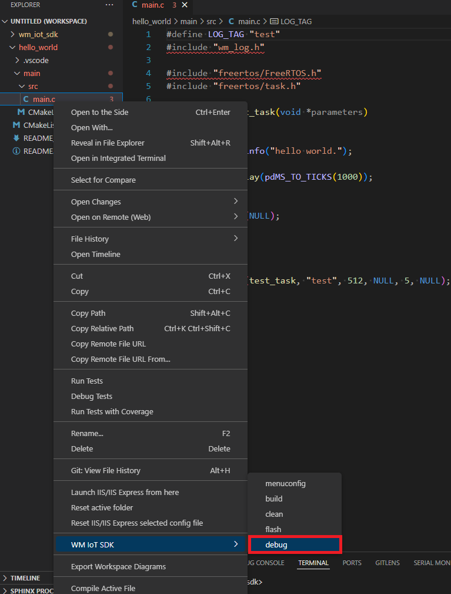
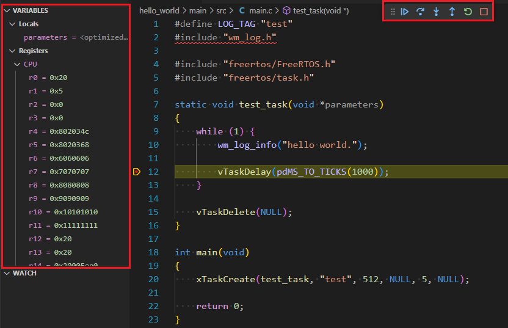

**IDE Debugging Guide**
------------------------------------------

For IDE environment installation, please refer to :ref:`IDE Compilation Environment <ide>`。

VS Code Debugging
^^^^^^^^^^^^^^^^^^^^^^^

After connecting the cklink debugger, open VS Code.

Right-click on the project file and select the Debug command to start debugging.

Alternatively,you can also select the Debug command from the WM IOT SDK tool in the bottom status bar to start debugging.

Debugging with breakpoints using VS Code is illustrated in the figure below:

