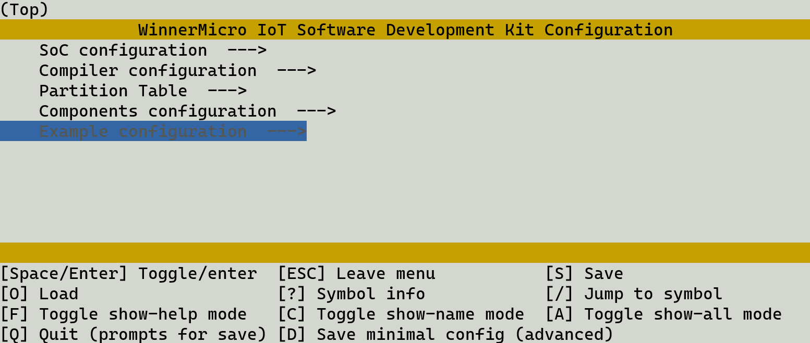

Kconfig Configuration
*********************

Introduction
============

Kconfig provides a project configuration mechanism at compile time, along with various types of configuration options (such as integers, strings, boolean and more).
The Kconfig file specifies the dependencies, default values, and combinations among options.
The WM IoT SDK  utilizes the kconfiglib_ package, which is a Python extension for the Kconfig_ system.

To understand all available features, please refer to the documentation Kconfig_ and `kconfiglib extension`_.

Configuration Menu
==================

Users can open the project configuration menu in the terminal and configure the project via ``wm.py menuconfig`` .

At the bottom of the menuconfig interface, there are instructions on how to operate the interface, which you can read to understand.  
The most commonly used operations are: using the H, J, K, L keys to move the cursor(or using the keyboard arrow keys),  pressing the spacebar to select or deselect, pressing Enter to select or enter the next level of menu (option), and pressing ESC to exit or return to the previous menu.  
After making configuration changes, please press the S key to save the configuration. Otherwise, all  modifications will be lost when you exit the menu. The save path that pops up after pressing the S key does not need to be modified; just press Enter to confirm.

The configuration is saved in the ``build\config\wmsdk.config`` file in the project root directory, and the ``build\config\wmsdk_config.h`` file is generated in the build directory.  
Therefore, deleting the ``build\config`` folder will restore default configuration for the current project.

Please note that the menuconfig interface only supports keyboard operations and does not support using a mouse. If you want to use a mouse, please enter ``wm.py guiconfig`` to configure the project.

Default Project Configuration
=============================

Although Kconfig provides default configurations for each option, different projects may still require specific some unique configurations.  
Therefore, to allow each project to have its own default configuration, the WM IoT SDK can place a ``prj.config`` file in the project root directory.  
When the ``menuconfig`` interface is opened, the configuration in the ``prj.config`` file will be loaded, displaying the current project's configuration, which will take effect during the compilation.

When the user makes changes in the ``menuconfig`` interface and saves the configuration, the ``build\config\wmsdk.config`` file will still be generated, and subsequent configurations will be based on``wmsdk.config``.  
For a project, the priority of the final effective Kconfig configuration file priority is ``wmsdk.config`` > ``prj.config`` > ``Kconfig``.

The format of the ``prj.config`` file is the same as ``wmsdk.config``. It can be generated  by executing the ``wm.py saveconfig`` command after configuring the project, or it can be edited and generated manually.

Configuration Options
=====================

According to general usage habits, all option names are in uppercase letters with underscores.
When Kconfig generates the ``wmsdk.config`` and ``wmsdk_config.h`` files, the generated option option names will have a ``CONFIG_`` prefix. In the ``wmsdk_config.h`` file, the options will be defined as macros with the ``CONFIG_`` prefix.  
For example, if the Kconfig file defines the ``ENABLE_FOO`` option and the option is selected in ``menuconfig``, then ``wmsdk.config`` and ``wmsdk_config.h`` files will also define ``CONFIG_ENABLE_FOO``, and for ``wmsdk_config.h`` file, it will be defined as ``#define CONFIG_ENABLE_FOO``.

When programming, users can include ``wmsdk_config.h`` in their .c or .h files to reference the macros generated  in  Kconfig, for example:

::

  #include "wmsdk_config.h"

Please note that due to the different selected options, some options may not be visible by default in the ``menuconfig`` interface.

.. _Kconfig: https://www.kernel.org/doc/Documentation/kbuild/kconfig-language.txt
.. _kconfiglib: https://github.com/ulfalizer/Kconfiglib
.. _kconfiglib extension: https://pypi.org/project/kconfiglib/#kconfig-extensions