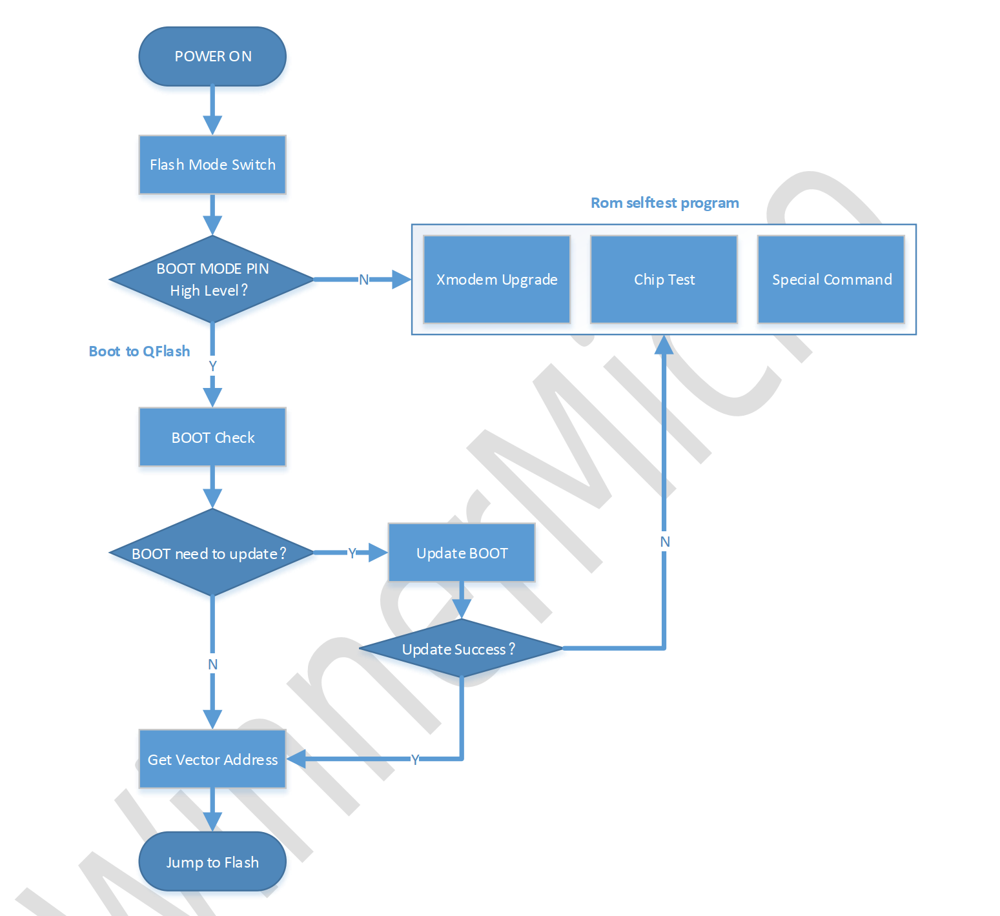
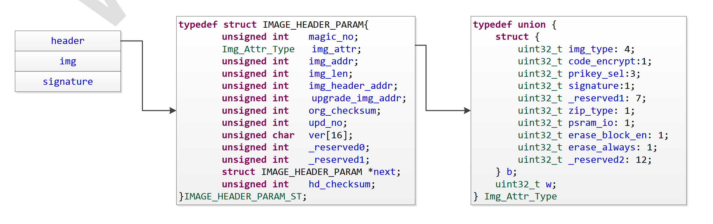

.. _rom_function:

ROM
==============

Introduction
----------------

Overview
~~~~~~~~~~~~~~~~

.. only:: w800
    
    This document provides a brief description of the ROM functionality and usage instructions for developers and designers to understand the function of ROM.

Definition of Terms
~~~~~~~~~~~~~~~~~~~~~~

.. list-table:: 
   :widths: 25 25 
   :header-rows: 0
   :align: center

   * - CRC
     - Cyclic Redundancy Check

   * - IMAGE
     - Binary File

   * - MAC
     - Medium Access Control

   * - QFLASH
     - Quad-SPI Flash

   * - RAM
     - Read-Write Memory

   * - ROM 
     - Read-Only Memory

   * - UART
     - Universal Asynchronous Receiver/Transmitter
	 
	 
Basic Funtions of ROM
--------------------------

ROM Flowchart
~~~~~~~~~~~~~~~

    figure 2-1

Bootloader Program
~~~~~~~~~~~~~~~~~~~~~

QFLASH Self-test
^^^^^^^^^^^^^^^^^^^^^^^^

Complete QFLASH work status check

QFLASH Mode Switch
^^^^^^^^^^^^^^^^^^^^^^^^

After ROM startup, QFLASH is in 1-line mode by default. To enable the program to run on QFLASH, ROM needs to switch QFLASH to 4-wire mode.

IMAGE Verification
^^^^^^^^^^^^^^^^^^^^^^^^

Complete IMAGE header verification and IMAGE content verification

Vector Table Redirection
^^^^^^^^^^^^^^^^^^^^^^^^^^^^

.. only:: w800

    The W800 program ultimately needs to run in QFLASH (code base address: 0x8000000), so it is necessary to redirect the vector table.

The redirection address rule: (exception vector+interrupt) There are a total of 64 words, and according to the VBR register requirements, the vector table address must be an integer multiple of 0x400.

Upgrade Program
~~~~~~~~~~~~~~~~~~~~

Using the Xmodem protocol to upgrade IMAGE to QFLASH or memory area, the upgraded Image will jump to memory execution after the upgrade is completed, and the upgraded FLASH will need to be restarted before jumping to execution.

Upgrade IMAGE format:

    figure 2-2

.. only:: w800

    The IMAGE of W800 includes three parts: header, image area, and signature. The header contains contents such as magic_no, imd_attr, etc., where imd_attr is a Uint32 type that includes fields such as imd_type and code_crypt.

    Description of the IMAGE header field for W800:

    .. list-table:: 
        :widths: 25 25
        :header-rows: 0
        :align: center

        * - Field
          - Description

        * - magic_no
          - Magic number, fixed value 0xA0FFFF9F 

        * - img_attr
          - Img_Attr_Type, IMAGE Attribute

        * - img_addr
          - Location of the Image area in flash memory, running position

        * - img_len
          - Length of the Image area in bytes

        * - img_header_addr
          - Location of the IMAGE header in flash memory

        * - upgrade_img_addr 
          - Upgrade area address, storage location of the upgrade IMAGE header in flash memory

        * - org_checksum
          - CRC32 checksum result of the Image area

        * - upd_no
          - Upgrade version number, higher value indicates a newer version; if the version number is 0xFFFFFFFF, any firmware version can be upgraded

        * - ver
          - Image version number, string

        * - next
          - The location of the subsequent Image header within the flash memory

        * - hd_checksum
          - The crc32 checksum value for the aforementioned fields within the image header

    Descriptions of the IMAGE Attribute Field for W800:

    .. list-table::
        :widths: 25 25 25
        :header-rows: 0
        :align: center

        * - Field
          - Bit
          - Description

        * - img_type
          - 4
          - 0x0: bootloader;
            
            0xE: ft test program;
            
            other values: user-defined

        * - code_encrypt
          - 1
          - 0: Firmware stored in plaintext; 1：Firmware stored after being encrypted by the customer

        * - pricey_sel
          - 3
          - The chip has 8 sets of built-in RSA private keys for decrypting the encrypted firmware key. Users can choose any set, with a value range of 0-7

        * - signature
          - 1
          - 0: IMAGE does not include a signature part;1：IMAGE includes a 128-byte signature

        * - reserved
          - 7
          - Reserved

        * - gzip_enable
          - 1
          - 0: GZIP compression is not enabled;
            1: The image area is part of the GZIP compressed file; (Currently does not support GZIP, only supports the higher compression ratio XZ)

        * - erase_block_en
          - 1
          - 0: Does not support 64KB Block erasure; 1: Supports Block erasure
        
        * - erase_always
          - 1
          - 0: Before erasing a Sector or Block, check if the flash is all F, If the Sector or Block is all F, no erasure operation is performed; 1: Always erase before writing
        
        * - compress_type
          - 2
          - 0: No compression 1: The image area is part of the XZ compressed file; (Currently only supports XZ with a higher compression ratio)
        
        * - reserved
          - 10
          - Reserved

    W800 Flash Area Partitioning:

    .. figure:: ../../_static/component-guides/rom/flash_regionalism_en.png
        :align: center
        :alt: Flash Area Partitioning

        figure 2-3

The ROM program uses the upgrade_area_addr parameter to determine if the img_type of the first header is a secure boot. If it is, it verifies the CRC and signature of both the header and the img, compares the version numbers, and if the verification passes and the version is newer, it moves the header to the img_header_addr address and the img along with its signature to the img_addr address.

The ROM program locates the img header of the bootloader program based on the img_header_addr parameter. After successfully verifying the CRC and signature of the imge header and imge, it jumps to img_addr to execute the bootloader.

The bootloader program uses the upgrade_area_addr parameter to iterate through the headers until it finds a header with an img_type indicating an img. Then, similar to the ROM program, it moves the header to the next_img_addr address and the img along with its signature to the img_addr address.

The upgrade area can support multiple img upgrades, including the bootloader, by placing the programs to be upgraded end-to-end at the upgrade_area_addr address.

For img with compress_type=1 in their headers, the img part is the result of XZ compression applied to the original img's header, img, and signature. Decompression is required before moving the img. The bootloader does not support compression.

OTP Parameter Area
~~~~~~~~~~~~~~~~~~~~

.. only:: w800
    
    The W800 OTP parameter area stores some parameters related to firmware upgrades and signature verification.

Test Program
~~~~~~~~~~~~~~~~~~~

.. only:: w800
    
   The test programs for the W800 chip during the testing phase are not stored in ROM. Prior to testing, they need to be upgraded into memory or Flash via UART XMODEM for execution.

Operational Commands
~~~~~~~~~~~~~~~~~~~~~~~

.. only:: w800
    
    The ROM program of the W800 supports several operations during the module production phase, including baud rate switching, QFLASH ID and capacity acquisition, ROM version retrieval, system reboot, etc.

    Instruction sending method: Hexadecimal.
    

Command List
^^^^^^^^^^^^^^^^^^^^

.. list-table:: 
    :widths: 25 25 25 25
    :header-rows: 0
    :align: center

    * - Function
      - Sub-Command
      - Data Segment
      - Description

    * - Baud rate switching
      - 0x31
      - ≤2000000
      - Baud rate can be set up to 2M. Setting above 2M returns S (command parameter error)
        
    * - QFlash erase
      - 0x32
      - 4bytes
      - struct  {

            uint16_t index;

            uint16_t count; 

        }; 

        index: start position (index highest bit is 1 for block erase, 0 for sector erase)

        count: number of blocks to erase

    * - Set BT MAC Address
      - 0x33
      - 6bytes~8bytes
      - 

    * - Get BT MAC Address
      - 0x34
      - None
      - 

    * - Set GAIN Parameters 
      - 0x35
      - 84bytes
      - Gain parameters used during Wi-Fi transmission (``use with caution``)

    * - Get GAIN Parameters 
      - 0x36
      - None
      - Read the length set gain value.

    * - Set MAC Address
      - 0x37
      - 6bytes~8bytes
      - 

    * - Get MAC Address
      - 0x38
      - None
      - 

    * - Get the Last Error
      - 0x3B
      - None
      - Get the last error information until the next operation clears it.

    * - Get QFLASH ID and Capacity
      - 0x3C
      - None
      - For example, GD 32MB returns: FID:C8,19
        
        PUYA 8MB returns: FID:85,17

    * - Get ROM Version
      - 0x3E
      - None
      - 

    * - System Reboot
      - 0x3F
      - None
      - 

Common Command Set
^^^^^^^^^^^^^^^^^^^^^^

Baud Rate Change:

  2M setting command: 21 0a 00 ef 2a 31 00 00 00 80 84 1e 00 

  1M setting command: 21 0a 00 5e 3d 31 00 00 00 40 42 0f 00 
  
  921600 setting command: 21 0a 00 5d 50 31 00 00 00 00 10 0e 00 
  
  460800 setting command: 21 0a 00 07 00 31 00 00 00 00 08 07 00 
  
  115200 setting command: 21 0a 00 97 4b 31 00 00 00 00 c2 01 00 

Get BT MAC Address:  21 06 00 D8 62 34 00 00 00
 
Get WiFi MAC Address: 21 06 00 ea 2d 38 00 00 00

Get the last Error: 21 06 00 36 B6 3B 00 00 00 

Get QFLASH ID and Capacity:  21 06 00 1b e7 3c 00 00 00 

Get ROM Version: 21 06 00 73 0a 3e 00 00 00 

System Reboot:  21 06 00 c7 7c 3f 00 00 00 

QFlash Erase (1M):  21 0a 00 e2 25 32 00 00 00 02 00 fe 00 

QFlash Erase (2M):  21 0a 00 c3 35 32 00 00 00 02 00 fe 01 

ROM Error Codes
~~~~~~~~~~~~~~~~~~~~~~

During the ROM boot process, if an abnormality is encountered, it will enter an infinite loop program on the "right side" of the ROM (typically referring to a specific section of the ROM's error handling routine). An error code will then be printed, indicating the current error information encountered. This allows users to analyze and identify the issue they are facing.

The definition of error codes is as follows:

.. table::
    :widths: 25 25
    :align: center

    +--------------------+----------------------------------+
    |    Error codes     |          Description             |
    +====================+==================================+
    |         C          |          Normal                  |
    +--------------------+----------------------------------+
    |            Upgrade Process (XMODEM Protocol)          |
    +--------------------+----------------------------------+
    |         D          |        Host Cancellation         |
    +--------------------+----------------------------------+
    |         F          |   No data received after timeout |
    +--------------------+----------------------------------+
    |         G          |      Package number incorrect    |
    +--------------------+----------------------------------+
    |         I          |      IMAGE too large             |
    +--------------------+----------------------------------+
    |         J          | IMAGE burning address is illegal |
    +--------------------+----------------------------------+
    |         K          |   IMAGE page is not aligned      |
    +--------------------+----------------------------------+
    |         L          |   IMAGE head verification error  |
    +--------------------+----------------------------------+
    |         M          | IMAGE content verification error |
    +--------------------+----------------------------------+
    |         P          |    IMAGE incomplete or missing   |
    +--------------------+----------------------------------+
    |                 Start up process                      |
    +--------------------+----------------------------------+
    |         N          |   FLASH ID self check failed     |
    +--------------------+----------------------------------+
    |         Q          |       Firmware type error        |
    +--------------------+----------------------------------+
    |         L          | SECBOOT head verification error  |
    +--------------------+----------------------------------+
    |         M          |    SECBOOT verification error    |
    +--------------------+----------------------------------+
    |         Y          | Decryption reading SECBOOT failed|
    +--------------------+----------------------------------+
    |         Z          |  Signature verification failed   |
    +--------------------+----------------------------------+
    |                 Functional module                     |
    +--------------------+----------------------------------+
    |         R          |      Command verification error  |
    +--------------------+----------------------------------+
    |         S          |      Command parameter error     |
    +--------------------+----------------------------------+
    |         T          |  Failed to obtain FT parameters  |
    +--------------------+----------------------------------+
    |         U          |       Failed to set gain         |
    +--------------------+----------------------------------+
    |         V          |       Setting MAC failed         |
    +--------------------+----------------------------------+

QFLASH and RAM Usage
-------------------------

QFLASH Layout
~~~~~~~~~~~~~~~~~~~

.. only:: w800
    
    The W800 supports a four-address mode with a maximum capacity of 128MB Flash, but the ROM program only supports a three-address mode, which allows for a maximum address access of 16MB . 
    
    From the ROM's perspective, the QFLASH layout is as follows:

    .. figure:: ../../_static/component-guides/rom/qflash_layout.png
        :align: center
        :alt: QFLASH layout

        figure 3-1

The Use of RAM
~~~~~~~~~~~~~~~~~

.. only:: w800
    
    The memory of W800 is divided into two parts: 160Kbyte and 128Kbyte. The distribution of ROM is as follows:

    .. table::
        :widths: 25 25 25 25 25 25
        :align: center

        +--------------------+-----------------------+---------------------+---------------------+----------+--------------+
        |    Memory block    |      Function         |    Starting address | Termination Address |   Size   | Description  |
        +====================+=======================+=====================+=====================+==========+==============+
        |      160Kbyte      |       Stack&Heap      |      0x20000000     |      0x20003FFF     |  16Kbyte |   ROM Usage  |
        |                    +-----------------------+---------------------+---------------------+----------+--------------+
        |                    |           NC          |      0x20004000     |      0x20027FFF     |  144Kbyte|      NC      |
        +--------------------+-----------------------+---------------------+---------------------+----------+--------------+
        |      128Kbyte      |           NC          |      0x20028000     |      0x20047FFF     |  128Kbyte|      NC      |
        +--------------------+-----------------------+---------------------+---------------------+----------+--------------+

