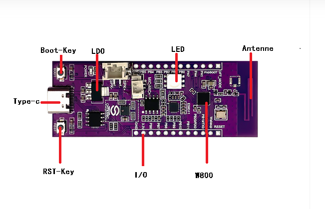
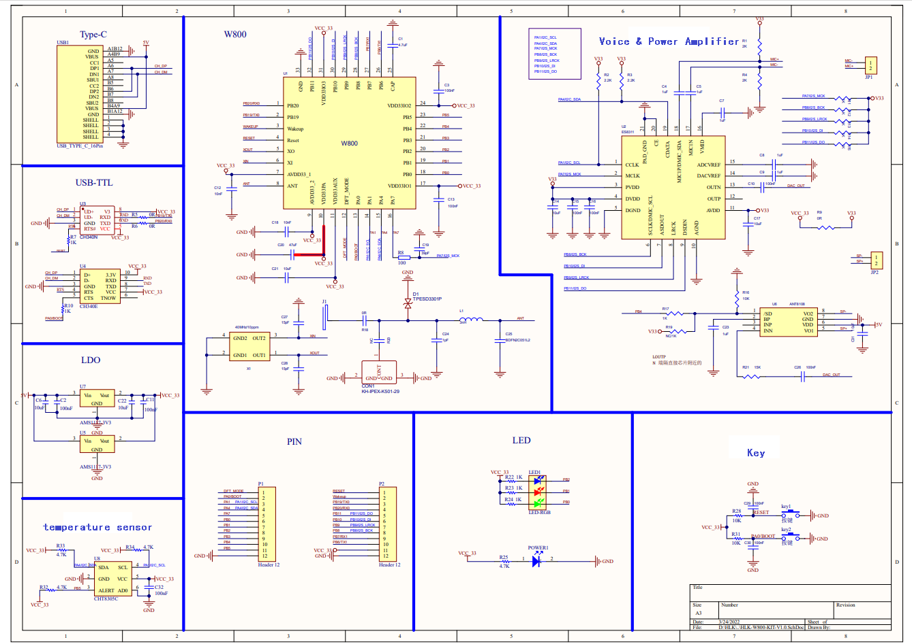
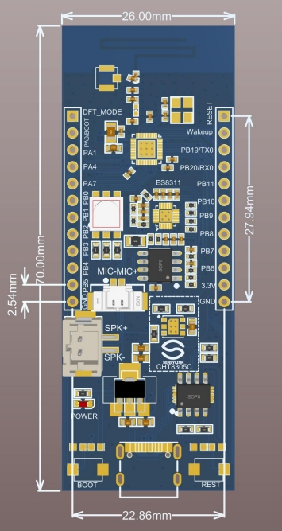

HLK-W800-KIT Getting Started Guide
=======================================

Preparation
--------------

- HLK-W800-KIT Development Board

- Type-C Cable

- USB Serial Driver （`Click to download the CH34X driver <https://doc.winnermicro.net/download/tools/all/CH341SER.zip>`_）

- PC (Windows, Linux, or macOS)

You can skip the introduction and go directly to the :ref:`Application Development<application-program-w800>` section.

Overview
--------------------------

The HLK-W800-KIT is a multifunctional development board produced by Hailingke Electronics, featuring the W800 and equipped with an RGB trichromatic light, as well as integrating the CHT8305C temperature and humidity sensor. 
This board allows users to study and research the development of embedded systems and IoT products, facilitating the creation and development of your own IoT products. 
It enables rapid mass production for a wide range of IoT applications including smart appliances, smart homes, smart toys, wireless audio-video devices, industrial control, and more, thus saving your valuable time.

Function Description
--------------------------

The main components, interfaces, and control methods of the HLK-W800-KIT development board are as follows.

The main components of the HLK-W800-KIT development board are described in the table below (clockwise from the top left corner).

.. list-table:: 
   :widths: 25 25 
   :header-rows: 0
   :align: center

   * - Main Component
     - Basic Description

   * - BOOT-Key
     - The download and usage button allows users to enter the download mode by pressing the BOOT button, then plugging the USB cable into the UART0 port, and releasing the BOOT button afterward.

   * - LDO
     - 5V to 3.3V LDO chip.

   * - LED
     - The trichromatic LED is provided for users to conveniently debug PWM. To use it, flip the K1 switch to the ON position; when not in use, flip it to the OFF position.

   * - Antenna
     - The development board features an onboard antenna and also supports an external antenna.

   * - W800
     - Three-color LED for user debugging of PWM. Set the K1 switch to the ON position when using, and to the OFF position when not in use.

   * - I/O
     - All pins of the W800 are led out to the pin headers on the development board. Users can program the W800 to achieve functions such as PWM, ADC, DAC, I2C, and I2S. For details, see :ref:`Pin Descriptions<base-pin-w800>`。

   * - RST-Key
     - System Reset Button

   * - TYPE-C
     - The default USB port on the development board can serve as either the power supply for the board or as a communication interface connecting the PC and the development board.

Power Options
--------------------------

The development board can be powered by any of the following three methods:

- Type-c power supply (default).
- 5V / GND pin power supply.
- 3.3V / GND pin power supply.

.. warning:: 

    The above power supply modes **cannot be connected simultaneously**, otherwise the development board or power supply may be damaged.

.. _base-pin-w800:

Pin Descriptions
--------------------------

The table below introduces the **name** and **functions** of the I/O pins on the development board.  For the specific layout, see the :ref:`Development Board Schematic and Layout Diagram<schematic-diagram-w800>` section.

.. list-table:: 
   :widths: 25 25 25 25 25 25 25 25
   :header-rows: 0
   :align: center

   * - Number.
     - Name
     - Type
     - Pin Function After Reset
     - Multiplexing Function
     - Maximum Frequency
     - Pull-up/Pull-down Capability
     - Drive Capability

   * - 1
     - PB_20
     - I/O
     - UART_RX
     - UART0_RX/PWM1/UART1_CTS/I²C_SCL
     - 10MHz
     - UP/DOWN
     - 12mA

   * - 2
     - PB_19
     - I/O
     - UART_TX
     - UART0_TX/PWM0/UART1_RTS/I²C_SDA
     - 10MHz
     - UP/DOWN
     - 12mA

   * - 3
     - WAKEUP
     - I
     - WAKEUP wake-up function
     - 
     - 
     - DOWN
     - 

   * - 4
     - RESET
     - I
     - RESET reset
     - 
     - 
     - UP
     - 

   * - 5
     - XTAL_OUT
     - O
     - External crystal oscillator output
     - 
     - 
     - 
     - 

   * - 6
     - XTAL_IN
     - I
     - External crystal oscillator input
     - 
     - 
     - 
     - 

   * - 7
     - AVDD33
     - P
     - Chip power supply, 3.3V
     - 
     - 
     - 
     - 

   * - 8
     - ANT
     - I/O
     - RF antenna
     - 
     - 
     - 
     - 

   * - 9
     - AVDD33
     - P
     - Chip power supply, 3.3V
     - 
     - 
     - 
     - 

   * - 10
     - AVDD33
     - P
     - Chip power supply, 3.3V
     - 
     - 
     - 
     - 

   * - 11
     - AVDD33_AUX
     - P
     - Chip power supply, 3.3V
     - 
     - 
     - 
     - 

   * - 12
     - TEST
     - I
     - Test function configuration pin
     - 
     - 
     - 
     -

   * - 13
     - BOOTMODE
     - I/O
     - BOOTMODE
     - I²S_MCLK/LSPI_CS/PWM2/I²S_DO
     - 20MHz
     - UP/DOWN
     - 12mA

   * - 14
     - PA_1
     - I/O
     - JTAG_CK
     - JTAG_CK/I²C_SCL/PWM3/I²S_LRCK/ADC0
     - 20MHz
     - UP/DOWN
     - 12mA

   * - 15
     - PA_4
     - I/O
     - JTAG_SWO
     - JTAG_SWO/I²C_SDA/PWM4/I²S_BCK/ADC1
     - 20MHz
     - UP/DOWN
     - 12mA

   * - 16
     - PA_7
     - I/O
     - GPIO, input, high impedance
     - PWM4/LSPI_MOSI/I²S_MCK/I²S_DI /Touch0
     - 20MHz
     - UP/DOWN
     - 12mA

   * - 17
     - VDD33IO
     - P
     - IO power, 3.3V
     - 
     - 
     - 
     -

   * - 18
     - PB_0
     - I/O
     - GPIO, input, high impedance
     - PWM0/LSPI_MISO/UART3_TX/PSRAM_CK/Touch3
     - 80MHz
     - UP/DOWN
     - 12mA

   * - 19
     - PB_1
     - I/O
     - GPIO, input, high impedance
     - PWM1/LSPI_CK/UART3_RX/PSRAM_CS/Touch4
     - 80MHz
     - UP/DOWN
     - 12mA

   * - 20
     - PB_2
     - I/O
     - GPIO, input, high impedance
     - PWM2/LSPI_CK/UART2_TX/PSRAM_D0/Touch5
     - 80MHz
     - UP/DOWN
     - 12mA

   * - 21
     - PB_3
     - I/O
     - GPIO, input, high impedance
     - PWM3/LSPI_MISO/UART2_RX/PSRAM_D1/Touch6
     - 80MHz
     - UP/DOWN
     - 12mA

   * - 22
     - PB_4
     - I/O
     - GPIO, input, high impedance
     - LSPI_CS/UART2_RTS/UART4_TX/PSRAM_D2/Touch7
     - 80MHz
     - UP/DOWN
     - 12mA

   * - 23
     - PB_5
     - I/O
     - GPIO, input, high impedance
     - LSPI_MOSI/UART2_CTS/UART4_RX/PSARM_D3/Touch8
     - 80MHz
     - UP/DOWN
     - 12mA

   * - 24
     - VDD33IO
     - P
     - IO power supply, 3.3V
     - 
     - 
     - 
     - 

   * - 25
     - CAP
     - I
     - External capacitor, 4.7µF
     - 
     - 
     - 
     - 

   * - 26
     - PB_6
     - I/O
     - GPIO, input, high impedance
     - UART1_TX/MMC_CLK/HSPI_CK/SDIO_CK/Touch9
     - 50MHz
     - UP/DOWN
     - 12mA

   * - 27
     - PB_7
     - I/O
     - GPIO, input, high impedance
     - UART1_RX/MMC_CMD/HSPI_INT/SDIO_CMD/Touch10
     - 50MHz
     - UP/DOWN
     - 12mA

   * - 28
     - PB_8
     - I/O
     - GPIO, input, high impedance
     - I²S_BCK/MMC_D0/PWM_BREAK/SDIO_D0/Touch11
     - 50MHz
     - UP/DOWN
     - 12mA

   * - 29
     - PB_9
     - I/O
     - GPIO, input, high impedance
     - I²S_LRCK/MMC_D1/HSPI_CS/SDIO_D1/Touch12
     - 50MHz
     - UP/DOWN
     - 12mA

   * - 30
     - PB_10
     - I/O
     - GPIO, input, high impedance
     - I²S_DI/MMC_D2/HSPI_DI/SDIO_D2
     - 50MHz
     - UP/DOWN
     - 12mA

   * - 31
     - VDD33IO
     - P
     - IO power supply, 3.3V
     - 
     - 
     - 
     - 

   * - 32
     - PB_11
     - I/O
     - GPIO, input, high impedance
     - I²S_DO/MMC_D3/HSPI_DO/SDIO_D3
     - 50MHz
     - UP/DOWN
     - 12mA

   * - 33
     - GND
     - P
     - Grounding
     - 
     - 
     - 
     - 

.. _application-program-w800:

Application Development
--------------------------

Before powering on the HLK-W800-KIT, please first confirm that the development board is intact.

Now, proceed to the Quick Start Guide section on :ref:`Set Up the Compilation Environment<compiling-environment>` to see how to set up the development environment and try flashing the sample project to your development board.

.. _schematic-diagram-w800:

Development Board Schematic and Layout Diagram
-------------------------------------------------

The schematic diagram of the HLK-W800-KIT development board is shown below.

The layout diagram of the HLK-W800-KIT development board is shown below.

Download Reference Materials
----------------------------------

-`Click to Download <../../../../download/board/w800_hlk_board_v1.0.zip>`__