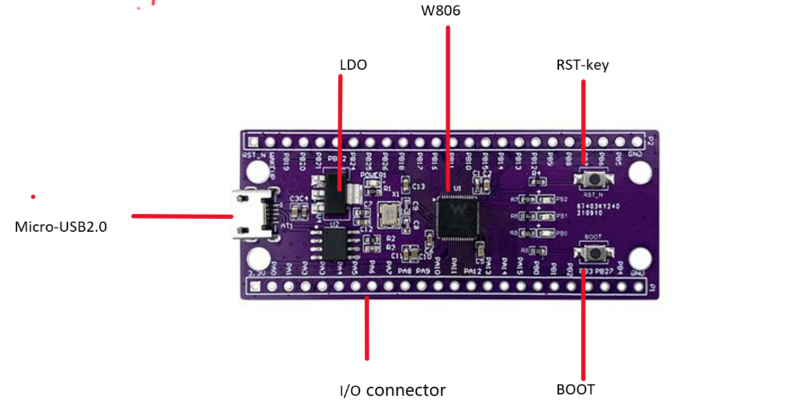
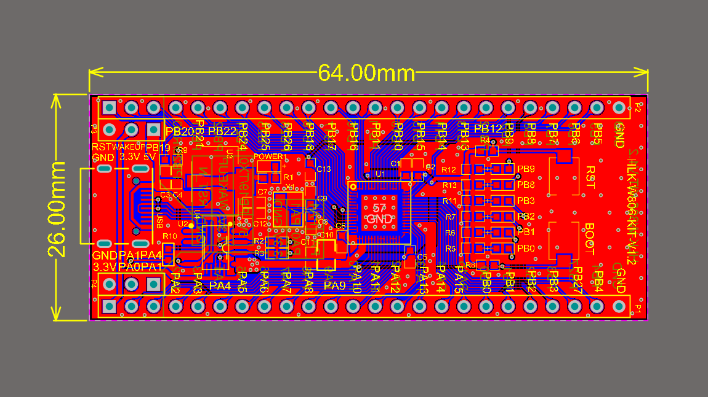

HLK-W806-KIT Getting Started Guide
==================================

Preparation
-----------

Hardware:
~~~~~~~~~
- HLK-W806 Development Board

- Micro USB Data Cable

- USB to Serial Driver (`Click to download CH34X driver <https://doc.winnermicro.net/download/tools/all/CH341SER.zip>`_)

- PC (Windows, or Linux)

You can skip the introduction and go directly to the :ref:`Application Development<application-program-w806>` section.

Overview
--------
This development board is based on the IoT application MCU development board featuring the RISC-V core W806 by Winner Micro. It comes equipped with an RST reset button, a Boot upgrade button, and a USB 2.0 interface. The expansion interfaces support peripherals such as Touch, UART, PWM, GPIO, SPI, I2C, I2S, ADC, LCD, and more, making it suitable for IoT application developers to evaluate the W806 chip and rapidly build application examples.

Function Description
----------------------

The main components, interfaces, and control methods of the HLK-W806-KIT development board are as follows.

The description of the main components of the HLK-W806-KIT development board is shown in the table below (starting from the top left corner in a clockwise direction).

.. list-table::
   :widths: 25 25 
   :header-rows: 0
   :align: center

   * - Main Components
     - Basic Introduction

   * - LDO
     - 5V to 3.3V LDO (Low Dropout)regulator chip.

   * - W806
     - The main control chip of the development board, with WiFi, Bluetooth, and other functions.

   * - RST-Key
     - System reset button.

   * - BOOT
     - Download mode button. Press the BOOT button, then insert the USB cable into the UART0 port. After releasing the BOOT button, it will enter the download mode.

   * - I/O
     - All pins of the W800 are brought out to the development board's pin headers. Users can program the W800 to implement functions like PWM, ADC, DAC, I2C, and I2S. For details, please refer to :ref:`Pin Description <base-pin-w806>`.

   * - Micro-USB 2.0
     - The default USB port on the development board, which can be used as a power supply or as a communication interface between the PC and the development board.

Power Options
--------------

The development board can be powered by any of the following three methods:

- Micro USB power (default)
- 5V / GND pin power
- 3.3V / GND pin power

.. warning:: 

    The above power modes **should not be connected simultaneously**, as this may damage the development board or power supply.

.. _base-pin-w806:

Pin Description
---------------

The table below introduces the **name** and **function** of the development board's I/O pins. For the specific layout, please refer to the :ref:`Development Board Schematic and Layout Diagram<schematic-diagram-w806>` section.

.. list-table:: 
   :widths: 25 25 25 25 25 25 25 25
   :header-rows: 0
   :align: center

   * - No.
     - Name
     - Type
     - Pin Function after Reset
     - Multiplexed Function
     - Maximum Frequency
     - Pull-up/Pull-down Capability
     - Drive Capability

   * - 1
     - PB_18
     - I/O
     - GPIO, Input, High Impedance
     - UART5_TX/LCD_SEG30
     - 10MHz
     - UP/DOWN
     - 12mA

   * - 2
     - PB_26
     - I/O
     - GPIO, Input, High Impedance
     - LSPI_MOSI/PWM4/LCD_SEG1
     - 20MHz
     - UP/DOWN
     - 12mA

   * - 3
     - PB_25
     - I/O
     - GPIO, Input, High Impedance
     - LSPI_MISO/PWM3/LCD_COM0
     - 20MHz
     - UP/DOWN
     - 12mA

   * - 4
     - PB_24
     - I/O
     - GPIO, Input, High Impedance
     - LSPI_CK/PWM2/LCD_SEG2
     - 20MHz
     - UP/DOWN
     - 12mA

   * - 5
     - PB_22
     - I/O
     - GPIO, Input, High Impedance
     - UART0_CTS/PCM_CK/LCD_COM2
     - 10MHz
     - UP/DOWN
     - 12mA

   * - 6
     - PB_21
     - I/O
     - GPIO, Input, High Impedance
     - UART0_RTS/PCM_SYNC/LCD_COM1
     - 10MHz
     - UP/DOWN
     - 12mA

   * - 7
     - PB_20
     - I/O
     - UART_RX
     - UART0_RX/PWM1/UART1_CTS/I2C_SCL
     - 10MHz
     - UP/DOWN
     - 12mA

   * - 8
     - PB_19
     - I/O
     - UART_TX
     - UART0_TX/PWM0/UART1_RTS/I2C_SDA
     - 10MHz
     - UP/DOWN
     - 12mA

   * - 9
     - WAKEUP
     - I
     - WAKEUP
     - Wake-up Function
     - 
     - DOWN
     - 

   * - 10
     - RESET
     - I
     - RESET
     - Reset Function
     - 
     - UP
     - 

   * - 11
     - XTAL_OUT
     - O
     - External Crystal Oscillator Output
     - 
     - 
     - 
     - 

   * - 12
     - XTAL_IN
     - I
     - External Crystal Oscillator Input
     - 
     - 
     - 
     - 

   * - 13
     - VDD33
     - P
     - Chip Power Supply，3.3V
     - 
     - 
     - 
     - 

   * - 14
     - NC
     - 
     - 
     - 
     - 
     - 
     - 

   * - 15
     - VDD33
     - P
     - Chip Power Supply，3.3V
     - 
     - 
     - 
     - 

   * - 16
     - VDD33
     - P
     - Chip Power Supply，3.3V
     - 
     - 
     - 
     - 

   * - 17
     - VDD33
     - P
     - Chip Power Supply，3.3V
     - 
     - 
     - 
     - 

   * - 18
     - BOOTMODE
     - I/O
     - BOOTMODE
     - I2S_MCLK/LSPI_CS/PWM2/I2S_DO
     - 20MHz
     - UP/DOWN
     - 12mA

   * - 19
     - PA_1
     - I/O
     - JTAG_CK
     - JTAG_CK/I2C_SCL/PWM3/I2S_LRCK/ADC_1
     - 20MHz
     - UP/DOWN
     - 12mA

   * - 20
     - PA_2
     - I/O
     - GPIO, Input, High Impedance
     - UART1_RTS/UART2_TX/PWM0/UART3_RTS/ADC_4
     - 20MHz
     - UP/DOWN
     - 12mA

   * - 21
     - PA_3
     - I/O
     - GPIO, Input, High Impedance
     - UART1_CTS/UART2_RX/PWM1/UART3_CTS/ADC_3
     - 20MHz
     - UP/DOWN
     - 12mA

   * - 22
     - PA_4
     - I/O
     - JTAG_SWO
     - JTAG_SWO/I2C_SDA/PWM4/I2S_BCK/ADC_2
     - 20MHz
     - UP/DOWN
     - 12mA

   * - 23
     - PA_5
     - I/O
     - GPIO, Input, High Impedance
     - UART3_TX/UART2_RTS/PWM_BREAK/UART4_RTS/VRP_EXT
     - 20MHz
     - UP/DOWN
     - 12mA

   * - 24
     - PA_6
     - I/O
     - GPIO, Input, High Impedance
     - UART3_RX/UART2_CTS/NULL/UART4_CTS/LCD_SEG31/VRP_EXT
     - 20MHz
     - UP/DOWN
     - 12mA

   * - 25
     - PA_7
     - I/O
     - GPIO, Input, High Impedance
     - PWM4/LSPI_MOSI/I2S_MCK/I2S_DI/LCD_SEG3/Touch_1
     - 20MHz
     - UP/DOWN
     - 12mA

   * - 26
     - PA_8
     - I/O
     - GPIO, Input, High Impedance
     - PWM_BREAK/UART4_TX/UART5_TX/I2S_BCLK/LCD_SEG4
     - 20MHz
     - UP/DOWN
     - 12mA

   * - 27
     - PA_9
     - I/O
     - GPIO, Input, High Impedance
     - MMC_CLK/UART4_RX/UART5_RX/I2S_LRCLK/LCD_SEG5/TOUCH_2
     - 50MHz
     - UP/DOWN
     - 12mA

   * - 28
     - PA_10
     - I/O
     - GPIO, Input, High Impedance
     - MMC_CMD/UART4_RTS/PWM0/I2S_DO/LCD_SEG6/TOUCH_3
     - 50MHz
     - UP/DOWN
     - 12mA

   * - 29
     - VDD33
     - P
     - Chip Power Supply，3.3V
     - 
     - 
     - 
     - 

   * - 30
     - PA_11
     - I/O
     - GPIO, Input, High Impedance
     - MMC_DAT0/UART4_CTS/PWM1/I2S_DI/LCD_SEG7
     - 50MHz
     - UP/DOWN
     - 12mA

   * - 31
     - PA_12
     - I/O
     - GPIO, Input, High Impedance
     - MMC_DAT1/UART5_TX/PWM2/LCD_SEG8/TOUCH_14
     - 50MHz
     - UP/DOWN
     - 12mA

   * - 32
     - PA_13
     - I/O
     - GPIO, Input, High Impedance
     - MMC_DAT2/UART5_RX/PWM3/LCD_SEG9
     - 50MHz
     - UP/DOWN
     - 12mA

   * - 33
     - PA_14
     - I/O
     - GPIO, Input, High Impedance
     - MMC_DAT3/UART5_CTS/PWM4/LCD_SEG10/TOUCH_15
     - 50MHz
     - UP/DOWN
     - 12mA

   * - 34
     - PA_15
     - I/O
     - GPIO, Input, High Impedance
     - PSRAM_CK/UART5_RTS/PWM_BREAK/LCD_SEG11
     - 50MHz
     - UP/DOWN
     - 12mA

   * - 35
     - PB_0
     - I/O
     - GPIO, Input, High Impedance
     - PWM0/LSPI_MISO/UART3_TX/PSRAM_CK/LCD_SEG12/Touch_4
     - 80MHz
     - UP/DOWN
     - 12mA

   * - 36
     - PB_1
     - I/O
     - GPIO, Input, High Impedance
     - PWM1/LSPI_CK/UART3_RX/PSRAM_CS/LCD_SEG13/Touch_5
     - 80MHz
     - UP/DOWN
     - 12mA

   * - 37
     - PB_2
     - I/O
     - GPIO, Input, High Impedance
     - PWM2/LSPI_CK/UART2_TX/PSRAM_D0/LCD_SEG14/Touch_6
     - 80MHz
     - UP/DOWN
     - 12mA

   * - 38
     - PB_3
     - I/O
     - GPIO, Input, High Impedance
     - PWM3/LSPI_MISO/UART2_RX/PSRAM_D1/LCD_SEG15/Touch_7
     - 80MHz
     - UP/DOWN
     - 12mA

   * - 39
     - PB_27
     - I/O
     - GPIO, Input, High Impedance
     - PSRAM_CS/UART0_TX/LCD_COM3
     - 80MHz
     - UP/DOWN
     - 12mA

   * - 40
     - PB_4
     - I/O
     - GPIO, Input, High Impedance
     - LSPI_CS/UART2_RTS/UART4_TX/PSRAM_D2/LCD_SEG16/Touch_8
     - 80MHz
     - UP/DOWN
     - 12mA

   * - 41
     - PB_5
     - I/O
     - GPIO, Input, High Impedance
     - LSPI_MOSI/UART2_CTS/UART4_RX/PSRAM_D3/LCD_SEG17/Touch_9
     - 80MHz
     - UP/DOWN
     - 12mA

   * - 42
     - VDD33
     - P
     - Chip Power Supply，3.3V
     - 
     - 
     - 
     - 

   * - 43
     - CAP
     - I
     - External Capacitor，4.7µF
     - 
     - 
     - 
     - 

   * - 44
     - PB_6
     - I/O
     - GPIO, Input, High Impedance
     - UART1_TX/MMC_CLK/HSPI_CK/SDIO_CK/LCD_SEG18/Touch_10
     - 50MHz
     - UP/DOWN
     - 12mA

   * - 45
     - PB_7
     - I/O
     - GPIO, Input, High Impedance
     - UART1_RX/MMC_CMD/HSPI_INT/SDIO_CMD/LCD_SEG19/Touch_11
     - 50MHz
     - UP/DOWN
     - 12mA

   * - 46
     - PB_8
     - I/O
     - GPIO, Input, High Impedance
     - I2S_BCK/MMC_D0/PWM_BREAK/SDIO_D0/LCD_SEG20/Touch_12
     - 50MHz
     - UP/DOWN
     - 12mA

   * - 47
     - PB_9
     - I/O
     - GPIO, Input, High Impedance
     - I2S_LRCK/MMC_D1/HSPI_CS/SDIO_D1/LCD_SEG21/Touch_13
     - 50MHz
     - UP/DOWN
     - 12mA

   * - 48
     - PB_12
     - I/O
     - GPIO, Input, High Impedance
     - HSPI_CK/PWM0/UART5_CTS/I2S_BCLK/LCD_SEG24
     - 50MHz
     - UP/DOWN
     - 12mA

   * - 49
     - PB_13
     - I/O
     - GPIO, Input, High Impedance
     - HSPI_INT/PWM1/UART5_RTS/I2S_LRCLK/LCD_SEG25
     - 50MHz
     - UP/DOWN
     - 12mA

   * - 50
     - PB_14
     - I/O
     - GPIO, Input, High Impedance
     - HSPI_CS/PWM2/LSPI_CS/I2S_DO/LCD_SEG26
     - 50MHz
     - UP/DOWN
     - 12mA

   * - 51
     - PB_15
     - I/O
     - GPIO, Input, High Impedance
     - HSPI_DI/PWM3/LSPI_CK/I2S_DI/LCD_SEG27
     - 50MHz
     - UP/DOWN
     - 12mA

   * - 52
     - PB_10
     - I/O
     - GPIO, Input, High Impedance
     - I2S_DI/MMC_D2/HSPI_DI/SDIO_D2/LCD_SEG22
     - 50MHz
     - UP/DOWN
     - 12mA

   * - 53
     - VDD33
     - P
     - Chip Power Supply，3.3V
     - 
     - 
     - 
     - 

   * - 54
     - PB_11
     - I/O
     - GPIO, Input, High Impedance
     - I2S_DO/MMC_D3/HSPI_DO/SDIO_D3/LCD_SEG23
     - 50MHz
     - UP/DOWN
     - 12mA

   * - 55
     - PB_16
     - I/O
     - GPIO, Input, High Impedance
     - HSPI_DO/PWM4/LSPI_MISO/UART1_RX/LCD_SEG28
     - 50MHz
     - UP/DOWN
     - 12mA

   * - 56
     - PB_17
     - I/O
     - GPIO, Input, High Impedance
     - UART5_RX/PWM_BREAK/LSPI_MOSI/I2S_MCLK/LCD_SEG29
     - 20MHz
     - UP/DOWN
     - 12mA

   * - 57
     - GND
     - P
     - Chip Bottom Ground PAD
     - 
     - 
     - 
     - 
     
.. _application-program-w806:

Application Development
-----------------------

Before powering on HLK-W806-KIT, please first ensure that the development board is in good condition.
Now, please go to the :ref:`Set Up the Compilation Environment <compiling-environment>` section in the Quick Start guide to learn how to set up the development environment and try flashing the example project to your development board.

.. _schematic-diagram-w806:

Development Board Schematic and Layout Diagram
----------------------------------------------

The schematic damageiagram of the HLK-W806-KIT development board is shown below.

.. figure:: ../../_static/get_started/hardware/hlk_w806_schematic_diagram.png
    :align: center
    :alt: HLK-W806-KIT  development Board Schematic

HLK-W806-KIT  the layout diagram of the development board is as follows.

Reference Material Download
---------------------------

- `Click to Download <../../../../download/board/w806_hlk_board_v1.2.zip>`__
