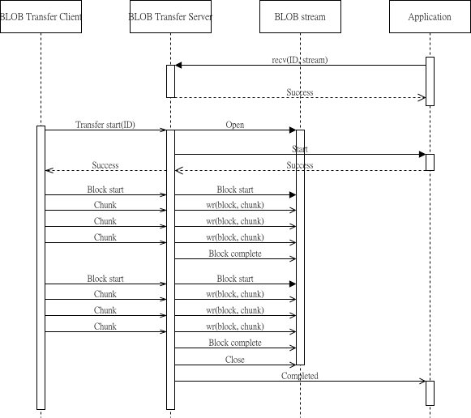

.. _bluetooth_mesh_blob_srv:

BLOB 传输服务器
####################

二进制型大对象（BLOB）传输服务器模型实现了大型二进制对象的可靠接收。它用作 :ref:`bluetooth_mesh_dfu_srv` 的后端，但也可以用于接收其他二进制图像。

BLOBs
*****

如 :ref:`bluetooth_mesh_blob` 中所述，由 BLOB 传输模型传输的二进制对象被划分为块，块被划分为区块。由于传输由 BLOB 传输客户端模型控制，BLOB transfer Server 必须允许块以任何顺序出现。
块中的块也可以以任何顺序出现，但在启动下一个块之前，必须接收块中的所有块。

BLOB 传输服务器跟踪接收的块和区块，并且只处理每个块和区块一次。BLOB 传输服务器还确保 BLOB Transfer Client 重新发送任何丢失的块。

使用
*****

BLOB 传输服务器在具有一组事件处理程序回调的元素上实例化：

.. code-block:: C

   static const struct bt_mesh_blob_srv_cb blob_cb = {
       /* Callbacks */
   };

   static struct bt_mesh_blob_srv blob_srv = {
       .cb = &blob_cb,
   };

   static const struct bt_mesh_model models[] = {
       BT_MESH_MODEL_BLOB_SRV(&blob_srv),
   };

BLOB 传输服务器能够一次接收单个 BLOB 传送。在 BLOB 传输服务器可以接收传输之前，它必须由用户准备。
在 BLOB 传输客户端启动传输之前，必须通过 :func:`bt_mesh_BLOB_srv_recv（）` 函数将传输 ID 传递给 BLOB transfer Server。
必须通过一些更高级别的过程（如特定于供应商的传输管理模型）在 BLOB 传输客户端和 BLOB 转移服务器之间共享 ID。

一旦在 BLOB 传输服务器上设置了传输，就可以接收 BLOB 了。通过事件处理程序回调将传输进度通知应用程序，并将 BLOB 数据发送到 BLOB 流。

BLOB 传输服务器、BLOB 流和应用程序之间的交互如下所示：

   BLOB 传输服务器模型交互

转移暂停
*******************

BLOB 传输服务器在传输期间保持一个运行计时器，该计时器在每个接收到的消息上重置。如果 BLOB 传输客户端在传输计时器到期之前未发送消息，则传输将被 BLOB Transfer Server 挂起。

BLOB 传输服务器通过调用 :func:`suspended<bt_mesh_BLOB_srv_cb.Spended>` 回调来通知用户暂停。如果 BLOB 传输服务器正在接收块，则丢弃该块。

BLOB 传输客户端可以通过启动新的块传输来恢复暂停的传输。BLOB 传输服务器通过调用 :func:`resume<bt_mesh_BLOB_srv_cb.resume>` 回调来通知用户。

传输恢复
*****************

BLOB 传输的状态被持久存储。如果发生重新启动，BLOB 传输服务器将尝试恢复传输。
启动 Bluetooth Mesh 子系统时（例如，通过调用 :func:`bt_Mesh_init` ），BLOB 传输服务器将检查中止的传输，
并调用 :func:`recover<bt_Mesh-BLOB_srv_cb.recover>` 回调（如果存在）。在恢复回调中，
用户必须提供用于其余传输的 BLOB 流。如果恢复回调未成功返回或未提供 BLOB 流，则放弃传输。
如果未实现恢复回调，则在重新启动后总是放弃传输。

成功恢复传输后，BLOB 传输服务器进入挂起状态。它将保持挂起状态，直到 BLOB 传输客户端恢复传输或用户取消传输。

.. note::
   发送传输的 BLOB 传输客户端必须支持传输恢复，才能完成传输。如果 BLOB 传输客户端已经放弃传输，则 BLOB Transfer Server 将保持挂起状态，直到应用程序调用 :func:`bt_mesh_BLOB_srv_cancel`

API 参考
*************

.. doxygengroup:: bt_mesh_blob_srv
   :project: wm-iot-sdk-apis
   :members:
