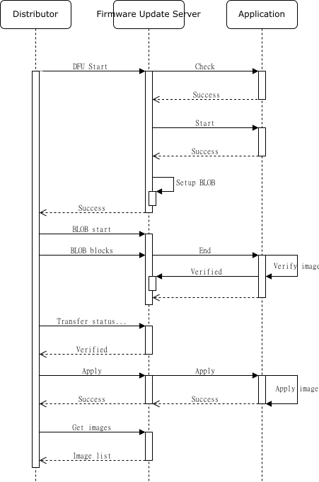

.. _bluetooth_mesh_dfu_srv:

固件更新服务器
######################

固件更新服务器模型实现 :ref:`bluetooth_mesh_dfu` 子系统的目标节点功能。它扩展了 :ref:`bluetooth_mesh_blob_srv` ，用于从分发服务器节点接收固件映像二进制文件。

与扩展的 BLOB 传输服务器模型一起，固件更新服务器模型实现了通过网状网络接收固件更新所需的所有功能，但不提供存储、应用或验证映像的任何功能。

固件映像
***************

固件更新服务器保存设备上所有可更新固件映像的列表。完整列表应通过 ``BT_MESH_DFU_SRV_INIT`` 中的 ``_imgs`` 参数传递到服务器，
并且必须在 Bluetooth Mesh 子系统启动之前填充。映像列表中的每个固件映像都必须是可独立更新的，并且应该具有自己的固件 ID。

例如，具有可升级引导加载程序、应用程序和具有固件更新功能的外围芯片的设备可以在固件映像列表中具有三个条目，每个条目具有自己的单独固件 ID。

接收传输
*******************

固件更新服务器模型在同一元素上使用 BLOB 传输服务器模型来传输二进制映像。固件更新服务器、BLOB 传输服务器和应用程序之间的交互描述如下：

   Bluetooth Mesh 固件更新服务器传输

传输检测
==============

传输检查是应用程序可以对传入固件映像元数据执行的可选传输前检查。固件更新服务器通过调用 :c:member:`check <bt_mesh_dfu_srv_cb.check>` 回调来执行传输检查。

传输检查的结果是通过/失败状态返回和预期的 :c:type:`bt_mesh_dfu_effect` 。DFU effect return 参数将传回分发服务器，并应指示固件更新对设备的网格状态的影响。

.. _bluetooth_mesh_dfu_srv_comp_data_and_models_metadata:

合成数据和模型元数据
------------------------------------

如果传输将导致设备更改其组成数据或变得未配置，则应通过元数据检查的效果参数进行通信。

当传输将导致成分数据更改时，以及 :ref:`bluetooth_mesh_models_rpr_srv` 支持，
则新固件映像的合成数据将由合成数据页面128、129和130表示。新固件映像的模型元数据将由模型元数据第128页表示。
组合数据页0、1和2以及模型元数据页0将表示旧固件映像的组合数据和模型元数据，直到使用 :ref:`bluetooth_mesh_models_rpr_cli` .

在使用更新的合成数据和模型元数据引导到固件之前，应用程序必须调用函数 :c:func:`bt_mesh_comp_change_prepare` 和 :c:func:`bt_mesh_models_metadata_change_prepare` 。
然后，旧的成分数据将加载到成分数据页面0、1和2中，而新固件中的成分数据则加载到合成数据页面128、129和130中。
旧映像的模型元数据将加载到模型元数据页0中，新映像的模型元数据将加载到建模元数据页128中。

限制：

* 在应用新固件映像后，无法更改设备的组成数据并保持设备已配置并使用旧固件。

开始
=====

Start 过程为传入传输准备应用程序。它将包含有关正在更新哪个映像的信息，以及更新元数据。

固件更新服务器 :c:member:`start<bt_mesh_dfu_srv_cb.start>` 回调必须返回指向 BLOB 传输服务器将 BLOB 发送到的 BLOB 写入程序的指针。

BLOB 传输
=============

在设置阶段之后，固件更新服务器为传入传输准备 BLOB 传输服务器。整个固件映像被传输到 BLOB 传输服务器，该服务器将映像传递给其分配的 BLOB Writer。

在 BLOB 传输结束时，固件更新服务器调用其 :c:member:`end<bt_mesh_dfu_srv_cb.end>` 回调。

图像验证
==================

BLOB 传输完成后，应用程序应尽可能验证映像，以确保它已准备好应用。验证映像后，应用程序将调用 :c:func:`bt_mesh_dfu_srv_verified` 。

如果无法验证映像，则应用程序调用 :c:func:`bt_mesh_dfu_srv_rejected` 。

应用图像
==================

最后，如果映像已验证，分发服务器可以指示固件更新服务器应用传输。这通过 :c:member:`apply<bt_mesh_dfu_srv_cb.apply>` 回调传递给应用程序。
应用程序应交换映像并开始使用新固件运行。应更新固件映像表，以反映更新映像的新固件 ID。

当传输应用于网格应用程序本身时，设备可能必须作为交换的一部分重新启动。
此重新启动可以从应用回调内部执行，也可以异步完成。使用新固件引导后，应在启动 Bluetooth Mesh  子系统之前更新固件映像表。

分发服务器将读取固件映像表，以确认传输已成功应用。如果元数据检查指示设备将变为未配置，则不需要目标节点响应此检查。

API 参考
*************

.. doxygengroup:: bt_mesh_dfu_srv
   :project: wm-iot-sdk-apis
   :members:
