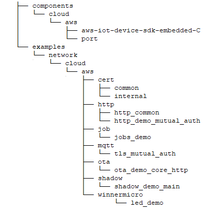

.. _aws:

AWS IoT
=============

简介
-------------

    AWS IoT 是亚马逊云服务（Amazon Web Services）提供的全面的物联网平台，旨在帮助企业和开发者轻松连接、管理和分析来自数十亿物联网设备的数据。 AWS IoT 通过一系列强大的服务和功能，支持从工业自动化到智能家居等多种应用场景，助力客户实现物联网解决方案的快速部署和高效运营。

功能列表
-------------

    1. :ref:`功能概述 <functional_overview>`
    2. :ref:`账户注册 <account_registration>`
    3. :ref:`IAM 权限控制 <iam_permission_control>`
    4. :ref:`创建产品（海外区） <create_overseas_products>`
    5. :ref:`AWS in WM SDK <aws_in_wm_sdk>`
    6. :ref:`AWS 代码结构说明 <aws_code_structure_explanation>`
    7. :ref:`AWS IoT 推荐链接 <aws_iot_recommended_links>`

.. _functional_overview:

功能概述
-------------

    AWS IoT 的核心组件是 AWS IoT Core，这是一个托管云平台，能让设备安全地接入云端并相互通信。IoT Core 支持多种通信协议，如 MQTT (S)、HTTP (S) 等，确保设备可以高效、低延迟地传输数据。此外，它还具备以下关键功能：

    **设备管理：** 通过设备注册表为每个设备创建身份，并对其元数据进行跟踪记录。

    **设备影子：** 为各个设备生成虚拟副本，即便设备处于离线状态，也能存储其最新状态信息。

    **安全与认证：** 提供多层安全防护机制，涵盖设备身份验证、数据加密以及访问控制等方面。

    **OTA：** 利用 AWS IoT 空中下载（OTA）更新库，您可以选择 MQTT 或 HTTP 作为协议，对 FreeRTOS 设备固件更新的通知、下载和验证流程进行管理。

.. _account_registration:

AWS 账户注册
---------------

    **海外区域账户注册：**

    支持个人账户和企业账户注册，注册时需绑定信用卡。

    `海外区注册地址 <https://portal.aws.amazon.com/billing/signup#/start/email>`_

    `如何创建海外区账户 <https://docs.aws.amazon.com/zh_cn/accounts/latest/reference/manage-acct-creating.html>`_

    某些情况下，使用 AWS 会产生一定的费用，具体资费可以参考
    `账单和成本优化基础知识 <https://aws.amazon.com/cn/getting-started/cost-optimization-essentials>`_

    **中国区域账户注册：**

    不支持个人注册，注册时需提供企业营业执照等相关信息。

    `中国区注册地址 <https://signin.amazonaws.cn/signup?request_type=register>`_

    `如何创建中国区账户 <https://www.amazonaws.cn/about-aws/china/faqs/signup-process>`_

    **MAF 多重身份验证：**

    起初，AWS 并未强制要求使用多重身份验证，但在注册约 2 个月后，将强制执行 MAF。用户可在手机上安装以下应用程序进行身份验证。由于安卓系统依赖 Google Play，建议优先使用 iOS 系统。

    安卓系统：Twilio Authy Authenticator、Duo Mobile、Microsoft Authenticator、Google Authenticator、Symantec VIP

    iOS 系统：Twilio Authy Authenticator、Duo Mobile、Microsoft Authenticator、Google Authenticator、Symantec VIP

.. _iam_permission_control:

IAM 权限控制
---------------

    AWS Identity and Access Management（身份和访问管理）。它是一项用于管理和控制对 AWS 服务和资源访问的重要服务。

    `IAM 权限控制 <https://console.aws.amazon.com/iam>`_

    **添加 IAM 角色：**

    在选择服务或使用场景时，选择 EC2；勾选 “AWSIoT1ClickFullAccess” 权限策略，输入角色名称后创建角色。此 IMA 角色在后续创建 JOB 时会用到。

.. _create_overseas_products:

创建产品（海外区）
---------------------

    `AWS IoT控制台 <https:// console.aws.amazon.com/console>`_

    **选择账户使用区域：**
    用户可依据产品的实际部署地点选择账户使用区域，此处以亚太地区（首尔）为例。

    **域配置：**
    系统会自动创建名为 “iot:Data-ATS” 的域名，该域名将作为设备的接入地址。

    **创建物品：**
    创建路径为（AWS IoT→管理→物品→创建物品→创建单个物品）。输入物品名称时，建议勾选 “未命名的阴影（经典）”，该物品名称在设备接入时需要填写。配置设备证书时，建议选择自动生成新证书。设备创建完成后，会弹出证书和密钥下载页面，在此需下载三份证书，分别为设备证书 xxxx.certificate.pem.crt、设备证书私钥 xxxx.private.pem.key 以及根证书 AmazonRootCA1.pem。

.. _aws_in_wm_sdk:

AWS in WM SDK
-----------------

.. figure:: ../../../_static/component-guides/network/cloud/aws/aws_arch.svg
    :align: center
    :alt: AWS Arch
..

    **Demo:** WM SDK 提供了多个 AWS IoT 应用示例，涵盖了大部分常见的应用场景。

    **aws-iot-device-sdk-embedded-C:** 这是 AWS IoT core 的官方库代码，包含解析、协议等多种组件。

    **WM component:** WM SDK 自有组件，包含 BSD socket，mbedTLS，WiFi stack 等。

.. _aws_code_structure_explanation:

AWS 代码结构说明
---------------------

..

    **components/cloud/aws/aws-iot-device-sdk-embedded-C：** AWS IoT 官方源码

    **components/cloud/aws/port：** AWS IoT core 适配层

    **examples/network/cloud/aws/cert/common：** 为对外发布证书，该证书格式正确，但无法接入到服务器，需要用户替换为有效的证书

    **examples/network/cloud/aws/http/http_common：** HTTP demo 公共组件

    **examples/network/cloud/aws/http/http_demo_mutual_auth：** HTTP 演示 demo，来源于 AWS 官方示例

    **examples/network/cloud/aws/job/jobs_demo：** Job 演示 demo，源自于 AWS 官方示例 jobs_demo_mosquitto 改造而来

    **examples/network/cloud/aws/mqtt/tls_mutual_auth：** MQTT 演示demo，来源于AWS 官方示例

    **examples/network/cloud/aws/ota/ota_demo_core_http：** OTA （HTTP） demo，源自于 AWS Branch_202211.00 分支，其在 202412 版本中被移除

    **examples/network/cloud/aws/shadow/shadow_demo_main：** Shadow 演示 demo，来源于 AWS 官方示例

    **examples/network/cloud/aws/winnermicro/led_demo：** 适用于联盛德 Arduino 开发板的演示示例程序，基于 Shadow 示例改造而成，可通过 MQTT 消息控制板载三色 LED。

.. _aws_iot_recommended_links:

AWS IoT 推荐链接
-------------------

    `Amazon IoT Core <https://docs.amazonaws.cn/en_us/iot/latest/developerguide/what-is-aws-iot.html>`_

    `FreeRTOS Over-the-Air Updates <https://docs.amazonaws.cn/en_us/freertos/latest/userguide/freertos-ota-dev.html>`_

    `aws-iot-device-sdk-embedded-C github <https://github.com/aws/aws-iot-device-sdk-embedded-C>`_

    `AWS IoT Console Home <https:// console.aws.amazon.com/console>`_
