:orphan:

.. _i2s:

I2S
=============

简介
-------------

I2S（Inter-IC Sound）是一种串行、同步通信协议，通常用于传输两个数字音频设备之间的音频数据。本模块支持多种数据格式和通信标准，适用于多种音频传输场景。

功能列表
-------------

- 支持多种接口:I2S 接口、PCM 接口。
- 支持主/从模式。
- 支持过零检测。
- 支持采样位宽 8/16/24/32 bits。
- 支持单声道，立体声音频传输。
- 支持多种数据格式，包括 I2S、MSB Justified、PCM A/B。
- 支持 DMA 模式发送和接收数据。

功能概述
-------------

.. note::
   上图中分别是发送和接收过程，在收发双方时钟信号不兼容情况下，用外部 CONTROLLER 来提供同步时钟供双方使用

**模块支持多种功能选择**

**模式选择**

- master、slave

**传输方向**

- 输入、输出、双工

**协议标准**

- I2S、MSB、PCMA、PCMB

**帧格式**

每个通道位宽为8bit，支持的帧格式：

- 8/16/24/32 bits

**通道类型**

- 立体声（双声道）、单声道

**采样率**

- 8KHz、11.025KHz、16KHz、22.05KHz、24KHz、32KHz、44.1KHz、47.25KHz、48KHz、50KHz、50.04KHz、96KHz、192KHz

使用配置
-------------

参数配置
^^^^^^^^^^^^^

调用结构体 ``wm_drv_i2s_cfg_t`` 来配置

.. code:: C

    typedef struct {
        enum wm_i2s_mode mode;       /**< I2S role mode                                         */
        enum wm_i2s_dir dir;         /**< I2S xfer direction                                    */
        enum wm_i2s_std std;         /**< I2S protocol standard                                 */
        enum wm_i2s_xfer_type xtype; /**< the transfer type select from DMA or others           */
        uint32_t rx_pkt_size;        /**< The buffer size of each received packet [80 ~ 15360].
                                        Usually set to 10/20 millisecond transmission data size.
                                        4 bytes aligned, 32 bits and stereo need 8 bytes align  */
        uint8_t rx_pkt_num;          /**< Max number of the RX package receive buffer [2~16],
                                        recommended 4, can be large if rx_pkt_size is small     */
        uint8_t tx_pkt_num;          /**< Max number of the TX packages wait to send, [2~16]
                                        recommended 4, can be large if tx send pkt size is small*/

    } wm_drv_i2s_cfg_t;

**mode**

| 工作模式：主模式、从模式

**dir**

| 传输方向：输入、输出、双工

**std**

| 协议标准：I2S、MSB、PCMA、PCMB

**fmt**

| 帧格式标准：8/16/24/32 bits

.. note::
    每个通道位宽为8bit

**ctype**

| 通道类型：立体声（双声道）、单声道

**xtype**

| 数据传输类型：当前仅支持 DMA 方式

**sample_rate_hz**

| 采样率：8KHz、11.025KHz、16KHz、22.05KHz、24KHz、32KHz、44.1KHz、47.25KHz、48KHz、50KHz、50.04KHz、96KHz、192KHz

**rx_pkt_size**

| 作为输入时，每一包数据最大长度

**rx_pkt_num**

| 指定接收 I2S 数据时，最大接收 Buffer 个数

**tx_pkt_num**

| 指定发送 I2S 数据时，最大等待发送数据包个数

.. note::
   rx/tx treshold设置原则：内存越大，延迟要求越低，可以设置的值越大，从而可以兼容的链路抖动（出现数据阻塞，突发）情况

**用户可以动态调用IOCTL API进行修改的参数**

| 指定要执行的 IOCTL 命令，包括：

- ``WM_DRV_I2S_CMD_SET_TX_BITSHIFT``: 设置 TX 时钟相位为反转模式。这通常用于与某些特定硬件的兼容性，以确保时钟信号的相位正确
- ``WM_DRV_I2S_CMD_SET_RX_BITSHIFT``: 设置 RX 时钟相位为反转模式。这通常用于与某些特定硬件的兼容性，以确保时钟信号的相位正确
- ``WM_DRV_I2S_CMD_SET_LZC``: 启用或禁用左声道的零点交叉检查。零点交叉检查是一种技术，用于确保音频信号在交叉零点时的相位连续性
- ``WM_DRV_I2S_CMD_SET_RZC``: 启用或禁用右声道的零点交叉检查，与左声道类似

DMA 配置
^^^^^^^^^^^^^

该模块利用 DMA 来实现高效收发，即 I2S 模块会依赖 DMA 的 HW,故需要 DMA 有足够的可用的 channel(2S 每个方向占用一个 DMA channel)

时钟配置
^^^^^^^^^^^^^

I2S 中包含多种时钟：

- BCLK（串行时钟，也叫位时钟）：对应数字音频的每一位数据。
- WS/LRCLK（字段选择，用于选择左右声道）：为 “0” 表示正在传输的是左声道的数据，为“1”表示正在传输的是右声道的数据。
- SD（串行数据）：用二进制补码来表示音频数据（数据传输从高位到低位）。

| I2S 的时钟上级是 CLK_PERI，该时钟由 DPLL 输出的 480MHz 分频得出
| 正常工作情况下应固定为 3 分频，即 CLK_PERI 时钟为 160MHz。

主要功能
-------------

发送数据功能
^^^^^^^^^^^^^

**起始条件:**

- I2S 模块初始化

**相关时序API:**

- 调用 ``wm_drv_i2s_set_format`` 调用该接口设置传输格式
- 调用 ``wm_drv_i2s_write_async`` 异步发送I2S数据，返回成功表示已经被 I2S 驱动成功处理，否则需要用户释放
- 根据需要调用 ``wm_drv_i2s_write_pause`` 暂停 I2S 设备的写操作，此接口不会复位 HW，在 resume 可以快速进行发送
- 根据需要调用 ``wm_drv_i2s_write_resume`` 恢复 I2S 设备的写操作，重新开始异步发送数据
- 根据需要调用 ``wm_drv_i2s_write_stop`` 停止 I2S 设备的写操作
- 根据需要调用 ``wm_drv_i2s_register_write_cb`` 用于注册回调函数，以便在异步写操作成功完成时被调用

**结果:**

- 成功返回 ``WM_ERR_SUCCESS`` ,失败返回对应错误码

接收数据功能
^^^^^^^^^^^^^

**起始条件:**

- I2S 模块初始化

**相关时序API:**

- 调用 ``wm_drv_i2s_set_format`` 调用该接口设置传输格式
- 调用 ``wm_drv_i2s_read_async`` 异步从 I2S 设备读取数据，返回成功表示已经被 I2S 驱动成功处理，否则需要用户释放
- 根据需要调用 ``wm_drv_i2s_read_pause`` 暂停 I2S 设备的写操作，此接口不会复位 HW，在 resume 可以快速进行接收
- 根据需要调用 ``wm_drv_i2s_read_resume`` 恢复 I2S 设备的读操作，重新开始异步接收数据
- 根据需要调用 ``wm_drv_i2s_read_stop`` 停止 I2S 设备的读操作
- 根据需要调用 ``wm_drv_i2s_register_read_cb`` 用于注册回调函数，以便在异步读操作成功完成时被调用

**结果:**

- 成功返回 ``WM_ERR_SUCCESS`` ,失败返回对应错误码

I2S设备查询功能
^^^^^^^^^^^^^^^^^

**起始条件:**

- I2S 模块初始化

**相关时序API:**

- 调用 ``wm_drv_i2s_dump_info`` 查询I2S设备的配置信息并打印

**结果:**

- 返回设备信息

注意事项
-------------

.. warning:: I2S 是一个流式设备，对数据流稳定性和时延有较高要求。在实现场景中，要求数据连续不断，中间不能停顿。以发送为例，如果发送 2 笔数据的之间有间隙，接收端会收到错误数据。驱动可以同时缓冲多笔发送数据，在驱动发送完最后一笔数据前，尽快追加后续数据。

.. warning:: 24 位模式下，一个声道样本占 24 位。发送数据时，应用需要把每个样本转成 32 位，即 32 位的高 8 位补 0 ， 低 24 位为样本。接收到的数据后，应用需要把每个样本的高 8 位去除，从 32 位转回 24 位。

应用实例
-------------

    使用 I2S 基本示例请参照 :ref:`examples/peripheral/i2s<peripheral_example>`

API 参考
-------------
    查找 I2S 相关 API 请参考：

    :ref:`label_api_i2s`
