.. _label_component_driver_spim:

.. _spimaster:

SPI Master
=================

简介
-----------------

    SPI 是一种高速的全双工同步串行通信协议。在 SPI 通信中，设备分为主设备（Master）和从设备（Slave）。SPI-Master 作为主控制器，负责发起通信过程，控制数据传输的时序和速率，
    并管理整个通信流程。它在 SPI 通信中起主导作用，能够主动向 SPI 从设备发送指令或数据，并接收来自从设备的响应。

功能列表
-----------------

1. :ref:`初始化 <spi_init>`——初始化 SPI 驱动。
2. :ref:`数据同步传输 <spi_trans_sync>`——数据传输完成或传输超时，结束传输。
3. :ref:`数据异步传输 <spi_trans_async>`——在数据传输完成后结束传输, 并进入回调函数。
4. :ref:`发送命令并获取结果<TX_CMD>`——发送指令给对端用户, 并获取执行结果。
5. :ref:`大小端 <big_endian>`—— 硬件以 word 为单位发送数据，先发送 word 的高地址还是低地址的内容。

功能概述
-----------------
    **全双工通信** SPI 同时支持数据的发送和接收，每个时钟周期内可以同时进行数据传输和接收。

    **时钟控制** SPI Master 生成和控制串行时钟信号（SCLK），用于同步数据传输。

    **片选管理** 通过控制片选信号（CS），SPI-M 可以选择不同的从设备进行通信。

    **数据传输控制** SPI Master 控制数据传输方向，并决定何时发送和接收数据。

    **高传输速率** 相比于 I2C 等接口，SPI 具有更高的传输速率，适用于高速数据传输的应用。

    **SPI 有四种传输模式，如下表**

    ================ ======== ======== ====================================================
    SPI Mode          CPOL     CPHA     说明
    ================ ======== ======== ====================================================
    Mode 0            0        0        空闲时 SCLK 为低电平，在上升沿对数据进行采样
    Mode 1            0        1        空闲时 SCLK 为低电平，在下降沿对数据进行采样
    Mode 2            1        0        空闲时 SCLK 为高电平，在下降沿对数据进行采样
    Mode 3            1        1        空闲时 SCLK 为高电平，在上升沿对数据进行采样
    ================ ======== ======== ====================================================

SPI Master 硬件连线
---------------------

.. _spi_init:

初始化 SPI
-----------------
    使用 SPI 前需调用 ``wm_drv_spim_init()`` 函数为 SPI 分配资源，利用 ``wm_device_t`` 结构体接收 SPI 设备标识符。示例如下：

    .. code:: c

        wm_device_t *spi_dev;
        spi_dev=wm_drv_spim_init("spim");

    初始化时只需要传入 ``"spim"`` 字符串即可进行

    .. note::

     1. 如果 SPI 已经初始化，也可以直接调用 ``wm_dt_get_device_by_name`` 来获取 SPI 设备指针
     2. SPI 相关配置在设备树中去更改

.. _spi_trans_sync:

SPI 同步传输
------------------

设置传输参数
^^^^^^^^^^^^^^^^^^

    - 收发结束之后 API 才会返回，用户可设置最大等待时间，如果在该时间内，收发没有结束，也会立即返回。
    - SPI device 可利用 SPI 和 slave进行通信， SPI 使用了默认的 GPIO 引脚有3根，CLK: GPIO17， MISO：GPIO16， MOSI: GPIO7，如需修改，可在设备树中修改
    - 不同的 slave 需选择自己的 CS 引脚线， W800 提供的 CS GPIO 有：  GPIO0, GPIO20, GPIO30, GPIO39，也可以使用任意空闲的GPIO作为CS PIN，GPIO相关配置可参考SPI master demo project
    - CS引脚以及其它参数都放在结构体 ``wm_dt_hw_spim_dev_cfg_t`` 当中

    使用同步传输可调用 ``wm_drv_spim_transceive_sync()`` 并向其传递 ``wm_dt_hw_spim_dev_cfg_t`` 和 ``spim_transceive_t`` 结构体，

    **1.SPI 设备参数配置**

    SPI 的传输频率、传输模式和引脚可在 ``wm_dt_hw_spim_dev_cfg_t`` 结构体中进行配置。配置示例如下：

    .. code:: c

        wm_device_t *spi_dev;
        spi_dev=wm_drv_spim_init("spim");

        wm_dt_hw_spim_dev_cfg_t config = {
        .freq = 2  * 1000000, //2M clock
        .mode = 0,  // SPI modle
        .pin_cs = {
            .pin_num = WM_GPIO_NUM_20,
            .pin_mux = WM_GPIO_IOMUX_FUN5,
            },
        };

    **2.SPI 片选引脚配置**

    SPI 传输引脚需要单独进行配置，设置为浮空输出模式，作为片选引脚，低电平有效。配置示例如下：

    .. code:: c

        //SPI GPIO config
        wm_drv_gpio_iomux_func_sel(config.pin_cs.pin_num, WM_GPIO_IOMUX_FUN5);
        wm_drv_gpio_set_pullmode(config.pin_cs.pin_num, WM_GPIO_FLOAT);
        wm_drv_gpio_set_dir(config.pin_cs.pin_num, WM_GPIO_DIR_OUTPUT);
        wm_drv_gpio_data_set(config.pin_cs.pin_num);

    **3.SPI 传输参数配置**

    - SPI 发送和传输的数据需要设置 tx_buffer 和 rx_buffer。需要发送的数据存储在 tx_buffer 中，接收到的数据存储在 rx_buffer 中
    - 支持 tx buffer 和 rx buffer 都不为空， 收发同时进行
    - 支持 tx buffer 为空， rx buffer 不为空， 只接收不发送数据
    - 支持 rx buffer 为空， tx buffer 不为空， 只发送不接收数据

    配置示例如下：

    .. code:: c

        uint32_t tx_len   = 8;
        uint8_t *tx_buf   = NULL;
        uint32_t rx_len   = 8;
        uint8_t *rx_buf   = NULL;

        tx_buf = malloc(tx_len);
        rx_buf = malloc(rx_len);

        spim_transceive_t desc ={
        .tx_buf=tx_buf,
        .tx_len=tx_len,
        .rx_buf=rx_buf,
        .rx_len=rx_len,
        };

启动同步传输数据
^^^^^^^^^^^^^^^^^^

    完成同步传输参数配置后可调用 ``wm_drv_spim_transceive_sync()`` 进行同步传输。需要传入设备描述符，SPI 设备参数、传输参数、超时时间：单位 ms

        .. code:: c

            //set TX data
            for (int i = 0; i < tx_len; i++) {
                tx_buf[i] = 0xAA;
            }

            wm_drv_spim_transceive_sync(spi_dev, &config, &desc, 1000);

去初始化 SPI
^^^^^^^^^^^^^^^^^^

    如不再需要使用 SPI 进行数据传输，则可调用 ``wm_drv_spim_deinit()`` 删除驱动程序，释放已分配的资源。

.. _spi_trans_async:

SPI 异步传输
------------------

设置传输参数
^^^^^^^^^^^^^^^^^^

    - 调用该接口，相关参数给到驱动之后， API 就会理解返回， 底层收发结束会主动调用用户注册的 callback
    - SPI device 可利用 SPI 和 slave进行通信， SPI 使用了默认的 GPIO 引脚有3根，CLK: GPIO17， MISO：GPIO16， MOSI: GPIO21，如需修改，可在设备树中修改
    - 不同的 slave 需选择自己的 CS 引脚线， W800 提供的 CS GPIO 有：  GPIO0, GPIO20, GPIO30, GPIO39
    - CS引脚以及其它参数都放在结构体 ``wm_dt_hw_spim_dev_cfg_t`` 当中
    - 使用同步传输可调用 ``wm_drv_spim_transceive_sync()`` 并向其传递 ``wm_dt_hw_spim_dev_cfg_t`` 和 ``spim_transceive_t`` 结构体

    **1.SPI 设备参数配置**

    SPI 的传输频率、传输模式和引脚可在 ``wm_dt_hw_spim_dev_cfg_t`` 结构体中进行配置。配置示例如下：

    .. code:: c

        wm_device_t *spi_dev;
        spi_dev=wm_drv_spim_init("spim");

        wm_dt_hw_spim_dev_cfg_t config = {
        .freq = 2 * 1000000, //2M clock
        .mode = 0,
        .pin_cs = {
            .pin_num = WM_GPIO_NUM_20,
            .pin_mux = WM_GPIO_IOMUX_FUN5,
            },
        };

    **2.SPI 片选引脚配置**

    SPI 传输引脚需要单独进行配置，设置为浮空输出模式, 作为片选引脚，低电平有效。配置示例如下：

    .. code:: c

        //SPI GPIO config
        wm_drv_gpio_iomux_func_sel(config.pin_cs.pin_num, WM_GPIO_IOMUX_FUN5);
        wm_drv_gpio_set_pullmode(config.pin_cs.pin_num, WM_GPIO_FLOAT);
        wm_drv_gpio_set_dir(config.pin_cs.pin_num, WM_GPIO_DIR_OUTPUT);
        wm_drv_gpio_data_set(config.pin_cs.pin_num);

    **3.SPI 传输参数配置**

    - SPI 发送和传输的数据需要设置 tx_buffer 和 rx_buffer ，需要发送的数据存储在 tx_buffer 中，接收到的数据存储在 rx_buffer 中
    - 支持 tx buffer 和 rx buffer 都不为空， 收发同时进行
    - 支持 tx buffer 为空， rx buffer 不为空， 只接收不发送数据
    - 支持 rx buffer 为空， tx buffer 不为空， 只发送不接收数据

    配置示例如下：

    .. code:: c

        uint32_t tx_len   = 8;
        uint8_t *tx_buf   = NULL;
        uint32_t rx_len   = 8;
        uint8_t *rx_buf   = NULL;

        tx_buf = malloc(tx_len);
        rx_buf = malloc(rx_len);

        spim_transceive_t desc ={
        .tx_buf=tx_buf,
        .tx_len=tx_len,
        .rx_buf=rx_buf,
        .rx_len=rx_len,
        };

    **4. 配置 SPI 回调函数**

    异步传输结束后会调用回调函数，该函数会传入整型的 ``result`` 和用户数据 ``data``，返回的数据类型为 ``wm_spim_callback_t``。具体示例如下：

    .. code:: c

        void example_spim_aysnc_callback(int result, void *data){
            printf("SPI callback:transmit result:%d\n", result);
        }

启动异步传输数据
^^^^^^^^^^^^^^^^^^

    完成异步传输参数配置后可调用 ``wm_drv_spim_transceive_async()`` 进行异步传输。需要传入设备描述符，SPI 设备参数、传输参数、回调函数和用户数据。

        .. code:: c

            //set TX data
            for (int i = 0; i < tx_len; i++) {
                tx_buf[i] = 0xAA;
            }

            wm_drv_spim_transceive_async(spi_dev, &config, &desc, example_spim_aysnc_callback, NULL);

去初始化 SPI
^^^^^^^^^^^^^^^^^^

    如不再需要使用 SPI 进行数据传输，则可调用 ``wm_drv_spim_deinit()`` 删除驱动程序，释放已分配的资源。

.. _TX_CMD:

SPI 发送指令并获取结果
-----------------------------

功能介绍
^^^^^^^^^^^^^^^^^^

    支持发送指令和操作地址到slave，并获取结果，比如操控 SPI flash。对应时序图如下

    .. figure:: ../../../_static/component-guides/driver/spim_cmd_addr.svg
        :align: center
        :scale: 100%
        :alt: 发送指令时序图

    T1 阶段：发送用户的指令和操作的地址

    T2 阶段：支持用户设置 dummy bits

    T3 阶段：获取slave返回的数据

数据结构体
^^^^^^^^^^^^^^^^^^

    需使用 SPI master 扩展的参数结构体来进行命令的发送，如下所示

    .. code:: c

        //***Only support half duplex mode
        typedef struct {
            spim_transceive_t basic; /**< it's must be as the first member */
            uint16_t cmd;            /**< [input] tx command data, if you want to use this member must set "cmd_len" at the same time,
                                          if transmit low byte first, must set SPI_TRANS_CMD_SMALL_ENDIAN */
            uint32_t addr;           /**< [input] tx address data, if you want to use this member must set "addr_len" at the same time,
                                          if transmit low byte first, must set SPI_TRANS_ADDR_SMALL_ENDIAN */
            uint8_t cmd_len;         /**< [input] command length, unit is byte [0~2]*/
            uint8_t addr_len;        /**< [input] address length, unit is byte [0~4] */
            uint8_t dummy_bits; /**< [input] dummy length, unit is bit, must set SPI_TRANS_DUMMY_BITS flag if want to use this member */
        } spim_transceive_ex_t;

示例代码如下
^^^^^^^^^^^^^^^^^^

    .. code:: c

        spim_transceive_ex_t desc_ex = { 0 };

        desc_ex.cmd     = 0x8;
        desc_ex.cmd_len = 1;
        desc_ex.basic.flags |= SPI_TRANS_VARIABLE_CMD;

        desc_ex.addr = 0x123456;
        desc_ex.addr_len = 3;
        desc_ex.basic.flags |= SPI_TRANS_VARIABLE_ADDR;

        desc_ex.dummy_bits = 8;
        desc_ex.basic.flags |= SPI_TRANS_DUMMY_BITS;

        desc_ex.basic.tx_buf = NULL;
        desc_ex.basic.tx_len = 0;
        desc_ex.basic.rx_buf = rx_buf;
        desc_ex.basic.rx_len = 32;

        ret = wm_drv_spim_transceive_sync(dev, config, &desc_ex.basic, 1000)

.. note::

    1: 该功能仅支持功能介绍里面提到的单双工模式，在全双工模式下不支持

    2: 需要将 desc_ex.basic.flags 的 SPI_TRANS_VARIABLE_CMD 或者 SPI_TRANS_VARIABLE_ADDR 置位，cmd 以及addr 才会有效

.. _big_endian:

大小端
-----------------

功能介绍
^^^^^^^^^^^^^^^^^^

    W800 SPI 硬件支持大小端发送功能

    小端模式：
        - 发送方向，SPI 控制器硬件以 word 为单位发送数据，会先发 word 的低地址内容。 
        - 接收方向，SPI 控制器硬件对收到的 Byte 流，会先存储到 FIFO 中，存储单位为 word，存储顺序是 先存到 word 中的低地址空间。

    大端模式:
        - 发送方向，SPI 控制器硬件以 word 为单位发送数据，会先发 word 的高地址内容。 
        - 接收方向，SPI 控制器硬件对收到的 Byte 流，会先存储到 FIFO 中，存储单位为 word，存储顺序是 先存到 word 中的高地址空间。

    driver层开出了一个 flag 位：SPI_TRANS_BIG_ENDIAN， 用户在每次调用 SPI 的收发 API，可以选择使用大端或者小端模式。

TX 方向举例
^^^^^^^^^^^^^^^^^^

    假设用户想要发送为：0x11, 0x22, 0x33, 0x44, 0x55, 0x66, 0x77, 0x88, 0x99, 0xAA, 0xBB

    存储存储到 TX FIFO 的样式如下图

.. figure:: ../../../_static/component-guides/driver/spim_endian_tx.svg
    :align: center
    :scale: 100%
    :alt: SPI 连线示意图

    小端模式HW 会从一个 word 的低地址开始发送，则 0x11 第一个被发送，发送顺序依次为：0x11(first), 0x22, 0x33, 0x44, 0x55, 0x66, 0x77, 0x88, 0x99, 0xAA, 0xBB

    大端模式HW 会从一个 word 的高地址开始发送，则 0x44 第一个被发送，发送顺序依次为：0x44(first), 0x33, 0x22, 0x11, 0x88, 0x77, 0x66, 0x55, 0xBB, 0xAA, 0x99

RX 方向举例
^^^^^^^^^^^^^^^^^^

    假设对端发过的数据为：0x11, 0x22, 0x33, 0x44, 0x55, 0x66, 0x77, 0x88, 0x99, 0xAA, 0xBB

    小端模式下，数据被送到用户的顺序为：0x11(first), 0x22, 0x33, 0x44, 0x55, 0x66, 0x77, 0x88, 0x99, 0xAA, 0xBB

    大端模式下，数据被送到用户的顺序为：0x44(first), 0x33, 0x22, 0x11, 0x88, 0x77, 0x66, 0x55, 0x99, 0xAA, 0xBB 

注意事项
------------------

.. note::

    1. 如果发送或者接收起始地址没有 4 字节对齐，底层不会使用 DMA 进行收发
    2. 发送的长度最好不小于接收长度， 不然对方可能接收到一些无效数据
    3. 支持只发送或者只接收
    4. 收发长度没有限制
    5. CLOCK, MISO, MOSI pin 脚在 SPI drvier 中进行配置，如果用户要修改默认的 pin 脚，可在 DT(Device Table) 里面进行修改
    6. CS pin 由用户在每次调用收发 API 的时候传入，driver 会管理 CS pin，如果用户传入的是一个无效的 CS pin（WM_GPIO_NUM_MAX），则 CS pin 由用户自己维护，除非特别用途。
       我们不推荐用户应用层来控制 CS Pin，特别是在 SPI Master 控制多个 Slave 设备的场景下， 若存在部分设备 被配置成用 Driver 控制 CS pin， 其他设备被配置成由用户应用来控制 CS pin， 容易造成使用混乱。

应用实例
------------------

    使用 SPI 基本示例请参照 :ref:`examples/peripheral/spi_master <spi_master_example>`

API 参考
------------------
    查找 SPI 相关 API 请参考:

    :ref:`label_api_spi_master`