.. _label_component_driver_spis:

.. _spislave:

SPI Slave
=================

简介
-----------------

    SPI 是一种高速的全双工同步串行通信协议。在 SPI 通信中，设备分为主设备（Master）和从设备（Slave）。SPI-Slave 作为从设备，被动响应主设备发起的通信过程，接收主设备控制的时钟信号和数据传输请求。它在 SPI 通信中处于从属地位，只能在主设备的控制下进行数据交换，无法主动发起通信，但可以准备好数据等待主设备读取。

功能列表
-----------------

1. :ref:`初始化 <spis_init>`——初始化 SPI 驱动。
2. :ref:`数据同步传输 <spis_trans_sync>`——数据传输完成或传输超时，结束传输。
3. :ref:`数据异步传输 <spis_trans_async>`——在数据传输完成后结束传输, 并进入回调函数。
4. :ref:`发送命令并获取结果<TX_CMD>`——发送指令给对端用户, 并获取执行结果。
5. :ref:`大小端 <spis_big_endian>`—— 硬件以 word 为单位发送数据，先发送 word 的高地址还是低地址的内容。

功能概述
-----------------
    **全双工通信** SPI 同时支持数据的发送和接收，每个时钟周期内可以同时进行数据传输和接收。

    **时钟同步** SPI Slave 接收主设备提供的串行时钟信号（SCLK），用于同步数据传输。

    **片选响应** SPI Slave 通过监听片选信号（CS），在被主设备选中时激活并参与通信。

    **数据传输响应** SPI Slave 根据主设备的控制被动地发送和接收数据，无法主动发起通信。

    **高传输速率** 相比于 I2C 等接口，SPI 具有更高的传输速率，适用于高速数据传输的应用。

    **SPI 有四种传输模式，如下表**

    ================ ======== ======== ====================================================
    SPI Mode          CPOL     CPHA     说明
    ================ ======== ======== ====================================================
    Mode 0            0        0        空闲时 SCLK 为低电平，在上升沿对数据进行采样
    Mode 1            0        1        空闲时 SCLK 为低电平，在下降沿对数据进行采样
    Mode 2            1        0        空闲时 SCLK 为高电平，在下降沿对数据进行采样
    Mode 3            1        1        空闲时 SCLK 为高电平，在上升沿对数据进行采样
    ================ ======== ======== ====================================================

SPI Slave 硬件连线
---------------------

.. _spis_init:

初始化 SPI
-----------------
    使用 SPI 前需调用 ``wm_drv_spis_init()`` 函数为 SPI 分配资源，利用 ``wm_device_t`` 结构体接收 SPI 设备标识符。示例如下：

    .. code:: c

        wm_device_t *spi_dev;
        spi_dev=wm_drv_spis_init("spis");

    初始化时只需要传入 ``"spis"`` 字符串即可进行

    .. note::

     1. 如果 SPI 已经初始化，也可以直接调用 ``wm_dt_get_device_by_name`` 来获取 SPI 设备指针
     2. SPI 相关配置在设备树中去更改

.. _spis_trans_sync:

SPI 同步传输
------------------

设置传输参数
^^^^^^^^^^^^^^^^^^

    - 收发结束之后 API 才会返回，用户可设置最大等待时间，如果在该时间内，收发没有结束，也会立即返回。
    - SPI 使用了默认的 GPIO 引脚有4根，PIN_CS: GPIO20， CLK: GPIO17， MISO：GPIO16， MOSI: GPIO7，如需修改，可在设备树中修改

    使用同步传输可调用 ``wm_drv_spis_transceive_sync()`` 并向其传递 ``wm_dt_hw_spis_dev_cfg_t`` 和 ``spis_transceive_t`` 结构体，

    **1.SPI 设备参数配置**

    SPI 的传输频率、传输模式和引脚可在 ``wm_dt_hw_spis_dev_cfg_t`` 结构体中进行配置。配置示例如下：

    .. code:: c

        wm_device_t *spi_dev;
        spi_dev=wm_drv_spis_init("spis");

        wm_dt_hw_spis_dev_cfg_t config = {
        .mode = 0,  // SPI modle
        };

    **2.SPI 传输参数配置**

    - SPI 发送和传输的数据需要设置 tx_buffer 和 rx_buffer。需要发送的数据存储在 tx_buffer 中，接收到的数据存储在 rx_buffer 中
    - 支持 tx buffer 和 rx buffer 都不为空， 收发同时进行
    - 支持 tx buffer 为空， rx buffer 不为空， 只接收不发送数据
    - 支持 rx buffer 为空， tx buffer 不为空， 只发送不接收数据

    配置示例如下：

    .. code:: c

        uint32_t tx_len   = 8;
        uint8_t *tx_buf   = NULL;
        uint32_t rx_len   = 8;
        uint8_t *rx_buf   = NULL;

        tx_buf = malloc(tx_len);
        rx_buf = malloc(rx_len);

        spis_transceive_t desc ={
        .tx_buf=tx_buf,
        .tx_len=tx_len,
        .rx_buf=rx_buf,
        .rx_len=rx_len,
        };

启动同步传输数据
^^^^^^^^^^^^^^^^^^

    完成同步传输参数配置后可调用 ``wm_drv_spis_transceive_sync()`` 进行同步传输。需要传入设备描述符，SPI 设备参数、传输参数、超时时间：单位 ms

        .. code:: c

            //set TX data
            for (int i = 0; i < tx_len; i++) {
                tx_buf[i] = 0xAA;
            }

            wm_drv_spis_transceive_sync(spi_dev, &config, &desc, 1000);

去初始化 SPI
^^^^^^^^^^^^^^^^^^

    如不再需要使用 SPI 进行数据传输，则可调用 ``wm_drv_spis_deinit()`` 删除驱动程序，释放已分配的资源。

.. _spis_trans_async:

SPI 异步传输
------------------

设置传输参数
^^^^^^^^^^^^^^^^^^

    - 调用该接口，相关参数给到驱动之后， API 就会理解返回， 底层收发结束会主动调用用户注册的 callback
    - SPI 使用了默认的 GPIO 引脚有4根，PIN_CS: GPIO20， CLK: GPIO17， MISO：GPIO16， MOSI: GPIO7，如需修改，可在设备树中修改
    - 使用同步传输可调用 ``wm_drv_spis_transceive_sync()`` 并向其传递 ``wm_dt_hw_spis_dev_cfg_t`` 和 ``spis_transceive_t`` 结构体

    **1.SPI 设备参数配置**

    SPI 的传输频率、传输模式和引脚可在 ``wm_dt_hw_spis_dev_cfg_t`` 结构体中进行配置。配置示例如下：

    .. code:: c

        wm_device_t *spi_dev;
        spi_dev=wm_drv_spis_init("spis");

        wm_dt_hw_spis_dev_cfg_t config = {
        .mode = 0,
        };

    **2.SPI 传输参数配置**

    - SPI 发送和传输的数据需要设置 tx_buffer 和 rx_buffer ，需要发送的数据存储在 tx_buffer 中，接收到的数据存储在 rx_buffer 中
    - 支持 tx buffer 和 rx buffer 都不为空， 收发同时进行
    - 支持 tx buffer 为空， rx buffer 不为空， 只接收不发送数据
    - 支持 rx buffer 为空， tx buffer 不为空， 只发送不接收数据

    配置示例如下：

    .. code:: c

        uint32_t tx_len   = 8;
        uint8_t *tx_buf   = NULL;
        uint32_t rx_len   = 8;
        uint8_t *rx_buf   = NULL;

        tx_buf = malloc(tx_len);
        rx_buf = malloc(rx_len);

        spis_transceive_t desc ={
        .tx_buf=tx_buf,
        .tx_len=tx_len,
        .rx_buf=rx_buf,
        .rx_len=rx_len,
        };

    **3. 配置 SPI 回调函数**

    异步传输结束后会调用回调函数，该函数会传入整型的 ``result`` 和用户数据 ``data``，返回的数据类型为 ``wm_spis_callback_t``。具体示例如下：

    .. code:: c

        void example_spis_aysnc_callback(int result, void *data){
            printf("SPI callback:transmit result:%d\n", result);
        }

启动异步传输数据
^^^^^^^^^^^^^^^^^^

    完成异步传输参数配置后可调用 ``wm_drv_spis_transceive_async()`` 进行异步传输。需要传入设备描述符，SPI 设备参数、传输参数、回调函数和用户数据。

        .. code:: c

            //set TX data
            for (int i = 0; i < tx_len; i++) {
                tx_buf[i] = 0xAA;
            }

            wm_drv_spis_transceive_async(spi_dev, &config, &desc, example_spis_aysnc_callback, NULL);

去初始化 SPI
^^^^^^^^^^^^^^^^^^

    如不再需要使用 SPI 进行数据传输，则可调用 ``wm_drv_spis_deinit()`` 删除驱动程序，释放已分配的资源。

.. _spis_big_endian:

大小端
-----------------

功能介绍
^^^^^^^^^^^^^^^^^^

    W800 SPI 硬件支持大小端发送功能

    小端模式：
        - 发送方向，SPI 控制器硬件以 word 为单位发送数据，会先发 word 的低地址内容。 
        - 接收方向，SPI 控制器硬件对收到的 Byte 流，会先存储到 FIFO 中，存储单位为 word，存储顺序是 先存到 word 中的低地址空间。

    大端模式:
        - 发送方向，SPI 控制器硬件以 word 为单位发送数据，会先发 word 的高地址内容。 
        - 接收方向，SPI 控制器硬件对收到的 Byte 流，会先存储到 FIFO 中，存储单位为 word，存储顺序是 先存到 word 中的高地址空间。

    driver层开出了一个 flag 位：SPI_TRANS_BIG_ENDIAN， 用户在每次调用 SPI 的收发 API，可以选择使用大端或者小端模式。

TX 方向举例
^^^^^^^^^^^^^^^^^^

    假设用户想要发送为：0x11, 0x22, 0x33, 0x44, 0x55, 0x66, 0x77, 0x88, 0x99, 0xAA, 0xBB

    存储存储到 TX FIFO 的样式如下图

.. figure:: ../../../_static/component-guides/driver/spi_endian_tx.svg
    :align: center
    :scale: 100%
    :alt: SPI 连线示意图

    小端模式HW 会从一个 word 的低地址开始发送，则 0x11 第一个被发送，发送顺序依次为：0x11(first), 0x22, 0x33, 0x44, 0x55, 0x66, 0x77, 0x88, 0x99, 0xAA, 0xBB

    大端模式HW 会从一个 word 的高地址开始发送，则 0x44 第一个被发送，发送顺序依次为：0x44(first), 0x33, 0x22, 0x11, 0x88, 0x77, 0x66, 0x55, 0xBB, 0xAA, 0x99

RX 方向举例
^^^^^^^^^^^^^^^^^^

    假设对端发过的数据为：0x11, 0x22, 0x33, 0x44, 0x55, 0x66, 0x77, 0x88, 0x99, 0xAA, 0xBB

    小端模式下，数据被送到用户的顺序为：0x11(first), 0x22, 0x33, 0x44, 0x55, 0x66, 0x77, 0x88, 0x99, 0xAA, 0xBB

    大端模式下，数据被送到用户的顺序为：0x44(first), 0x33, 0x22, 0x11, 0x88, 0x77, 0x66, 0x55, 0x99, 0xAA, 0xBB 

注意事项
------------------

.. note::

    1. 如果发送或者接收起始地址没有 4 字节对齐，底层不会使用 DMA 进行收发
    2. 发送的长度最好不小于接收长度， 不然主设备可能接收到一些无效数据
    3. 支持只发送或者只接收
    4. 收发数据长度不得大于 65535
    5. 最大传输速率为 4.5 MHz, 较低的系统时钟（80MHz）在非 4 字节同步方式接收场景会导致数据丢失
    6. CS, CLOCK, MISO, MOSI pin 脚在 SPI drvier 中进行配置，如果用户要修改默认的 pin 脚，可在 DT(Device Table) 里面进行修改
    7. 由于 SPI Master 和 SPI Slave 共用同一个硬件控制器，因此在同一时间只能使用其中一种模式

应用实例
------------------

    使用 SPI 基本示例请参照 :ref:`examples/peripheral/spi_slave <spi_slave_example>`

API 参考
------------------
    查找 SPI 相关 API 请参考:

    :ref:`label_api_spi_slave`