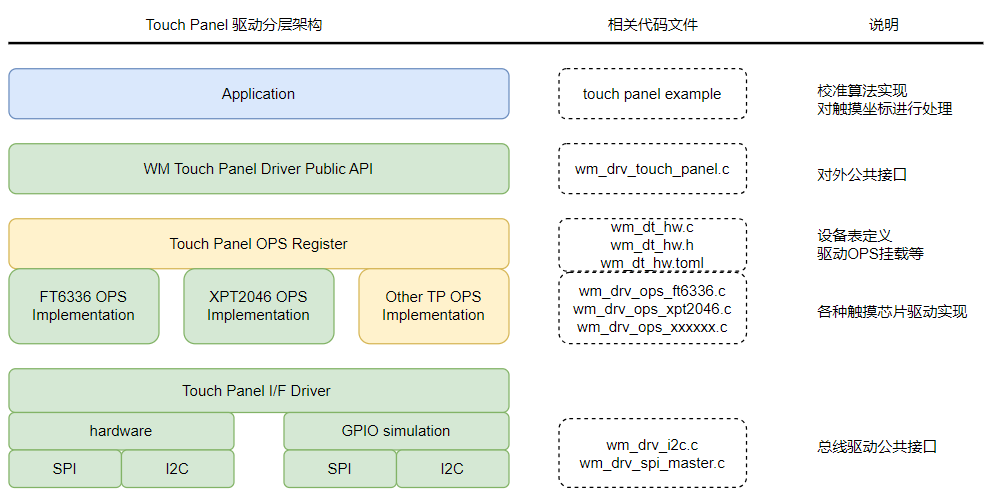

.. _touch_panel:

Touch_Panel
=============

简介
-------------

Touch Panel（触摸面板）是一种通过直接触摸屏幕实现人机交互的输入设备，广泛应用于智能手机、平板电脑、工业控制设备、汽车中控等领域。其核心功能是检测用户的触摸位置，并将信号传递给处理器，实现精准操作。  
根据工作原理，触摸面板主要分为 电阻式（Resistive）和 电容式（Capacitive）两大类，它们在结构、灵敏度、成本和应用场景上各有特点。  

- 电阻式：由两层导电薄膜（ITO） 组成，中间用微小绝缘点隔开。当用户按压屏幕时，两层薄膜接触，控制器检测电压变化，计算触控坐标（X/Y）  

  - 优点：成本低，抗干扰强，适合工业环境。
  - 缺点：单点触控，容易老化，需要定期校准。

- 电容式：利用人体电场改变表面电容或电极间互电容。控制器通过扫描电容变化，精确定位触控点。

  - 优点：灵敏度高，支持多点触控，无需校准。
  - 缺点：成本较高，易受干扰。

Touch Panel 模块分层结构
------------------------

WM IOT SDK 的 Touch Panel 模块分为4个功能层:

  1. 应用层（用户基于中间层，或直接基于驱动层开发的应用）。
  2. 中间层（集成 LVGL 实现点，线等功能）。
  3. 驱动层（用于各触摸芯片的设备驱动实现）。
  4. 通信层（如 SPI，I2C 等）。

驱动层 功能列表
-------------------

- 支持通过 Device Table 进行 Touch Panel 参数配置 （包含 Bus，屏幕的长和宽，引脚配置等）。
- 支持参数配置功能（可配置旋转、校准、校准参数）。
- 支持参数获取功能（可获取屏幕长和宽，校准参数）。
- 支持获取触摸点坐标。

驱动使用方法
^^^^^^^^^^^^^^^^

目前驱动层支持 xpt2046（电阻式）和 ft6336（电容式）两款。通过 menuconfig -> PERIPHERALS -> Touch driver -> touch Device 中选择触摸驱动控制器。
参考 example 下 touch panel basic 的 readme 说明，将触摸芯片和开发板的硬件引脚连接好。 `Touch Panel 示例说明 <../../examples_reference/examples/peripheral/touch_panel/touch_panel_basic/README.html>`_。

API 调用时序:

- 调用 ``wm_drv_touch_panel_init`` 初始化
- 调用 ``wm_drv_touch_panel_set_config`` 设置参数
- 调用 ``wm_drv_touch_panel_get_config`` 获取参数
- 调用 ``wm_drv_touch_panel_get_coords`` 读取坐标

结果：

- LOG 会打印用户触摸坐标

.. note:: 

    如果是电阻屏，需要进行校准。校准流程需要屏幕显示配合。
    参考 tft_lcd_polling example 的 readme 说明,将屏和开发板的硬件引脚连线好。 `Polling 示例说明 <../../examples_reference/examples/peripheral/tft_lcd/tft_lcd_polling/README.html>`_。  
    参考 touch panel calibration 示例工程。 `Calibration 示例说明 <../../examples_reference/examples/peripheral/touch_panel/touch_panel_calibration/README.html>`_。  

    结果：

    - TFT LCD 屏上会依次显示校准坐标，用户依次点击后完成校准。后续 LOG 打印校准后的像素坐标。

Touch Panel 设备驱动的添加方法
------------------------------

下图为 Touch Panel 设备驱动框架

若要添加新的 Touch Panel 的设备驱动，建议保持当前分层结构，大部分情况下只需要修改黄色相关层级即可。

第一步：在设备表中创建设备 ``wm_iot_sdk/components/wm_dt/config/w80x/wm_dt_hw.c``  

定义OPS

.. code-block:: c

    typedef struct wm_drv_ops_structure wm_drv_touch_driver_ops_t;
    extern const wm_drv_touch_driver_ops_t wm_drv_ft6336_ops;
    extern const wm_drv_touch_driver_ops_t wm_drv_xpt2046_ops;

定义设备信息

.. code-block:: c

    #if CONFIG_COMPONENT_XPT2046_DRIVER
    const static wm_dt_hw_touch_panel_t dt_hw_xpt2046 = {
        .init_cfg     = { .init_level = 0, .init_priority = 0 },
        .if_dev_name  = "spim_soft",
        .irq_pin      = { .pin_num  = WM_GPIO_NUM_16,
                        .pin_mux  = WM_GPIO_IOMUX_FUN5,
                        .pin_dir  = WM_GPIO_DIR_INPUT,
                        .pin_pupd = WM_GPIO_FLOAT },
        .mirror_image = 0,
        .width        = 480,
        .height       = 272,
        .spi_cfg  = { .freq   = 2 * 1000000,
                        .mode   = 0,
                        .pin_cs = { .pin_num  = WM_GPIO_NUM_27,
                                      .pin_mux  = WM_GPIO_IOMUX_FUN5,
                                      .pin_dir  = WM_GPIO_DIR_OUTPUT,
                                      .pin_pupd = WM_GPIO_FLOAT } }
    };
    #endif

挂载设备

.. code-block:: c

    #if CONFIG_COMPONENT_XPT2046_DRIVER
        { .dev_name = "xpt2046",      .hw_addr = (void *)&dt_hw_xpt2046,      .ops_addr = (void *)&wm_drv_xpt2046_ops          },
    #endif
    #endif  /* CONFIG_COMPONENT_DRIVER_TOUCH_PANEL_ENABLED */

.. note:: 

   - 设备表的修改方法 可参考相关章节 :ref:`pinmux`  以及  :ref:`lable_device_table`
   - 上面步骤为 C 风格的 Device Table ，使用 Toml 风格也参考  :ref:`lable_device_table`
   - 设备表中的 ``pin_num`` 配置须严格匹配 你所使用开发板所选择的 IO。使用的 if_dev_name 的 IO 也要严格匹配。如这里的 spim_soft

  .. code-block:: c

    const static wm_dt_hw_pin_cfg_t dt_spim_soft_pin_cfg[] = {
      { .pin_num  = WM_GPIO_NUM_24,
      .pin_mux  = WM_GPIO_IOMUX_FUN5,
      .pin_dir  = WM_GPIO_DIR_OUTPUT,
      .pin_pupd = WM_GPIO_FLOAT                                                                                           }, //clock

      { .pin_num = WM_GPIO_NUM_25,  .pin_mux = WM_GPIO_IOMUX_FUN5, .pin_dir = WM_GPIO_DIR_INPUT, .pin_pupd = WM_GPIO_FLOAT }, //miso

      { .pin_num  = WM_GPIO_NUM_26,
      .pin_mux  = WM_GPIO_IOMUX_FUN5,
      .pin_dir  = WM_GPIO_DIR_OUTPUT,
      .pin_pupd = WM_GPIO_FLOAT                                                                                           }, //mosi
    };

第二步：相关头文件操作

- 创建新设备的 header 文件 ``wm_iot_sdk/components/driver/include/touch_panel/xxxx.h``

该文件中主要存放 Touch Panel 设备 ``命令集``，用宏定义方式呈现

.. code-block:: c

    // The command definitions for XPT2046 must strictly match those in the XPT2046 Datasheet.
    #define XPT2046_TEMP0_CMD    0x86 // Get temperatur of temp0
    #define XPT2046_TEMP1_CMD    0xF6 // Get temperatur of temp1
    #define XPT2046_VBAT_CMD     0xA6 // Get spannung
    #define XPT2046_AUXIN_CMD    0xE6 // Get hilfseingang
    #define XPT_CMD_X_COORDINATE 0XD0 // Get x coordinate
    #define XPT_CMD_Y_COORDINATE 0X90 // Get y coordinate
    #define XPT_CMD_PRESSURE_Z1  0XB0 // Get the pressure of z1
    #define XPT_CMD_PRESSURE_Z2  0XC0 // Get the pressure of z2

- 列出 Touch Panel 设备名 ``wm_iot_sdk/components/driver/include/touch_panel_cfg.h``

.. code-block:: c

    /** List all the device names of touch panel devices that
    *  exactly match the device names defined in the device table. */
    #define DEV_NAME_FT6336_I2C        "ft6336"
    #define DEV_NAME_XPT2046_SPIM_SOFT "xpt2046"

    #if defined(CONFIG_COMPONENT_XPT2046_DRIVER)
    #define WM_CFG_TOUCH_PANEL_NAME DEV_NAME_XPT2046_SPIM_SOFT

    #elif defined(CONFIG_COMPONENT_FT6336_DRIVER)
    #define WM_CFG_TOUCH_PANEL_NAME DEV_NAME_FT6336_I2C

    #endif

第三步：创建新设备的 驱动主体文件

对于新设备主体驱动可以拷贝一份既有 Touch Panel 设备的驱动文件，如 ``wm_drv_ops_xpt2046.c`` 并重命名。
根据自己芯片的数据手册，按照时序要求实现基本的读取函数。然后实现自己的 ``Ops`` 函数，检查里面所实现的函数逻辑是否 与新设备预期行为 存在差异的地方。

.. code-block:: c

    static int xpt2046_read(wm_device_t *xpt2046_device, uint8_t cmd, uint16_t *data)
    {
        wm_drv_xpt2046_dev_t *dev = (wm_drv_xpt2046_dev_t *)xpt2046_device;
        spim_transceive_t desc    = { .flags = SPI_TRANS_BIG_ENDIAN };

        uint8_t tx_buf[XPT_CMD_SWAP_NUM] = { cmd, 0, 0 };
        uint8_t rx_buf[XPT_CMD_SWAP_NUM] = { 0, 0, 0 };

        desc.rx_buf = rx_buf;
        desc.rx_len = XPT_CMD_SWAP_NUM;
        desc.tx_buf = tx_buf;
        desc.tx_len = XPT_CMD_SWAP_NUM;

        WM_DRV_XPT2046_CHECK_FAIL(dev->drv->drv_mutex);
        WM_DRV_XPT2046_CHECK_FAIL(dev->drv->spi_controler);
        WM_DRV_XPT2046_CHECK_FAIL(dev->drv->spi_config);

        WM_DRV_XPT2046_LOCK(dev->drv->drv_mutex);
        wm_drv_spim_transceive_sync(dev->drv->spi_controler, dev->drv->spi_config, &desc, 10000);
        WM_DRV_XPT2046_UNLOCK(dev->drv->drv_mutex);
        *data = (((rx_buf[1] << 8) | rx_buf[2]) >> 3);
        return WM_ERR_SUCCESS;
    }

.. code-block:: C

    /*
    XPT2046 api ops
    */
    const wm_drv_touch_panel_ops_t wm_drv_xpt2046_ops = {
        .init       = xpt2046_touch_init,
        .deinit     = xpt2046_touch_deinit,
        .set_cfg    = xpt2046_touch_set_config,
        .get_cfg    = xpt2046_touch_get_config,
        .get_coords = xpt2046_touch_get_coords,
    };

第四步： 配置文件完善

新的 Touch Panel 驱动添加后，需要添加信息到这些文件中。用于在编译时能通过 menuconfig UI 选择到新添加的 Touch Panel Device。

文件： ``components\driver\Kconfig``

  - 该文件用于管理所有 Touch Panel Device 的 Compile Option。

.. code-block:: c

    choice COMPONENT_TOUCH_PANEL_OPTIONS
        prompt "touch panel"
        depends on COMPONENT_DRIVER_TOUCH_PANEL_ENABLED
        help
            "Select the touch panel for the screen"

        config COMPONENT_FT6336_DRIVER
            bool "ft6336_i2c"
            select COMPONENT_DRIVER_I2C_ENABLED
            help
                "touch panel FT6336"

        config COMPONENT_XPT2046_DRIVER
            bool "xpt2046_spi_soft"
            select COMPONENT_DRIVER_SPIM_SOFT_ENABLED
            help
                "touch panel XPT2046"

    endchoice

