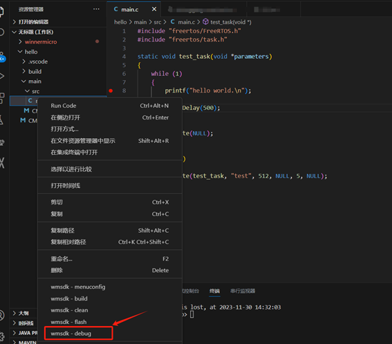

**IDE 调试指南**
------------------------------------------

IDE 环境安装请参考 :ref:`IDE 编译环境<ide>`。

VS Code 调试
^^^^^^^^^^^^^^^^^^^^^^^

在连接 cklink 调试器之后，打开VS Code

在工程文件上右键选择 Debug 命令启动调试

也可以在底部状态栏选择 WM IOT SDK 工具中的 Debug 命令启动调试。

使用 VS Code 进行断点调试如下图所示：

.. figure:: ../../_static/debug/cklink_achievement.png
   :align: center
