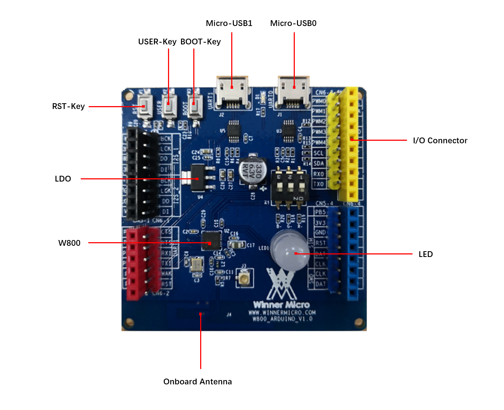
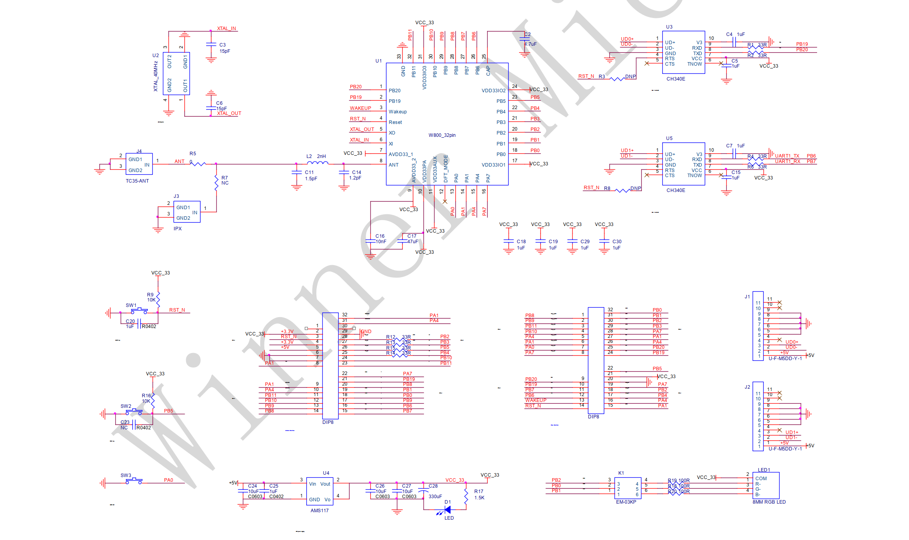
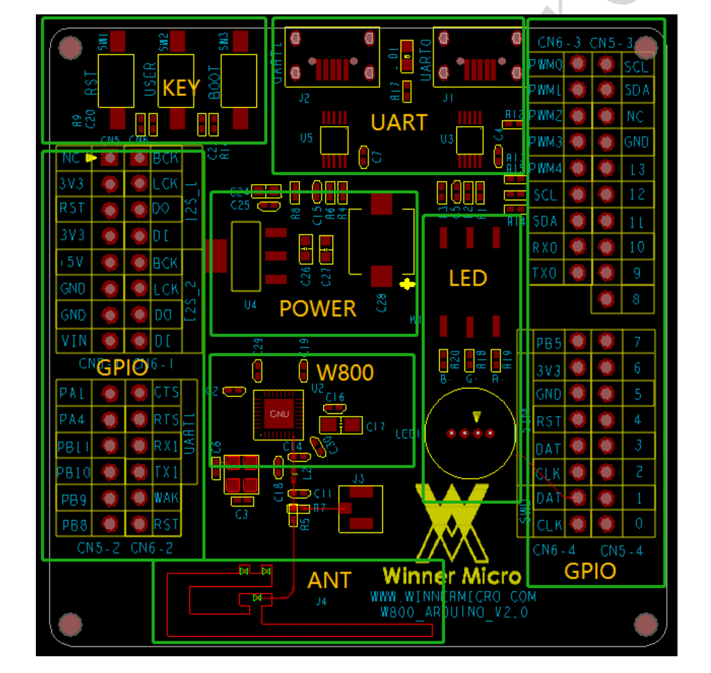

W800-Arduino 入门指南
=========================

准备工作
----------

- W800-Arduino 开发板

- Micro USB 数据线 或 Type-C 数据线

- USB 转串口驱动（`点击下载 CH34X 驱动 <https://doc.winnermicro.net/download/tools/all/CH341SER.zip>`_）

- PC（Windows、Linux 或 macOS）

你可以跳过介绍部分，直接前往 :ref:`应用程序开发<application-program>` 章节。

概述
----------

W800-Arduino 是联盛德一款基于 W800 的开发板。

.. attention::
    目前有 2 种硬件版本不同的开发板：v4 和 v3，使用时请观察板子上的丝印区分。
    下面的介绍均以硬件版本 v3 的 W800-Arduino 开发板为例。

W800-Arduino 开发板主要集成了以下外围器件：

- 外置天线接口和板载天线
- 集成了5v 转 3.3v LDO 芯片
- 提供了 BOOT、RESET 和 USER 按键
- 内置一个三色 LED 灯

这大大降低了用户额外采购和安装这些元器件的数量和成本，及额外组装测试的复杂度，并增加了可用性。

W800-Arduino 上的 USER 按键是为客户提供的输入信号检测按键，方便客户调试相关功能程序使用。

为了便于客户连接更多的外设，W800-Arduino 上所有的 IO 信号和系统电源管脚均通过开发板下方和上方的引脚引出，使得客户可以将 W800-Arduino 直接插在其他开发板上或是用杜邦线连接其他外设使用，大大增加了用户的使用多样性。

功能说明
----------

W800-Arduino 开发板的主要组件、接口及控制方式如下。

W800-Arduino 开发板的主要组件描述见下表（从左上角起顺时针顺序）。

.. list-table:: 
   :widths: 25 25 
   :header-rows: 0
   :align: center

   * - 主要组件
     - 基本介绍

   * - RST-Key
     - 系统复位按键。

   * - USER-Key
     - 为客户提供的输入信号检测按键。

   * - BOOT-Key
     - 下载使用按键，用户按下 BOOT 按键，然后将 USB 线插入到 UART0 口，松开 BOOT 按键后进入下载模式。

   * - Micro-USB1
     - 开发板的另一个 USB 口，功能与默认的 USB 口一致。

   * - Micro-USB0
     - 开发板默认的 USB 口，可作为开发板的供电口，或作为连接 PC 和开发板的通信接口。

   * - I/O
     - W800 的所有管脚都已引出至开发板的排针，用户可以对 W800 进行编程，实现 PWM、ADC、DAC、I2C和I2S等功能，详情请见 :ref:`管脚说明<base-pin>`。

   * - LED
     - 三色 LED，为用户方便调试 PWM。使用时需要将 K1 开关拨到 ON 档，不用时拨到 OFF 档。

   * - Antenna
     - 开发板的板载天线，开发板还支持外置天线。

   * - W800
     - 开发板的主控芯片，具有 WiFi，蓝牙等功能。

   * - LDO
     - 5v 转 3.3v 的 LDO 芯片。

电源选项
-----------

开发板可任一选用以下三种供电方式：

- Micro USB 供电（默认），两个 USB 接口均可供电。
- 5V / GND 管脚供电。
- 3.3V / GND 管脚供电。

.. warning:: 

    上述供电模式 **不可同时连接**，否则可能会损坏开发板或电源。

.. _base-pin:

管脚说明
----------

下表介绍了开发板 I/O 管脚的 **名称** 和 **功能** ，具体布局请见 :ref:`开发板原理图与布局示意图<schematic-diagram>` 章节。

.. list-table:: 
   :widths: 25 25 25 25 25 25 25 25
   :header-rows: 0
   :align: center

   * - 编号
     - 名称
     - 类型
     - 复位后管脚功能
     - 复用功能
     - 最高频率
     - 上下拉能力
     - 驱动能力

   * - 1
     - PB_20
     - I/O
     - UART_RX
     - UART0_RX/PWM1/UART1_CTS/I²C_SCL
     - 10MHz
     - UP/DOWN
     - 12mA

   * - 2
     - PB_19
     - I/O
     - UART_TX
     - UART0_TX/PWM0/UART1_RTS/I²C_SDA
     - 10MHz
     - UP/DOWN
     - 12mA

   * - 3
     - WAKEUP
     - I
     - WAKEUP 唤醒功能
     - 
     - 
     - DOWN
     - 

   * - 4
     - RESET
     - I
     - RESET 复位
     - 
     - 
     - UP
     - 

   * - 5
     - XTAL_OUT
     - O
     - 外部晶振输出
     - 
     - 
     - 
     - 

   * - 6
     - XTAL_IN
     - I
     - 外部晶振输入
     - 
     - 
     - 
     - 

   * - 7
     - AVDD33
     - P
     - 芯片电源，3.3V
     - 
     - 
     - 
     - 

   * - 8
     - ANT
     - I/O
     - 射频天线
     - 
     - 
     - 
     - 

   * - 9
     - AVDD33
     - P
     - 芯片电源，3.3V
     - 
     - 
     - 
     - 

   * - 10
     - AVDD33
     - P
     - 芯片电源，3.3V
     - 
     - 
     - 
     - 

   * - 11
     - AVDD33_AUX
     - P
     - 芯片电源，3.3V
     - 
     - 
     - 
     - 

   * - 12
     - TEST
     - I
     - 测试功能配置管脚
     - 
     - 
     - 
     -

   * - 13
     - BOOTMODE
     - I/O
     - BOOTMODE
     - I²S_MCLK/LSPI_CS/PWM2/I²S_DO
     - 20MHz
     - UP/DOWN
     - 12mA

   * - 14
     - PA_1
     - I/O
     - JTAG_CK
     - JTAG_CK/I²C_SCL/PWM3/I²S_LRCK/ADC0
     - 20MHz
     - UP/DOWN
     - 12mA

   * - 15
     - PA_4
     - I/O
     - JTAG_SWO
     - JTAG_SWO/I²C_SDA/PWM4/I²S_BCK/ADC1
     - 20MHz
     - UP/DOWN
     - 12mA

   * - 16
     - PA_7
     - I/O
     - GPIO, 输入, 高阻
     - PWM4/LSPI_MOSI/I²S_MCK/I²S_DI /Touch0
     - 20MHz
     - UP/DOWN
     - 12mA

   * - 17
     - VDD33IO
     - P
     - IO 电源，3.3V
     - 
     - 
     - 
     -

   * - 18
     - PB_0
     - I/O
     - GPIO, 输入, 高阻
     - PWM0/LSPI_MISO/UART3_TX/PSRAM_CK/Touch3
     - 80MHz
     - UP/DOWN
     - 12mA

   * - 19
     - PB_1
     - I/O
     - GPIO, 输入, 高阻
     - PWM1/LSPI_CK/UART3_RX/PSRAM_CS/Touch4
     - 80MHz
     - UP/DOWN
     - 12mA

   * - 20
     - PB_2
     - I/O
     - GPIO, 输入, 高阻
     - PWM2/LSPI_CK/UART2_TX/PSRAM_D0/Touch5
     - 80MHz
     - UP/DOWN
     - 12mA

   * - 21
     - PB_3
     - I/O
     - GPIO, 输入, 高阻
     - PWM3/LSPI_MISO/UART2_RX/PSRAM_D1/Touch6
     - 80MHz
     - UP/DOWN
     - 12mA

   * - 22
     - PB_4
     - I/O
     - GPIO, 输入, 高阻
     - LSPI_CS/UART2_RTS/UART4_TX/PSRAM_D2/Touch7
     - 80MHz
     - UP/DOWN
     - 12mA

   * - 23
     - PB_5
     - I/O
     - GPIO, 输入, 高阻
     - LSPI_MOSI/UART2_CTS/UART4_RX/PSARM_D3/Touch8
     - 80MHz
     - UP/DOWN
     - 12mA

   * - 24
     - VDD33IO
     - P
     - IO 电源，3.3V
     - 
     - 
     - 
     - 

   * - 25
     - CAP
     - I
     - 外接电容，4.7µF
     - 
     - 
     - 
     - 

   * - 26
     - PB_6
     - I/O
     - GPIO, 输入, 高阻
     - UART1_TX/MMC_CLK/HSPI_CK/SDIO_CK/Touch9
     - 50MHz
     - UP/DOWN
     - 12mA

   * - 27
     - PB_7
     - I/O
     - GPIO, 输入, 高阻
     - UART1_RX/MMC_CMD/HSPI_INT/SDIO_CMD/Touch10
     - 50MHz
     - UP/DOWN
     - 12mA

   * - 28
     - PB_8
     - I/O
     - GPIO, 输入, 高阻
     - I²S_BCK/MMC_D0/PWM_BREAK/SDIO_D0/Touch11
     - 50MHz
     - UP/DOWN
     - 12mA

   * - 29
     - PB_9
     - I/O
     - GPIO, 输入, 高阻
     - I²S_LRCK/MMC_D1/HSPI_CS/SDIO_D1/Touch12
     - 50MHz
     - UP/DOWN
     - 12mA

   * - 30
     - PB_10
     - I/O
     - GPIO, 输入, 高阻
     - I²S_DI/MMC_D2/HSPI_DI/SDIO_D2
     - 50MHz
     - UP/DOWN
     - 12mA

   * - 31
     - VDD33IO
     - P
     - IO 电源，3.3V
     - 
     - 
     - 
     - 

   * - 32
     - PB_11
     - I/O
     - GPIO, 输入, 高阻
     - I²S_DO/MMC_D3/HSPI_DO/SDIO_D3
     - 50MHz
     - UP/DOWN
     - 12mA

   * - 33
     - GND
     - P
     - 接地
     - 
     - 
     - 
     - 

.. _application-program:

应用程序开发
------------

W800-Arduino 上电前，请首先确认开发板完好无损。

现在，请前往快速入门中的 :ref:`搭建编译环境<compiling-environment>` 章节，查看如何设置开发环境，并尝试将示例项目烧录至你的开发板。

.. _schematic-diagram:

开发板原理图与布局示意图
-------------------------

W800-Arduino 开发板的原理图如下。

W800-Arduino 开发板的布局示意图如下。

参考资料下载
-------------------------

- `W800-Arduino 开发板 v3 <../../../../download/board/w800_arduino_board_v3.1_20240808.zip>`__
- `W800-Arduino 开发板 v4 <../../../../download/board/w800_arduino_board_v4_20240826.zip>`__

W800-Arduino 开发板 v4 和 v3 的区别为

.. list-table::
  :header-rows: 0
  :align: center

  * - 硬件版本
    - USB 转串口
    - 引脚
    - I2S
    - 自动复位

  * - v3
    - Micro USB
    - 丝印未标引脚编号
    - 无 MCLK 引脚
    - 无

  * - v4
    - Type-C
    - 丝印标引脚编号

      提供了更多的电源和地引脚

      减少了 1 个 RESET 引脚

      增加了 1 组 SPI 引脚

      减少了 1 组 I2S 引脚
    - 有 MCLK 引脚
    - 有

      串口 RTS 引脚连接了开发板 RESET 引脚
