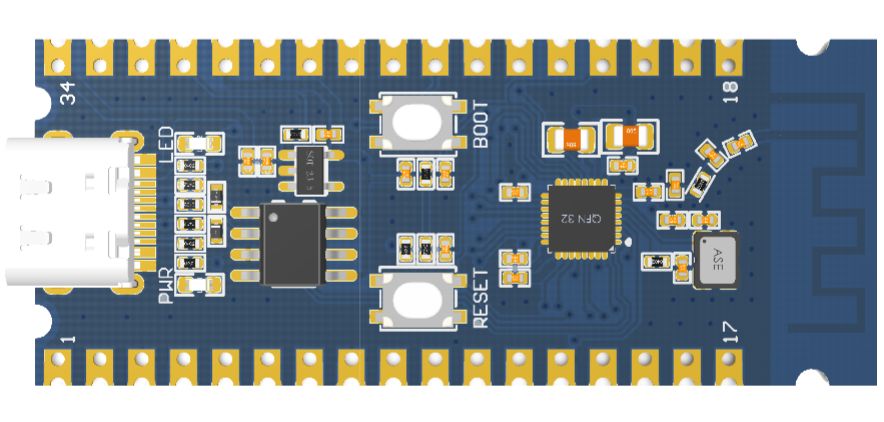
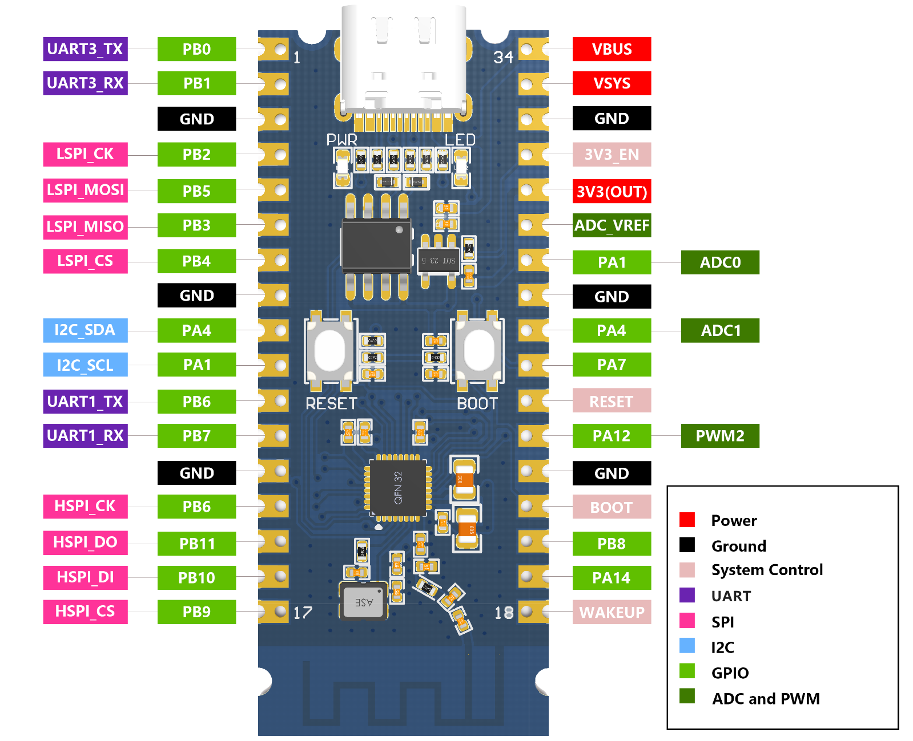
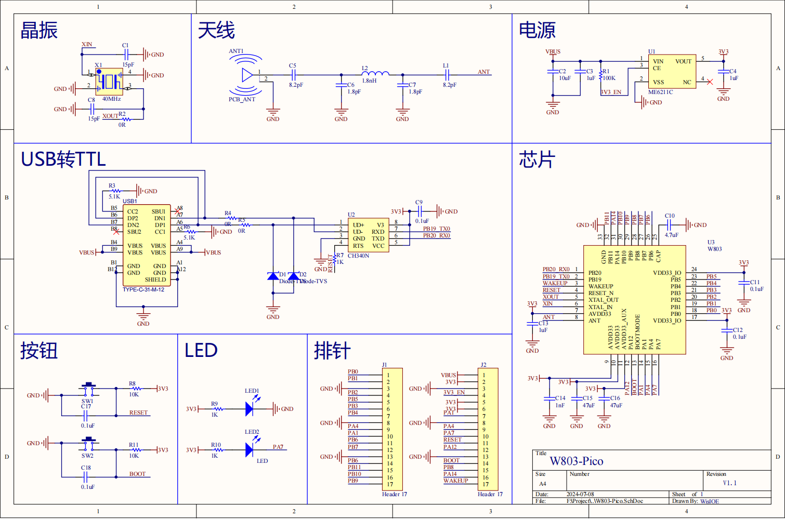
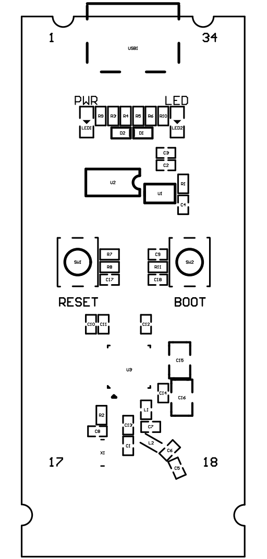

W803-Pico 入门指南
=========================

准备工作
----------

- W803-Pico 开发板

- Type-C 数据线

- USB 转串口驱动（`点击下载 CH34X 驱动 <https://doc.winnermicro.net/download/tools/all/CH341SER.zip>`_）

- PC（Windows、Linux 或 macOS）

你可以跳过介绍部分，直接前往 :ref:`应用程序开发<application-program-w803>` 章节。

概述
----------

W803-Pico是一款基于联盛德W803芯片为主控的开发板，支持IEEE802.11 b/g/n Wi-Fi，以及BT/BLE4.2协议蓝牙。芯片内置高性能32位处理器，主频高达240MHz。内置2MB Flash以及288KB RAM。硬件采用DIP封装，PCB板载天线，接口丰富，使用简单。

W803-Pico 开发板主要集成了以下外围器件：

- 外置PCB板载天线
- 集成了5v 转 3.3v LDO 芯片
- 提供了 BOOT、RESET 按键
- 内置电源指示灯（PWR）、用户指示灯（LED）灯

这大大降低了用户额外采购和安装这些元器件的数量和成本，及额外组装测试的复杂度，并增加了可用性。

为了便于客户连接更多的外设，W803-Pico 上所有的 IO 信号和系统电源管脚均通过开发板下方和上方的引脚引出，使得客户可以将 W803-Pico 直接插在其他开发板上或是用杜邦线连接其他外设使用，大大增加了用户的使用多样性。

硬件规格
---------

W803-Pico 开发板的主要组件图如下。

W803-Pico 开发板的硬件规格描述见下表。

.. list-table:: 
   :header-rows: 1
   :widths: 10 15 30
   :align: center
   
   * -
     - 
     - 
   * - 硬件接口
     - 供电
     - 5V DC
   * - 
     - LED 灯
     - 电源指示灯（PWR）、 用户指示灯（LED）
   * - 
     - USB 接口 
     - Type-C
   * - 
     - 按键 
     - BOOT， RESET
   * - 外形尺寸
     - 尺寸（长*宽*高）
     - 52.7*21.0*4.95mm
   * - 温度范围
     - 工作温度 
     - -40°C~85°C
   * - 
     - 存储温度
     - -40°C~85°C
   * - MCU 特性
     - CPU 
     - 32 位 XT804 处理器，工作频率 240MHz
   * - 
     - 存储
     - 2MB Flash， 288KB RAM
   * - 安全特性
     - 安全引擎 
     - Tee 安全引擎，代码可区分安全世界/非安全世界
   * - 
     - 安全功能
     - 固件签名、固件加密
   * - Wi-Fi 特性
     - 协议 
     - IEEE802.11 b/g/n
   * - 
     - 带宽工作模式 
     - 20M/40M
   * - 
     - 加密方式 
     - WMM/WMM-PS/WPA/WPA2/WPS
   * - 
     - 工作模式
     - Station、 Soft-AP、 Soft-AP/Station
   * - 蓝牙特性
     - 协议 
     - 支持 BT/BLE4.2 协议
   * - 
     - 工作模式 
     - 支持 BT/BLE 双模工作模式

电源选项
-----------

开发板可任一选用以下两种供电方式：

- VBUS供电，来自USB 5V 供电。
- VSYS供电，直接接入W803芯片，3.3V 供电。

.. warning:: 

    上述供电模式 **不可同时连接**，否则可能会损坏开发板或电源。

工作条件
-----------

W803-Pico 开发板的工作条件见下表。

.. list-table:: 
   :widths: 10 20
   :header-rows: 0
   :align: center

   * - 属性
     - 参数
   * - Type-C USB输入电压
     - DC 5V(+/- 10%)
   * - 工作温度
     - -40℃~85℃

.. _base-pin-w803:

管脚说明
----------

下表介绍了开发板 I/O 管脚的 **名称** 和 **功能** ，具体布局请见 :ref:`开发板引脚图、原理图与布局示意图<schematic-diagram-w803>` 章节。

.. list-table:: 
   :widths: 5 5 5 20 5 5 6
   :header-rows: 0
   :align: center

   * - 编号
     - 名称
     - 类型
     - 复用功能
     - 最高频率
     - 上下拉能力
     - 驱动能力
   * - 1
     - PB0
     - I/O
     - PWM0/LSPI_MISO/UART3_TX/PSRAM_CK/Touch_3
     - 80MHz
     - UP/DOWN
     - 12mA
   * - 2
     - PB1
     - I/O
     - PWM1/LSPI_CK/UART3_RX/PSRAM_CS/Touch_4
     - 80MHz
     - UP/DOWN
     - 
   * - 3
     - GND
     - P
     - 
     - 
     - 
     - 
   * - 4
     - PB2
     - I/O
     - PWM2/LSPI_CK/UART2_TX/PSRAM_D0/Touch_5
     - 80MHz
     - UP/DOWN
     - 12mA
   * - 5
     - PB5
     - I/O
     - LSPI_MOSI/UART2_CTS/UART4_RX/PSRAM_D3/Touch_8
     - 80MHz
     - UP/DOWN
     - 12mA
   * - 6
     - PB3
     - I/O
     - PWM3/LSPI_MISO/UART2_RX/PSRAM_D1/Touch_6
     - 80MHz
     - UP/DOWN
     - 12mA
   * - 7
     - PB4
     - I/O
     - LSPI_CS/UART2_RTS/UART4_TX/PSRAM_D2/Touch_7
     - 80MHz
     - UP/DOWN
     - 12mA
   * - 8
     - GND
     - P
     - 
     - 
     - 
     - 
   * - 9
     - PA4
     - I/O
     - JTAG_SWO/I²C_SDA/PWM4/I²S_BCK/ADC1
     - 20MHz
     - UP/DOWN
     - 12mA
   * - 10
     - PA1
     - I/O
     - JTAG_CK/I²C_SCL/PWM3/I²S_LRCK/ADC0
     - 20MHz
     - UP/DOWN
     - 12mA
   * - 11
     - PB6
     - I/O
     - UART1_TX/MMC_CLK/HSPI_CK/SDIO_CK/Touch_9
     - 50MHz
     - UP/DOWN
     - 12mA
   * - 12
     - PB7
     - I/O
     - UART1_RX/MMC_CMD/HSPI_INT/SDIO_CMD/Touch_10
     - 50MHz
     - UP/DOWN
     - 12mA
   * - 13
     - GND
     - P
     - 
     - 
     - 
     - 
   * - 14
     - PB6
     - I/O
     - UART1_TX/MMC_CLK/HSPI_CK/SDIO_CK/Touch_9
     - 50MHz
     - UP/DOWN
     - 12mA
   * - 15
     - PB11
     - I/O
     - I²S_DO/MMC_D3/HSPI_DO/SDIO_D3
     - 50MHz
     - UP/DOWN
     - 12mA
   * - 16
     - PB10
     - I/O
     - I2S_DI/MMC_D2/HSPI_DI/SDIO_D2
     - 50MHz
     - UP/DOWN
     - 12mA
   * - 17
     - PB9
     - I/O
     - I²S_LRCK/MMC_D1/HSPI_CS/SDIO_D1/Touch_12
     - 50MHz
     - UP/DOWN
     - 12mA
   * - 18
     - WAKEUP
     - I
     - 
     - 
     - 
     - 
   * - 19
     - PA14
     - I/O
     - TOUCH_CAP(CDC)/UART5_CTS/PWM4
     - 50MHz
     - UP/DOWN
     - 12mA
   * - 20
     - PB8
     - I/O
     - I²S_BCK/MMC_D0/PWM_BREAK/SDIO_D0/Touch_11
     - 50MHz
     - UP/DOWN
     - 12mA
   * - 21
     - BOOT
     - I
     - 
     - 
     - 
     - 
   * - 22
     - GND
     - P
     - 
     - 
     - 
     - 
   * - 23
     - PA12
     - I/O
     - TOUCH_CAP(CMOD)/UART5_TX/PWM2
     - 50MHz
     - UP/DOWN
     - 12mA
   * - 24
     - RESET
     - I
     - 
     - 
     - 
     - 
   * - 25
     - PA7
     - I/O
     - PWM4/LSPI_MOSI/I²S_MCK/I²S_DI
     - 25MHz
     - UP/DOWN
     - 12mA
   * - 26
     - PA4
     - I/O
     - JTAG_SWO/I²C_SDA/PWM4/I²S_BCK/ADC_1
     - 20MHz
     - UP/DOWN
     - 12mA
   * - 27
     - GND
     - P
     - 
     - 
     - 
     - 
   * - 注：
     - 
     - 
     - ADC_VREF是ADC校准电压，典型值3.3V。
     - 
     - 
     - 
   * - 
     - 
     - 
     - USB连接至串口0，用于固件烧录，AT指令交互等。
     - 
     - 
     -

.. _application-program-w803:

应用程序开发
------------

W803-Pico 上电前，请首先确认开发板完好无损。

现在，请前往快速入门中的 :ref:`搭建编译环境<compiling-environment>` 章节，查看如何设置开发环境，并尝试将示例项目烧录至你的开发板。

.. _schematic-diagram-w803:

开发板引脚图、原理图与布局示意图
---------------------------------------------------------

W803-Pico 开发板的引脚图如下。

W803-Pico 开发板的原理图如下。

W803-Pico 开发板的布局示意图如下。

