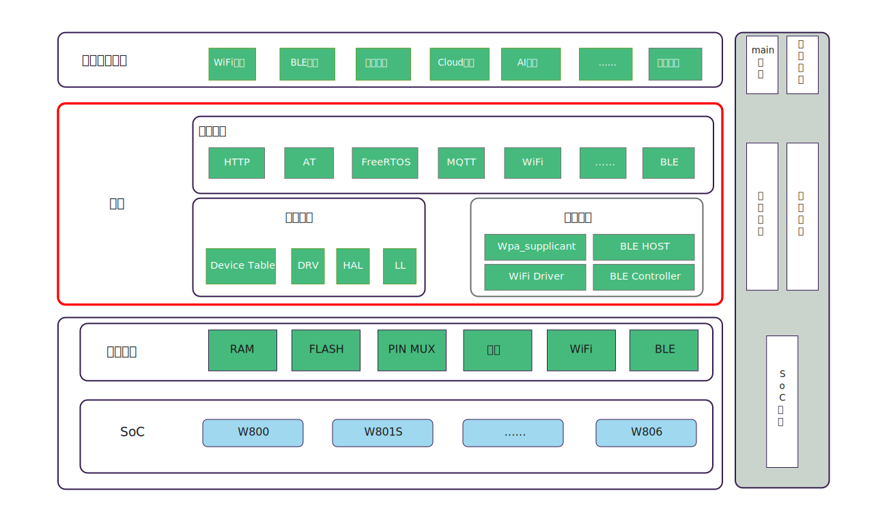

WM IoT SDK 编程指南
======================================

WM IoT SDK 是 WinnerMicro 官方推出的物联网系统，

支持 Windows 和 Linux 操作系统，是 ``W80X`` 系列芯片的官方开发框架。

.. toctree::
   :hidden:

   get_started/index
   soc_guides/index
   component_guides/index
   api_reference/index
   examples_reference/index
   contribute/index
   faq/index
