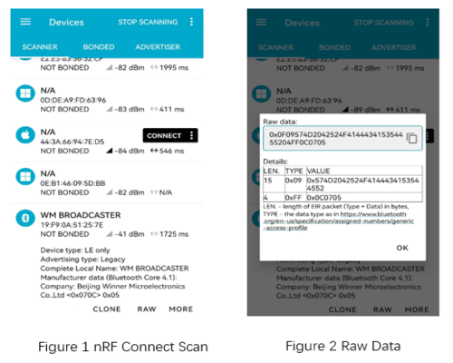

.. _bluetooth_broadcaster_sample:

broadcaster
#############

功能概述
*********

本示例演示如何使用 BLE 的广播功能。 程序运行后，周期性发不可连接送广播。广播包的内容包含名称 **WM BROADCASTER** 和厂商
自定义字段。每发送一次广播，厂商自定义字段中的计数器递增 1，计数器为 1 Byte（ 当计数值达到255后，将回滚至 0）。

环境要求
************

* 支持 BLE 功能的开发板
* nRF Connect APP

编译和烧录
********************

示例位置：``examples/bluetooth/broadcaster``
    

编译、烧录等操作请参考：`快速入门 <https://doc.winnermicro.net/w800/zh_CN/latest/get_started/index.html>`_

运行结果
************

1. 成功运行将输出如下日志

.. code-block:: console

	I/broadcaster     [0.110] Starting Broadcaster
	I/bt_hci_core     [0.134] Identity: 28:6D:CE:01:02:03 (public)
	I/bt_hci_core     [0.140] HCI: version 4.2 (0x08) revision 0x0709, manufacturer 0x070c
	I/bt_hci_core     [0.146] LMP: version 4.2 (0x08) subver 0x0709
	I/broadcaster     [0.152] Bluetooth initialized
	I/broadcaster     [1.156] Sending advertising data: 0x00
	I/broadcaster     [3.162] Sending advertising data: 0x01
	I/broadcaster     [5.168] Sending advertising data: 0x02
	I/broadcaster     [7.174] Sending advertising data: 0x03
	I/broadcaster     [9.180] Sending advertising data: 0x04

2. 运行 nRF Connect APP，可以扫描到 **WM BROADCASTER** 的设备

.. tip::

   本示例发送不可连接广播，广播内容的改变可以在 nRF Connect APP 端刷新扫描结果查看	