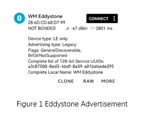
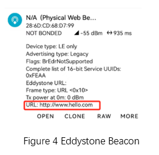

.. _bluetooth_eddystone_sample_en:

eddystone
####################

Overview
********
Application demonstrating `Eddystone Configuration Service`_

The Eddystone Configuration Service runs as a GATT service on the beacon while
it is connectable and allows configuration of the advertised data, the
broadcast power levels, and the advertising intervals. It also forms part of
the definition of how Eddystone-EID beacons are configured and registered with
a trusted resolver.

Requirements
************

* A board with BLE support
* nRF Connect APP

Building and Running
********************

Example Location：``examples/bluetooth/eddystone``

compile, burn, and more, see：`Quick Start Guide <https://doc.winnermicro.net/w800/en/latest/get_started/index.html>`_

Running result
***************

1. Successfully running will output the following logs，default ADV Slot Data is URL “http://www.winnermicro.com”

.. code-block:: console

	[I] (2) main: ver: 2.0.6dev build at Oct 18 2024 10:12:41
	[I] (26) bt: Identity: 28:6D:CD:68:D7:99 (public)
	[I] (26) bt: HCI: version 4.2 (0x08) revision 0x0709, manufacturer 0x070c
	[I] (26) bt: LMP: version 4.2 (0x08) subver 0x0709
	[I] (26) eddystone: Bluetooth initialized
	[I] (29) eddystone: Initial advertising as 28:6D:CD:68:D7:99 (public)
	[I] (29) eddystone: Configuration mode: waiting connections...
	
.. note::

   this connected advertisement will last **30** seconds, after **30** seconds, it changed to non-connected advertisement

2. Run nRF Connect APP, perform scan and you will find **WM Eddystone** 

	
3. After successfully executing the connection operation in the nRF Connect APP, the development board outputs the following log.

.. code-block:: console

	[I] (18493) eddystone: Connected

4. After a successful connection, perform read and write operations on the Eddystone Configuration Service. For example, change the ADV Slot Data.

.. figure:: assert/eddystone_service.svg
    :align: center

5. Disconnect with application on nRF Connect APP

.. code-block:: console

	[I] (101308) eddystone: Disconnected (reason 0x13)
	[I] (101310) eddystone: Switching to Beacon mode 0.
	[I] (101318) eddystone: Advertising as 28:6D:CD:68:D7:99 (public)

6. Restart scan on nRF Connect APP

.. warning::
   the advertisement data does not contains name, please verify the device depends on identify address

.. _Eddystone Configuration Service: https://github.com/google/eddystone/tree/master/configuration-service
