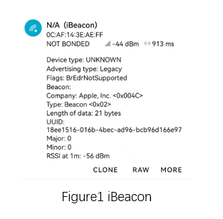

.. _bluetooth_ibeacon_sample_en:

ibeacon
##################

Overview
********

This example demonstrates the Apple iBeacon functionality. Once the program is running, it starts broadcasting Apple's iBeacon data packets. 
The signal strength of the broadcast packets can be adjusted through IBEACON_RSSI (e.g., IBEACON_RSSI=0xb8 corresponds to -72 dBm RSSI at 1 meter).

Requirements
************

* A board with BLE support
* nRF Connect APP

Building and Running
********************

Example Location：``examples/bluetooth/ibeacon``

compile, burn, and more, see：`Quick Start Guide <https://doc.winnermicro.net/w800/en/2.2-beta.2/get_started/index.html>`_

Running result
***************

1. Successfully running will output the following logs

.. code-block:: console

	I/ibeacon         [0.002] Starting iBeacon Demo
	I/bt_hci_core     [0.028] Identity: 28:6D:CE:01:02:03 (public)
	I/bt_hci_core     [0.034] HCI: version 4.2 (0x08) revision 0x0709, manufacturer 0x070c
	I/bt_hci_core     [0.040] LMP: version 4.2 (0x08) subver 0x0709
	I/ibeacon         [0.046] Bluetooth initialized
	I/ibeacon         [0.054] iBeacon started

2. Run nRF Connect APP, perform scan and you will find **iBeacon** 

.. warning::
   This application send advertisement with random address.Confirm whether the example is running correctly based on the **broadcast information** .