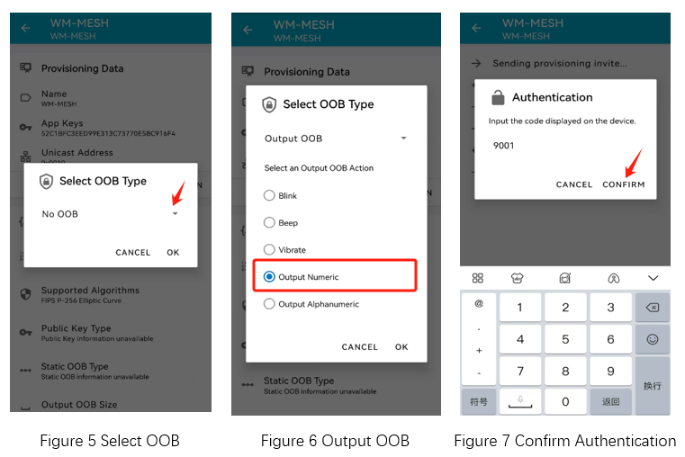
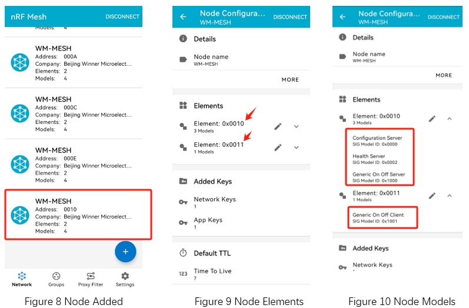
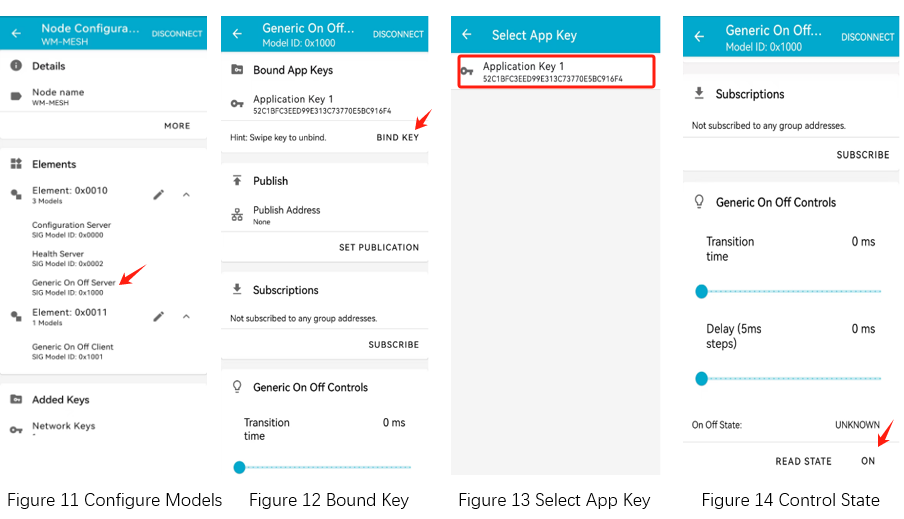
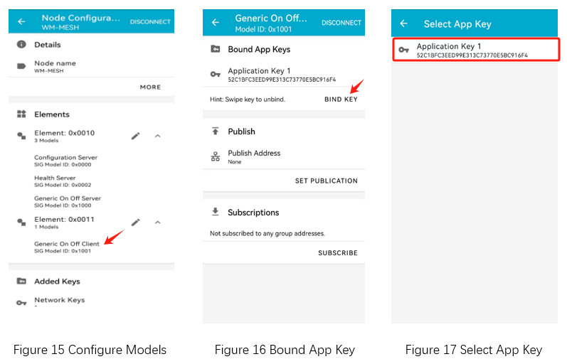

.. _ble_mesh_switch_and_light_sample:

mesh_switch_and_light
########################

功能概述
*********

本示例演示了 BLE Mesh 的节点功能。

- 示例包含了几个标准的 Mesh 模型和通用开关模型

- 支持通过广播模式和 GATT 模式进行配网操作

- 支持通过控制台输入授权信息

- 支持通过控制台发送开关指令

- 支持发布和订阅功能

- 示例通过输出不同 GPIO 的高低状态来更为直观的演示 Mesh 节点的工作状态
   
.. csv-table:: 节点工作状态和 GPIO 输出状态对应关系
    :header: "节点工作状态", "WM_GPIO_NUM_16(PB0)", "WM_GPIO_NUM_17(PB1)", "WM_GPIO_NUM_18(PB2)"
    :widths: 10, 30, 30, 30

    "等待入网 ", "低", "低", "高低切换，间隔 500ms"
    "Identity ", "低", "高低切换，间隔 200ms", "低"
    "开灯 ", "高", "高", "高"
	"关灯 ", "低", "低", "低"
	"入网后空闲 ", "低", "低", "高低切换，间隔 1000ms"

- 如果您正在使用 `W800-Arduino 开发板 <https://doc.winnermicro.net/w800/zh_CN/latest/get_started/w800_arduino.html>`_，Mesh 节点的工作状态和三色 LED 灯的颜色对应关系如下表格所示（确认三色 LED 灯的拨钮开关处于 ON 状态）

.. csv-table:: 节点工作状态和 LED 灯颜色的对应关系
    :header: "节点工作状态", "三色 LED 灯"
    :widths: 10, 30

    "等待入网 ", "蓝色闪烁，间隔 500ms"
    "Identity ", "绿色闪烁，间隔 200ms"
    "开灯 ", "亮"
	"关灯 ", "灭"
	"入网后空闲 ", "蓝色闪烁，间隔 1000ms"	
	
环境要求
************

* 支持 BLE Mesh 功能的开发板
* nRF Mesh APP

用户指令(cli commands)
******************************

mesh_prov_input_num:
   * 输入十进制格式的授权码。 如 ``mesh_prov_input_num 6789`` 

mesh_prov_input_str:
   * 输入字符串格式的授权码。如 ``mesh_prov_input_num asui``

mesh_ctrl:
   * 控制节点开关灯指令。指令格式为 ``mesh_ctrl dest val ack`` , dest 为 Mesh节点的模型地址 (十进制)，val 为开关状态 0 或者 1，ack 为控制指令是否带应答 0 或者 1。 

编译和烧录
********************

示例位置：``examples/bluetooth/mesh_switch_and_light``   

编译、烧录等操作请参考：`快速入门 <https://doc.winnermicro.net/w800/zh_CN/latest/get_started/index.html>`_

运行结果
************

1. 成功运行将输出如下日志

.. code-block:: console

	[I] (3) main: ver: 2.1.1dev build at Oct 29 2024 17:22:01
	[I] (4) bt: Mesh node demo running
	[I] (27) bt: No ID address. App must call settings_load()
	[I] (27) bt: Bluetooth initialized
	[I] (156) bt: Identity: 28:6D:CD:55:E5:90 (public)
	[I] (157) bt: HCI: version 4.2 (0x08) revision 0x0709, manufacturer 0x070c
	[I] (157) bt: LMP: version 4.2 (0x08) subver 0x0709
	[I] (187) bt: Mesh initialized
	
2. 运行 nRF Mesh APP，添加 **设备地址 (28:6D:CD:55:E5:90)** 的节点

.. figure:: assert/mesh_add_node.svg
    :align: center
	
	
3. Figure 5 所示，在选择 OOB Type 时，可以选择 No OOB 或者 Mesh 设备支持的 OOB 类型。如果选择 No OOB，忽略本步骤。如果选择 Mesh 设备支持的 OOB 类型，在 nRF Mesh APP 上确认后，输入在开发板日志打印的 OOB 数字并确认

  开发板输出 OOB 日志信息::

	[I] (283203) bt: OOB Number: 9001

	
4. Mesh 节点添加成功后，nRF Mesh APP 可以查看节点的元素信息

5. 同时开发板输出 Mesh 节点的首元素地址（节点默认地址）
  
.. code-block:: console

	[I] (301084) bt: Primary Element: 0x0010
	[I] (301091) bt: prov_complete: addr 0x0010

6. 在 nRF Mesh APP 上为 Generic On Off Server 模型绑定 APP Key

7. 模型绑定 APP Key 成功后，可以在 APP 上执行开关控制 (如图 Figure 14 所示)，此时开发板输出开关状态

.. code-block:: console

	[I] (365844) bt: onoff set state 1
	[I] (367294) bt: onoff set state 0

8. 在 nRF Mesh APP 上为 Generic On Off Client 模型绑定 APP Key

9. 模型绑定 APP Key 成功后，在开发板的控制台使用 ``mesh_ctrl`` 指令控制 Mesh 网络中的任意节点。如向 Mesh 网络中地址为 12 的元素节点发送带应答的开灯指令

.. code-block:: console

	mesh_ctrl 12 1 1
	[I] (55977973) bt: onoff ctrl dest 6 val 1
	[I] (55978132) bt: onoff state 1 [56114,27] max_delay 237 ms