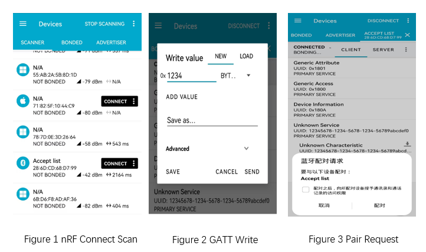

.. _ble_peripheral_accept_list_sample_en:

peripheral_accept_list
#######################

Overview
********

This application demonstrates the BLE advertising accept filter list feature.
If no device is bonded to the peripheral, casual advertising will be performed.
The broadcast name is **Accept list**.

Once a device is bonded, on subsequent boots, connection requests will only be
accepted if the central device is on the accept list. Additionally, scan response
data will only be sent to devices that are on the accept list. As a result, some
BLE central devices (such as Android smartphones) might not display the device
in the scan results if the central device is not on the accept list.

This sample also provides two BLE characteristics. To perform a write, devices need
to be bonded, while a read can be done immediately after a connection
(no bonding required).

.. csv-table:: Service list
    :header: "description", "UUID", property and permission"
    :widths: 15, 70, 15

    "Primary service", "0x12345678-0x1234-0x5678-0x1234-0x56789abcdef0", " "
    "Characteristic ", "0x12345678-0x1234-0x5678-0x1234-0x56789abcdef1", "BT_GATT_CHRC_READ|BT_GATT_PERM_READ"
    "Characteristic ", "0x12345678-0x1234-0x5678-0x1234-0x56789abcdef2", "BT_GATT_CHRC_WRITE|BT_GATT_PERM_WRITE_ENCRYPT"
	

Requirements
************

* A board with BLE support running this application
* nRF Connect APP

Building and Running
********************

Example Location：``examples/bluetooth/peripheral_accept_list``

compile, burn, and more, see：`Quick Start Guide <https://doc.winnermicro.net/w800/en/latest/get_started/index.html>`_

Running Result
**************

1. Successfully running will output the following logs

.. code-block:: console

	[I] (34) main: ver: 2.0.6dev build at Oct 18 2024 17:29:01
	[I] (83) bt: LE SC enabled
	[I] (213) bt: No ID address. App must call settings_load()
	[I] (213) peripheral_acl: Bluetooth initialized
	[I] (215) bt: Identity: 28:6D:CD:68:D7:99 (public)
	[I] (215) bt: HCI: version 4.2 (0x08) revision 0x0709, manufacturer 0x070c
	[I] (215) bt: LMP: version 4.2 (0x08) subver 0x0709
	[I] (232) peripheral_acl: Advertising successfully started
	
2. With smart Phone A, run nRF Connect APP, perform ``scan`` and ``connect`` it after finding **Accept list** device. 
   Bond procedure will be triggered by writting  **0x12345678-0x1234-0x5678-0x1234-0x56789abcdef2** .

3. After successful pairing, the example will automatically restart after a **5** -second wait. The log entry is as follows.
::

	[I] (39111) peripheral_acl: Pairing completed. Rebooting in 5 seconds...

4. With smart Phone B, perform ``scan`` and will find **Accept list** device, if you connect it on nRF Connect APP, the connection will fail.After using Phone A to run the nRF Connect app again, you can scan for devices on the ** Accept list** . When attempting to connect to one of these devices, it will prompt that the connection is successful.
 
.. code-block:: console

	[I] (24971) peripheral_acl: Connected with 1C:13:86:59:2D:FD (public)