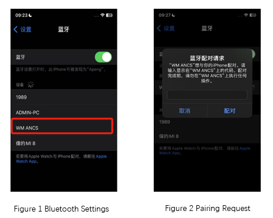
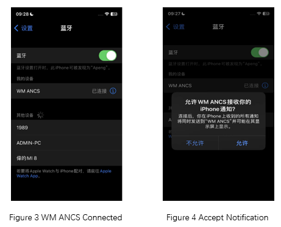
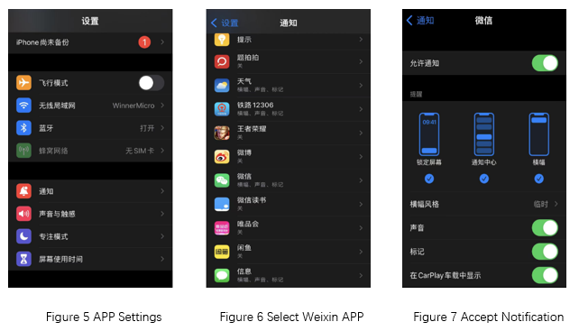

.. _peripheral_ancs_client:

peripheral_ancs
#################

功能概述
*********

The Apple Notification Center Service（ANCS）示例实现 Apple 通知中心服务客户端。

- ANCS 示例接收 iOS 通知，因此是通知使用者。它可以与通知提供程序连接，通常是 iPhone 或其他一些 Apple 设备

- ANCS 示例连接到通知提供程序时，它会在控制台上接收并打印通知

- ANCS 示例提供 Positive 和 Negative 操作，具体取决于发送通知的应用程序。例如，来电通知通常对应应答呼叫的 Positive 操作和拒绝呼叫对应的 Negative 操作相关联

- ANCS 示例提供读取通知信息和通知的应用程序信息操作

- ANCS 实现规范，请参阅：`ANCS Specification <https://developer.apple.com/library/archive/documentation/CoreBluetooth/Reference/AppleNotificationCenterServiceSpecification/Specification/Specification.html>`_

环境要求
************

* 支持 BLE 功能的开发板

* 提供 ANCS Server 服务的设备，如 iPhone

.. caution::

   本示例仅仅支持和 iOS 设备协同工作

用户指令(cli commands)
******************************

read_notify:
   * 读取并打印最新的通知消息

read_notify_next:
   * 读取并打印下一条通知消息

read_appl:
   * 读取并打印当前通知的应用程序信息

action_positive:
   * 执行 positive 操作

action_negative:
   * 执行 negative 操作

编译和运行
********************

示例位置：``examples/bluetooth/peripheral_ancs``       

编译、烧录等操作请参考：`快速入门 <https://doc.winnermicro.net/w800/zh_CN/2.2-beta.2/get_started/index.html>`_

运行结果
**************

1. 成功运行将输出如下日志

.. code-block:: console

	[I] (35) main: ver: 2.0.6dev build at Oct 25 2024 08:33:22
	[I] (61) ancs: Starting Apple Notification Center Service client
	[I] (85) bt: LE SC enabled
	[I] (214) bt: No ID address. App must call settings_load()
	[I] (216) bt: Identity: 28:6D:CE:11:22:33 (public)
	[I] (216) bt: HCI: version 4.2 (0x08) revision 0x0709, manufacturer 0x070c
	[I] (217) bt: LMP: version 4.2 (0x08) subver 0x0709
	[I] (232) ancs: Advertising successfully started

2. iOS 手机依次进入 **设置** 、 **蓝牙** 界面，发现 **WM ANCS** 的设备，连接该设备，系统提示输入配对码

3. 开发板接收到配对请求后，输出配对码 **544182**

.. code-block:: console

	[I] (12941) ancs: Passkey for 45:EF:D1:37:E1:C6 (random): 544182
	
4. 在iOS 手机输入配对码 **544182** 并确认以完成配对流程，并同意接收 ANCS 通知

5. 同时开发板输出如下日志

.. code-block:: console

	[W] (35860) bt: chan 0x20004308 conn 0x20003e7c handle 0 encrypt 0x01 hci status 0x00
	[I] (35860) ancs: Security changed: 45:EF:D1:37:E1:C6 (random) level 4
	[W] (35967) bt: Set privacy mode command is not supported
	[I] (35982) ancs: Pairing completed: 38:89:2C:64:6A:A5 (public), bonded: 1
	[I] (36374) ancs: [SUBSCRIBED] SC
	[I] (36733) ancs: [ATTRIBUTE] uuid 2800, handle 35
	[I] (36824) ancs: [ATTRIBUTE] uuid 2803, handle 36
	[I] (36824) ancs: got cp handle 37
	[I] (37213) ancs: [ATTRIBUTE] uuid 2800, handle 35
	[I] (37274) ancs: [ATTRIBUTE] uuid 2803, handle 42
	[I] (37333) ancs: [ATTRIBUTE] uuid 2902, handle 44
	[I] (37334) ancs: [SUBSCRIBED] DS
	[I] (37693) ancs: [ATTRIBUTE] uuid 2800, handle 35
	[I] (37754) ancs: [ATTRIBUTE] uuid 2803, handle 39
	[I] (37813) ancs: [ATTRIBUTE] uuid 2902, handle 41
	[I] (37813) ancs: [SUBSCRIBED] NS

6. 至此，**WM ANCS** 设备连接成功，开发板可以接收 iOS 的通知信息。下面以微信通知为例演示测试步骤

7. 测试前，请确认微信通知功能以打开。进入 **设置** 、 **通知** ，找到 **微信** ，接收通知已允许

8. iOS 手机接收到微信消息后，开发板接收到通知消息，并输出如下日志

.. code-block:: console

	[I] (68065) ancs: ------Notification-------
	[I] (68066) ancs: Event:       Added
	[I] (68066) ancs: Category ID: Social
	[I] (68066) ancs: Category Cnt:5
	[I] (68066) ancs: UID:         7
	[I] (68066) ancs: Flags: Silent
	[I] (68066) ancs: Flags: Negative Action
	
9. 在开发板控制台使用 ``read_notify`` 指令读取当前通知消息，控制台打印返回的消息内容。其中，消息的发送者是 **彭** ，消息内容为 **123** , 执行 **Negative** 指令将清除该消息

.. code-block:: console
	
	read_notify

	[I] (181772) ancs: App Identifier: com.tencent.xin
	[I] (181772) ancs: Title: 彭
	[I] (181773) ancs: Subtitle: (N/A)
	[I] (181773) ancs: Message: 123
	[I] (181773) ancs: Message Size: 3
	[I] (181773) ancs: Date: 20241025T082924
	[I] (181773) ancs: Positive Action Label: (N/A)
	[I] (181773) ancs: Negative Action Label: 清除	
	
10. 在开发板控制台使用 ``read_appl`` 指令读取当前消息的应用程序信息，控制台输出如下日志。显示此通知来源于微信

.. code-block:: console

	read_appl

	[I] (162958) ancs: Request for com.tencent.xin:
	[I] (163032) ancs: Display Name: 微信

11. 在步骤 9 中，看到 Action Label **Negative** 为清除该通知，可以在控制台使用 ``action_negative``  指令清除该通知，控制台输出清除后的日志信息 

.. code-block:: console
	
	action_negative

	[I] (187538) ancs: Performing Negative Action.
	[I] (187664) ancs: ------Notification-------
	[I] (187664) ancs: Event:       Removed
	[I] (187664) ancs: Category ID: Social
	[I] (187665) ancs: Category Cnt:1
	[I] (187665) ancs: UID:         0
	[I] (187665) ancs: Flags: Negative Action
	[I] (187665) ancs: remove middle notification	
