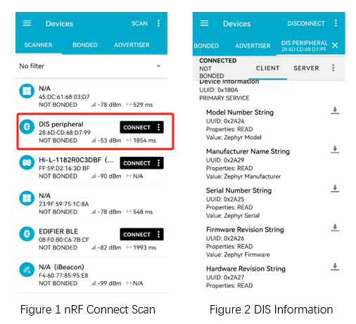

.. _ble_peripheral_dis_sample:

peripheral_dis
#########################

功能概述
*********

和 :ref:`外围设备 <ble_peripheral_sample>` 示例类似， 本示例提供了 DIS (Device Information) GATT 服务。

环境要求
************

* 支持 BLE 功能的开发板
* nRF Connect APP

编译和烧录
********************

示例位置：``examples/bluetooth/peripheral_dis``       

编译、烧录等操作请参考：`快速入门 <https://doc.winnermicro.net/w800/zh_CN/2.2-beta.2/get_started/index.html>`_

运行结果
************

1. 成功运行将输出如下日志

.. code-block:: console

	[I] (34) main: ver: 2.0.6dev build at Oct 21 2024 17:12:40
	[I] (81) bt: No ID address. App must call settings_load()
	[I] (83) bt: Identity: 28:6D:CD:68:D7:99 (public)
	[I] (83) bt: HCI: version 4.2 (0x08) revision 0x0709, manufacturer 0x070c
	[I] (83) bt: LMP: version 4.2 (0x08) subver 0x0709
	[I] (99) peripheral_dis: Bluetooth initialized
	[I] (102) peripheral_dis: Advertising successfully started

2. 运行 nRF Connect APP，发现 **DIS peripheral** 的设备后，执行连接操作。
   连接成功后，在 APP 上可以读取设备信息参数

	
3. 连接成功后，开发板输入如下日志

.. code-block:: console

	[I] (31560) peripheral_dis: Connected