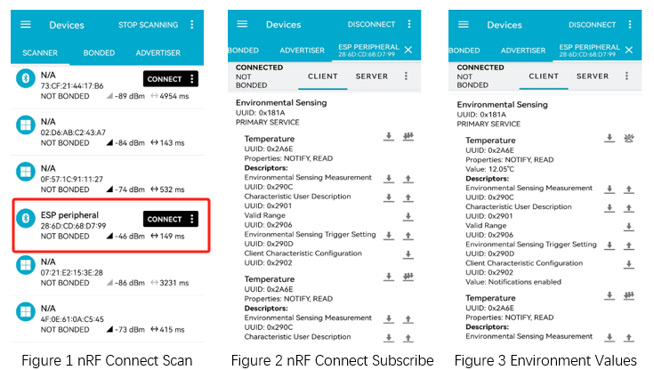

.. _ble_peripheral_esp_sample_en:

peripheral_esp
#########################

Overview
********
Similar to the :ref:`Peripheral <ble_peripheral_sample_en>` sample, except that this
application specifically exposes the ESP (Environmental Sensing Profile) GATT
Service.

Requirements
************

* A board with BLE support
* nRF Connect APP

Building and Running
********************

Example Location：``examples/bluetooth/peripheral_esp``

compile, burn, and more, see：`Quick Start Guide <https://doc.winnermicro.net/w800/en/2.2-beta.2/get_started/index.html>`_

Running Result
**************

1. Successfully running will output the following logs

.. code-block:: console

	[I] (23) main: ver: 2.0.6dev build at Oct 21 2024 18:16:59
	[I] (71) bt: LE SC enabled
	[I] (200) bt: Identity: 28:6D:CD:68:D7:99 (public)
	[I] (201) bt: HCI: version 4.2 (0x08) revision 0x0709, manufacturer 0x070c
	[I] (201) bt: LMP: version 4.2 (0x08) subver 0x0709
	[I] (201) peripheral_esp: Bluetooth initialized
	[I] (203) peripheral_esp: Advertising successfully started

2. Launch the nRF Connect app, and after discovering the **ESP peripheral** device, perform the connection operation. 
   Once the connection is successful, subscribe to the temperature measurement characteristic value on the app to view the real-time displayed simulated temperature value.

3. After a successful connection, the development board will output the following log:

.. code-block:: console

	[I] (27663) peripheral_esp: Connected