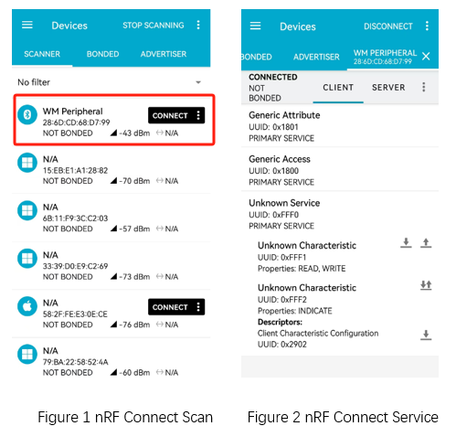
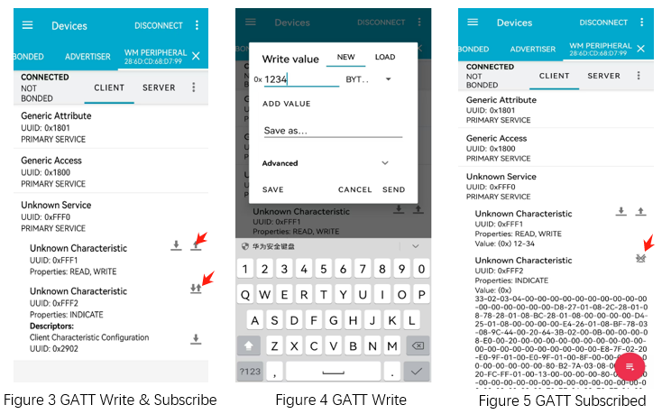

.. _ble_peripheral_general_sample:

peripheral_general
##############################

功能概述
*********

本示例演示了使能 BLE 外围设备角色。示例提供了三个自定义服务特征值，用于支持读写功能和中央设备发起的订阅服务功能。本示例也演示了更新 MTU 功能。
	
.. csv-table:: 服务列表
    :header: "描述", "UUID", "属性和权限"
    :widths: 35, 20, 45

    "Primary service", "0xFFF0", " "
    "Characteristic ", "0xFFF1", "BT_GATT_CHRC_READ|BT_GATT_PERM_READ|BT_GATT_CHRC_WRITE|BT_GATT_PERM_WRITE"
    "Characteristic ", "0xFFF2", "BT_GATT_CHRC_NOTIFY（ ``menuconfig -> Example configuration -> selectable item peripheral example`` ）"
	"Characteristic ", "0xFFF3", "BT_GATT_CHRC_INDICATE（ ``menuconfig -> Example configuration -> selectable item peripheral example`` ）default"

环境要求
************

* 支持 BLE 功能的开发板 B，用来运行本示例固件
* nRF Connect APP 或者支持 BLE 功能的开发板 A，用来运行 :ref:`central_general <ble_central_general_sample>` 示例固件

编译和烧录
********************

示例位置：``examples/bluetooth/peripheral_general``     

编译、烧录等操作请参考：`快速入门 <https://doc.winnermicro.net/w800/zh_CN/2.2-beta.2/get_started/index.html>`_

运行结果 ( 开发板 A 和开发板 B 为例)
*************************************

1. 开发板 B 成功运行将输出如下日志

.. code-block:: console

	[I] (7) main: ver: 2.0.6dev build at Oct 18 2024 07:59:44
	[I] (29) bt: Identity: 28:6D:CD:68:D7:99 (public)
	[I] (30) bt: HCI: version 4.2 (0x08) revision 0x0709, manufacturer 0x070c
	[I] (30) bt: LMP: version 4.2 (0x08) subver 0x0709
	[I] (32) peripheral: peripheral indicate service ready

2. 等待开发板 A 烧录 :ref:`central_general <ble_central_general_sample>` 示例的固件

3. 开发板 B 接收到开发板 A 的连接请求后，连接建立成功。自动执行 MTU 更新、连接参数更新

.. code-block:: console

	[I] (1318) peripheral: Updated MTU: TX: 23 RX: 23 bytes
	[I] (1319) peripheral: Connected 28:6D:CD:68:D7:99 (public)
	[I] (1366) peripheral: Updated MTU: TX: 247 RX: 247 bytes
	[I] (1965) peripheral: Turn on 2902 indication
	[I] (1966) peripheral: mtu_exchange: Current MTU = 247
	[I] (1966) peripheral: mtu_exchange: Exchange MTU...
	[E] (1966) peripheral: mtu_exchange: MTU exchange failed (err -120)
	[I] (2316) peripheral: LE conn param updated: 28:6D:CD:68:D7:99 (public) int 0x0014 lat 0 to 500

4. 开发板 B 接收到开发板 A 发送的订阅请求后，向开发板 A 以 Indicate 或者 Notify 的方式发送随机数值

5. 开发板 B 同时接收开发板 A 以写方式发送的数据

.. code-block:: console

	[I] (2416) peripheral: recv(244):
	[I] (3392) peripheral: recv(244):
	[I] (4392) peripheral: recv(244):
	[I] (5393) peripheral: recv(244):
	[I] (6392) peripheral: recv(244):
	[I] (7441) peripheral: recv(244):
	[I] (8393) peripheral: recv(244):
	[I] (9393) peripheral: recv(244):

运行结果 ( nRF Connect APP 和开发板 B 为例)
********************************************

1. 开发板 B 成功运行将输出如下日志

.. code-block:: console

	[I] (7) main: ver: 2.0.6dev build at Oct 18 2024 07:59:44
	[I] (29) bt: Identity: 28:6D:CD:68:D7:99 (public)
	[I] (30) bt: HCI: version 4.2 (0x08) revision 0x0709, manufacturer 0x070c
	[I] (30) bt: LMP: version 4.2 (0x08) subver 0x0709
	[I] (32) peripheral: peripheral indicate service ready

2. 运行 nRF Connect APP，执行扫描操作，发现并连接 **WM peripheral** 设备

3. 开发板 B 输出如下日志

.. code-block:: console

	[I] (15074) peripheral: Connected 7F:6B:49:51:23:CD (random)
	[I] (15781) peripheral: LE conn param updated: 7F:6B:49:51:23:CD (random) int 0x0006 lat 0 to 500
	[I] (16086) peripheral: LE conn param updated: 7F:6B:49:51:23:CD (random) int 0x0014 lat 0 to 500
	
4. 在 nRF Connect APP 执行写操作和订阅操作

5. 开发板 B 输出如下日志

.. code-block:: console

	[I] (46618) peripheral: recv(2):
	[I] (48568) peripheral: Turn on 2902 indication
	[I] (48569) peripheral: mtu_exchange: Current MTU = 23
	[I] (48569) peripheral: mtu_exchange: Exchange MTU...
	[I] (48618) peripheral: Updated MTU: TX: 247 RX: 247 bytes
	[I] (48619) peripheral: mtu_exchange_cb: MTU exchange successful (247)
