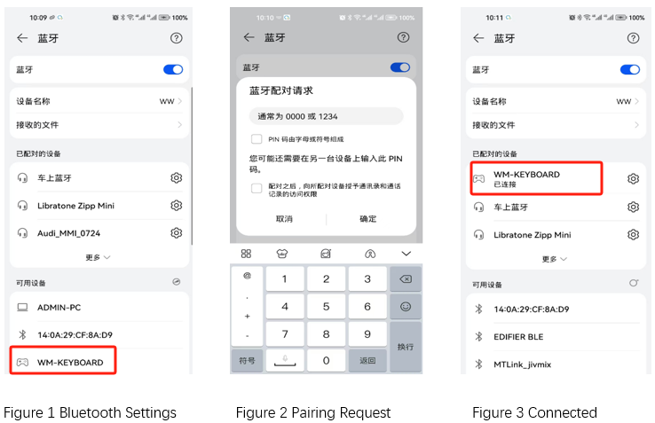

.. _ble_peripheral_hids_keyboard_sample:

peripheral_hids_keyboard
##########################

功能概述
*********

本实例演示了 BLE 键盘功能。示例运行后广播名称为 **WM-KEYBOARD** 的键盘设备，您可以使用支持 BLE HID 功能的中央设备（比如智能手机、PC）连接该键盘。
该示例同时展示了 LE Secure Connection 功能，默认的 IO 能力为仅仅支持显示。连接建立后，配对码会显示在开发板的控制台，在对端设备输入该配对码以完成配对操作。
该示例同时支持 SHELL 指令用于模拟键盘的输入功能，详尽指令集请参考示例代码。

输入指令 (cli commands)
******************************

in:
   * 模拟在键盘输入一个字符（仅支持单字符输入）。 如输入 ``in a`` ，相当于在键盘输入 a 键。提示： ``in capslock`` 指令用于模拟在键盘按下 CapsLock 键

sc:
   * 模拟在键盘输入系统控制按键。如输入 ``sc powerdown`` 相当于在智能手机的长按 power 键，``sc sleep`` 相当于短按 power 键

cc:
   * 模拟在键盘输入用户控制指令，如 ``cc home`` 模拟智能手机的 home 按键，``cc volup/voldown`` 模拟增加/降低音量按键

.. csv-table:: 1 键值指令列表
    :header: "键值指令", "指令值", "说明"
    :widths: 20, 30, 60

    "in", "‘a’~‘z’", "字母 a 到 z ，仅仅支持输入单个字符"
    "in", "‘a’~'z'", "字母 A 到 Z ，先使用 in capslock 指令使能大写锁定"
    "in", "‘0’~'9'", "数字 0 到 9 ，仅仅支持输入单个字符"

.. csv-table:: 2 系统控制指令列表
    :header: "系统控制指令", "指令值", "说明"
    :widths: 20, 30, 60

    "sc", "wakeup", "唤醒设备"
    "sc", "sleep", "进入 sleep 模式"
    "sc", "powerdown", "关机"
    "sc", "dock", "dock 状态，某些设备不支持"
    "sc", "undock", "undock 状态，，某些设备不支持"
    "sc", "mute", "静音，，某些设备不支持"
    "sc", "hibernate", "hibernate 模式，，某些设备不支持"
	
.. csv-table:: 3 用户控制指令列表 (此文档列出常用指令，详尽指令请参见示例代码)
    :header: "用户控制指令", "指令值", "说明"
    :widths: 20, 30, 60

    "cc", "home", "进入 home 界面"
    "cc", "email", "打开电子邮件界面"
    "cc", "volup", "调高音量"
    "cc", "voldown", "调低音量"
    "cc", "playpause", "播放暂停切换"
    "cc", "next", "下一首"
    "cc", "previous", "上一首"

环境要求
************

* 支持 BLE 功能的开发板
* 支持 BLE HID 中央设备功能的设备，如智能手机

编译和烧录
********************

示例位置：``examples/bluetooth/peripheral_hids_keyboard``       

编译、烧录等操作请参考：`快速入门 <https://doc.winnermicro.net/w800/zh_CN/2.2-beta.2/get_started/index.html>`_

运行结果
************

1. 成功运行将输出如下日志

.. code-block:: console

	[I] (2) main: ver: 2.0.1dev build at Sep 25 2024 10:32:07
	[I] (24) bt: LE SC enabled
	[I] (24) bt: No ID address. App must call settings_load()
	[I] (24) sc_hid: Bluetooth initialized
	[I] (26) bt: Identity: 28:6D:CE:11:22:33 (public)
	[I] (26) bt: HCI: version 4.2 (0x08) revision 0x0709, manufacturer 0x070c
	[I] (26) bt: LMP: version 4.2 (0x08) subver 0x0709
	[I] (34) sc_hid: Advertising successfully started
	
2. 手机端，依次进入 **设置**、**蓝牙** 显示界面，在可用设备列表发现 **WM-KEYBOARD** 设备后单击以连接该设备。手机界面提示输入 **配对码** ，此时输入在开发板显示的配对码

3. 开发板接收到智能手机的配对请求后，由于该示例配置默认的输入输出能力为仅仅显示，所以会输出配对码 **366039**

.. code-block:: console

	[I] (31836) sc_hid: Connected 4C:28:16:4D:51:3F (random)
	[I] (32018) sc_hid: Passkey for 4C:28:16:4D:51:3F (random): 366039
	[W] (42364) bt: chan 0x200040dc conn 0x20003c70 handle 0 encrypt 0x01 hci status 0x00
	[I] (42366) sc_hid: Security changed: 4C:28:16:4D:51:3F (random) level 4
	[W] (42444) bt: Set privacy mode command is not supported

4. 配对成功后，在手机端打开响应键盘输入的界面，然后开发板的控制台使用 ``in`` 指令输入相关按键或使用 ``sc`` 、``cc`` 指令控制智能手机

.. code-block:: console

	W800: in 1
	W800: in 2
	W800: in 3
	

.. figure:: assert/peripheral_hids_keyboard_100.svg
    :align: center
