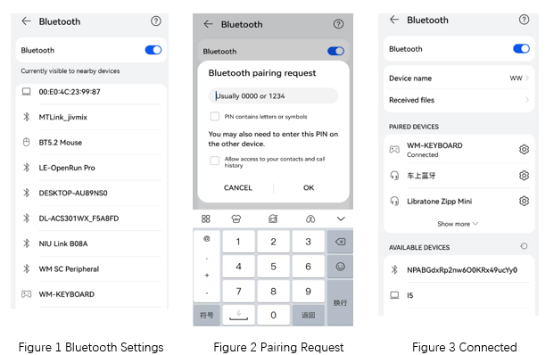
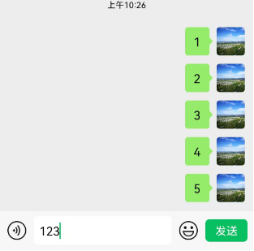

.. _ble_peripheral_hids_keyboard_sample_en:

peripheral_hids_keyboard
####################################

Overview
********

This example demonstrates the functionality of a BLE (Bluetooth Low Energy) keyboard. After running the example, a keyboard device with the broadcast name  **WM-KEYBOARD**  will be advertised, allowing it to be connected by central devices that support BLE HID (Human Interface Device) functionality, such as smartphones and PCs.
The example also showcases the LE Secure Connection feature, with a default IO capability that only supports display. Once the connection is established, a pairing code will be displayed on the development board's console. The pairing process is completed by entering this pairing code on the counterpart device.
Additionally, this example supports SHELL commands for simulating keyboard input functions. For a detailed set of commands, please refer to the example code.

User interface (cli commands)
******************************

in:
   * input a character(e.g. ``in a`` simulates press a on keyboard, ``in capslock`` simulates press CapsLock on keyboard, support this function key only)

sc:
   * input system control command(e.g. ``sc sleep`` to turn off the screen)

cc:
   * input consumer control command(e.g. ``cc home`` to display the home menu of system, ``cc volup/voldown`` to adjust the volume up/down)

.. csv-table:: 1 key value table
    :header: "key command", "key value", "description"
    :widths: 20, 30, 60

    "in", "‘a’~‘z’", "input a ~ z , Supports only single character input. "
    "in", "‘a’~'z'", "input A ~ Z"
    "in", "‘0’~'9'", "input 0 ~ 9, Supports only single character input."

.. note::

    to input ‘A’~'Z', uses ``in capslock`` to turn on CapsLock then input ‘a’~‘z’ character

.. csv-table:: 2 system control table
    :header: "system control", "command", "description"
    :widths: 20, 30, 60

    "sc", "wakeup", "wake up device"
    "sc", "sleep", "enter sleep mode"
    "sc", "powerdown", "turn off device"
    "sc", "dock", "enable dock "
    "sc", "undock", "undock state"
    "sc", "mute", "mute device"
    "sc", "hibernate", "hibernate mode"
	
.. csv-table:: 3 consumer control table (more see sample codes)
    :header: "consumer control", "command", "description"
    :widths: 20, 30, 60

    "cc", "home", "enter home"
    "cc", "email", "runing email app"
    "cc", "volup", "volume up"
    "cc", "voldown", "volume down"
    "cc", "playpause", "play or pause"
    "cc", "next", "next"
    "cc", "previous", "previous"

Requirements
************

* A board with Bluetooth Low Energy support
* Devices that support BLE HID (Human Interface Device) central functionality, such as smartphones.

Building and Running
********************

Example Location：``examples/bluetooth/peripheral_hids_keyboard``

compile, burn, and more, see：`Quick Start Guide <https://doc.winnermicro.net/w800/en/latest/get_started/index.html>`_

Running result
**************

1. Successfully running will output the following logs

.. code-block:: console

	[I] (2) main: ver: 2.0.1dev build at Sep 25 2024 10:32:07
	[I] (24) bt: LE SC enabled
	[I] (24) bt: No ID address. App must call settings_load()
	[I] (24) sc_hid: Bluetooth initialized
	[I] (26) bt: Identity: 28:6D:CE:11:22:33 (public)
	[I] (26) bt: HCI: version 4.2 (0x08) revision 0x0709, manufacturer 0x070c
	[I] (26) bt: LMP: version 4.2 (0x08) subver 0x0709
	[I] (34) sc_hid: Advertising successfully started

2. On smart phone, open **settings** , **bluetooth** and you will find **WM-KEYBOARD** . Connect it and input the **passkey** displayed on development kit side

	
3. After the development board receives a pairing request from a smartphone, since this example is configured with a default input/output capability that only supports display, it will output the pairing code **366039**

.. code-block:: console

	[I] (31836) sc_hid: Connected 4C:28:16:4D:51:3F (random)
	[I] (32018) sc_hid: Passkey for 4C:28:16:4D:51:3F (random): 366039
	[W] (42364) bt: chan 0x200040dc conn 0x20003c70 handle 0 encrypt 0x01 hci status 0x00
	[I] (42366) sc_hid: Security changed: 4C:28:16:4D:51:3F (random) level 4
	[W] (42444) bt: Set privacy mode command is not supported

4. After the pairing is successful, open the interface on your smartphone that corresponds to keyboard input. Then, on the console of the development board, use the ``in`` command to input relevant keys or utilize the ``sc`` 、``cc`` commands to control the smartphone.

.. code-block:: console

	W800: in 1
	W800: in 2
	W800: in 3
	

