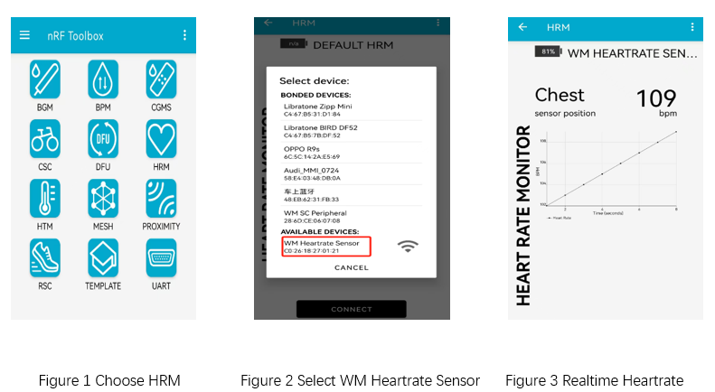

.. _ble_peripheral_hr_sample_en:

peripheral_hr
########################

Overview
********

Similar to the :ref:`Peripheral <ble_peripheral_sample_en>` sample, except that this
application specifically exposes the HR (Heart Rate) GATT Service. Once a device
connects it will generate dummy heart-rate values.

Requirements
************

* A board with BLE support
* nRF Toolbox APP or nRF Connect

Building and Running
********************

Example Location：``examples/bluetooth/peripheral_hr``

compile, burn, and more, see：`Quick Start Guide <https://doc.winnermicro.net/w800/en/2.2-beta.2/get_started/index.html>`_

Operation Instructions Translation
******************************************

#. Burn the firmware compiled from the peripheral_hr example onto the development board.
#. On your smartphone, run the nRF Toolbox application

Running Result
****************

1. Successfully running will output the following logs

.. code-block:: console

	I/bt_smp          [0.048] LE SC enabled
	I/bt_hci_core     [0.176] Identity: 28:6D:CE:01:02:03 (public)
	I/bt_hci_core     [0.182] HCI: version 4.2 (0x08) revision 0x0709, manufacturer 0x070c
	I/bt_hci_core     [0.190] LMP: version 4.2 (0x08) subver 0x0709
	I/peripheral_hr   [0.196] Bluetooth initialized
	I/peripheral_hr   [0.202] Advertising successfully started

2. Running nRF Toolbox, select **HRM**, then you will find **WM Heartrate Sensor**. Connect it and you will see the dummy heart-rate values on APP

3. Successfully running will output the following logs

.. code-block:: console

	[I] (42636) peripheral_hr: Connected
	[I] (43862) bt: BAS Notifications enabled
	[I] (43962) bt: HRS notifications enabled 
