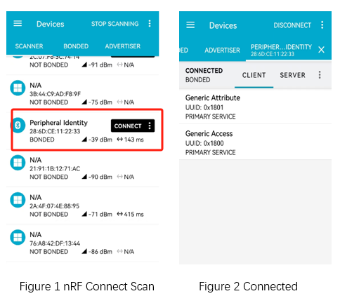

.. _ble_peripheral_identity_sample:

peripheral_identity
##############################

功能概述
*********

本示例演示了如何使能多个 Identify 地址用以接收多个中央设备发起的连接操作。

.. caution::

   受限于 W80X 蓝牙能力（做从设备时，仅支持单路链接），示例运行时使用蓝牙设备的 Identity Address

环境要求
************

* 支持 BLE 功能的开发板
* nRF Connect APP

编译和烧录
********************

示例位置：``examples/bluetooth/peripheral_identify``     

编译、烧录等操作请参考：`快速入门 <https://doc.winnermicro.net/w800/zh_CN/2.2-beta.2/get_started/index.html>`_

运行结果
************

1. 成功运行将输出如下日志

.. code-block:: console

	[I] (24) main: ver: 2.0.6dev build at Oct 24 2024 13:27:02
	[I] (74) bt: Identity: 28:6D:CE:11:22:33 (public)
	[I] (74) bt: HCI: version 4.2 (0x08) revision 0x0709, manufacturer 0x070c
	[I] (74) bt: LMP: version 4.2 (0x08) subver 0x0709
	[I] (74) identity: Bluetooth initialized
	[I] (74) identity: Using current id: 0
	[I] (77) identity: Advertising successfully started
	
2. 运行 nRF Connect APP， 执行扫描操作，发现 **Peripheral Identity** 的设备后执行连接操作

3. 开发板输出如下日志

.. code-block:: console

	[I] (24448) identity: Connected (1): 52:B9:39:43:87:B0 (random)

4. 连接成功后，示例程序断开连接。再次开启广播等待连接，示例重复上述流程。开发板输出如下日志

.. code-block:: console

	[I] (24449) identity: Iterations remaining: 0
	[I] (24449) identity: Wait for disconnections...
	[I] (25141) identity: LE conn param updated: 52:B9:39:43:87:B0 (random) int 0x0006 lat 0 to 500
	[I] (25219) identity: Disconnected 52:B9:39:43:87:B0 (random) (reason 0x13)
	[I] (25220) identity: Using current id: 0
	[I] (25222) identity: Advertising successfully started