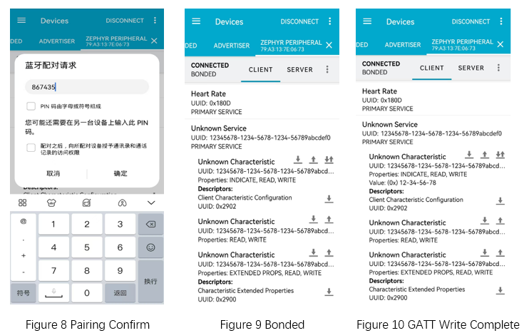

.. _ble_peripheral_lowpower_sample:

peripheral_lowpower
#####################

功能概述
*********

本示例演示了使能 BLE 低功耗模式时的外围设备角色，应用程序包含了几个常用的标准 GATT 服务和自定义服务。

.. csv-table:: 1 标准 GATT 服务
    :header: "描述", "UUID", "说明"
    :widths: 15, 70, 15

    "Battery service", "0x180F", "订阅号，实时上报模拟电池电压"
    "Current Time service", "0x1805", " "
    "Device Information", "0x180A", "读取设备信息"
	"Heart Rate", "0x180D", "订阅后，实时上报模拟心率值"

.. csv-table:: 2 自定义服务
    :header: "描述", "UUID", "属性和权限"
    :widths: 15, 70, 15

    "Primary service", "0x12345678-0x1234-0x5678-0x1234-0x56789abcdef0", " "
    "Characteristic ", "0x12345678-0x1234-0x5678-0x1234-0x56789abcdef1", "读 | 写 | INDICATE, 加密读 | 加密写"
    "Characteristic ", "0x12345678-0x1234-0x5678-0x1234-0x56789abcdef2", "读 | 写，认证读 | 认证写"
    "Characteristic ", "0x12345678-0x1234-0x5678-0x1234-0x56789abcdef3", "读 | 写 | 扩展 ，读 | 写 | 预备写"
	"Characteristic ", "0x12345678-0x1234-0x5678-0x1234-0x56789abcdef4", "读 | 写 | 认证 ，读 | 写 "
	"Characteristic ", "0x12345678-0x1234-0x5678-0x1234-0x56789abcdef5", "不带应答写 ， 写 "

环境要求
************

* 支持 BLE 功能的开发板
* nRF Connect APP

编译和烧录
********************

示例位置：``examples/bluetooth/peripheral`` 

编译、烧录等操作请参考：`快速入门 <https://doc.winnermicro.net/w800/zh_CN/latest/get_started/index.html>`_

运行结果
************

1. 成功运行将输出如下日志

.. code-block:: console

	[I] (84) bt: LE SC enabled
	[I] (217) bt: No ID address. App must call settings_load()
	[I] (217) peripheral: Bluetooth initialized
	[I] (233) bt: Identity: 28:6D:CE:11:22:33 (public)
	[I] (234) bt: HCI: version 4.2 (0x08) revision 0x0709, manufacturer 0x070c
	[I] (234) bt: LMP: version 4.2 (0x08) subver 0x0709
	[I] (280) peripheral: Advertising successfully started
	[I] (281) peripheral: Indicate VND attr 0x803dea8 (UUID 12345678-1234-5678-1234-56789abcdef1)
	
2. 运行 nRF Connect APP，执行扫描操作，可以发现 **WM Peripheral** 的设备。执行连接操作，连接成功后订阅电池服务和心率服务。在 APP 上可以看到上报的电池电量和心率值

3. 连接成功后，开发板输出如下日志

.. code-block:: console

	[I] (11454) peripheral: Connected
	
4. 在 nRF Connect APP 向特征值 **0x12345678-0x1234-0x5678-0x1234-0x56789abcdef1** 执行写操作， 将触发加密流程，APP 提示配对请求

	
5. 开发板接收到配对请求后，输出配对码 **867435**

.. code-block:: console

	[I] (80939) peripheral: Passkey for 60:58:28:93:AC:16 (random): 867435
	
6. 此时在 nRF Connect APP 输入配对码并确认，APP 会提示配对成功

