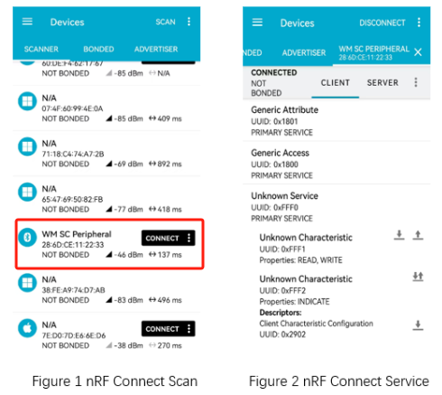
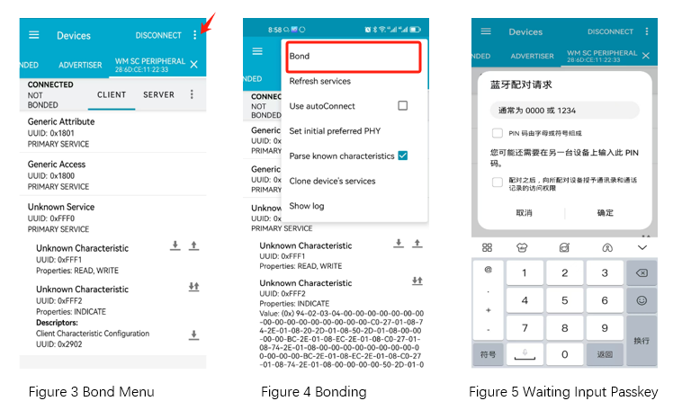
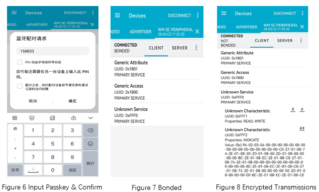

.. _ble_peripheral_sc_general_sample:

peripheral_sc_general
#################################

功能概述
*********

本示例演示了使能 BLE 外围设备角色，和 :ref:`peripheral_general <ble_peripheral_general_sample>` 示例不同的是本示例支持配对流程。
在连接建立后，用户可以在控制台下输入相关的指令以完成配对流程，如发起安全流程、设置 IO 能力和根据提示输入配对码。

.. csv-table:: 服务列表
    :header: "描述", "UUID", "属性和权限"
    :widths: 25, 20, 55

    "Primary service", "0xFFF0", " "
    "Characteristic ", "0xFFF1", "BT_GATT_CHRC_READ|BT_GATT_PERM_READ|BT_GATT_CHRC_WRITE|BT_GATT_PERM_WRITE"
    "Characteristic ", "0xFFF2", "BT_GATT_CHRC_NOTIFY（ ``menuconfig -> Example configuration -> selectable item peripheral example`` ）"
	"Characteristic ", "0xFFF3", "BT_GATT_CHRC_INDICATE（ ``menuconfig -> Example configuration -> selectable item peripheral example`` ）default"

配对指令 (cli commands)
******************************

security:
   * 发起配对流程

auth_method:
   * 设置设备输入输出能力，支持display, display and yes/no, input, no-input-no-output, display and input

auth_passkey:
   * 给对方设备回复配对码

auth_cancel:
   * 取消配对流程

auth_passkey_confirm:
   * 确认配对码正确

auth_pairing_confirm
	* 确认配对流程

环境要求
************

* 支持 BLE 功能的开发板 B，运行本示例固件
* 支持 BLE 功能的开发板 A，运行 :ref:`central_sc_general <ble_central_sc_general_sample>` 或者测试软件 nRF Connect APP

编译和烧录
********************

示例位置：``examples/bluetooth/peripheral_sc_general``   

编译、烧录等操作请参考：`快速入门 <https://doc.winnermicro.net/w800/zh_CN/2.2-beta.2/get_started/index.html>`_

运行结果 (开发板 A 和开发板 B)
*******************************

1. 开发板 B 成功运行将输出如下日志

.. code-block:: console

	[I] (2) main: ver: 0.9.0 build at Sep 12 2024 16:01:42
	[I] (24) bt: LE SC enabled
	[I] (150) bt: No ID address. App must call settings_load()
	[I] (168) bt: Identity: 28:6D:CD:68:D7:99 (public)
	[I] (168) bt: HCI: version 4.2 (0x08) revision 0x0709, manufacturer 0x070c
	[I] (168) bt: LMP: version 4.2 (0x08) subver 0x0709
	[I] (204) sc_peripheral: peripheral indicate service ready

2. 等待开发板 A 烧录 :ref:`central_sc_general <ble_central_sc_general_sample>` 示例固件

3. 开发板 B 接收到开发板 A 的连接请求后，自动执行 MTU 更新、连接参数更新

.. code-block:: console

	[I] (828) sc_peripheral: Updated MTU: TX: 23 RX: 23 bytes
	[I] (830) sc_peripheral: Connected 28:6D:CD:55:E4:57 (public)
	[I] (830) sc_peripheral: mtu_exchange: Current MTU = 0
	[I] (830) sc_peripheral: mtu_exchange: Exchange MTU...
	[E] (830) sc_peripheral: mtu_exchange: MTU exchange failed (err -128)
	[I] (1118) sc_peripheral: Updated MTU: TX: 247 RX: 247 bytes
	[I] (1120) sc_peripheral: Remote pairing features: IO: 0x04, OOB: 0, AUTH: 0x0d, Key: 16, Init Kdist: 0x05, Resp Kdist: 0x07

4. 开发板 B 接收到配对请求后，输出配对码 **764892** 。在开发板 A 上输入此配对码，以完成配对流程

.. code-block:: console

	[I] (1270) sc_peripheral: passkey for 28:6D:CD:55:E4:57 (public): 764892, please confirm it on remote device

5. 配对成功后，开发板 B 输出如下日志

.. code-block:: console

	[I] (1818) sc_peripheral: LE conn param updated: 28:6D:CD:55:E4:57 (public) int 0x0014 lat 0 to 500
	[W] (20600) bt: chan 0x20004128 conn 0x20003c9c handle 0 encrypt 0x01 hci status 0x00
	[I] (20602) sc_peripheral: Security changed: 28:6D:CD:55:E4:57 (public) level 4
	[I] (20666) sc_peripheral: BONDED with 28:6D:CD:55:E4:57 (public)
	
6. 开发板 B 接收到开发板 A 的订阅消息后，周期性的以 Indicate 或 Notify 的方式向开发板 A 发送数据。同时接收开发板 A 的写操作的数据，输出如下日志

.. code-block:: console

	[I] (19296) sc_peripheral: recv(240):
	[I] (19297) sc_peripheral: dump [content]
	0x0000   25 00 00 00 00 00 00 00  00 00 00 00 00 00 00 00  %...............
	0x0010   00 00 00 00 00 00 00 00  00 00 00 00 00 00 00 00  ................
	0x0020   00 00 00 00 00 00 00 00  00 00 00 00 00 00 00 00  ................
	0x0030   00 00 00 00 00 00 00 00  00 00 00 00 00 00 00 00  ................
	0x0040   00 00 00 00 00 00 00 00  00 00 00 00 00 00 00 00  ................
	0x0050   00 00 00 00 00 00 00 00  00 00 00 00 00 00 00 00  ................
	0x0060   00 00 00 00 00 00 00 00  00 00 00 00 00 00 00 00  ................
	0x0070   00 00 00 00 00 00 00 00  00 00 00 00 00 00 00 00  ................
	0x0080   00 00 00 00 00 00 00 00  00 00 00 00 00 00 00 00  ................
	0x0090   00 00 00 00 00 00 00 00  00 00 00 00 00 00 00 00  ................
	0x00a0   00 00 00 00 00 00 00 00  00 00 00 00 00 00 00 00  ................
	0x00b0   00 00 00 00 00 00 00 00  00 00 00 00 00 00 00 00  ................
	0x00c0   00 00 00 00 00 00 00 00  00 00 00 00 00 00 00 00  ................
	0x00d0   00 00 00 00 00 00 00 00  00 00 00 00 00 00 00 00  ................
	0x00e0   00 00 00 00 00 00 00 00  00 00 00 00 00 00 00 00  ................

运行结果 (nRF Connect APP 和开发板 B)
*****************************************

1. 开发板 B 成功运行将输出如下日志

.. code-block:: console

	[I] (2) main: ver: 0.9.0 build at Sep 12 2024 16:01:42
	[I] (24) bt: LE SC enabled
	[I] (150) bt: No ID address. App must call settings_load()
	[I] (168) bt: Identity: 28:6D:CD:68:D7:99 (public)
	[I] (168) bt: HCI: version 4.2 (0x08) revision 0x0709, manufacturer 0x070c
	[I] (168) bt: LMP: version 4.2 (0x08) subver 0x0709
	[I] (204) sc_peripheral: peripheral indicate service ready
	
2. 运行 nRF Connect APP， 执行扫描功能，发现 **WM SC Peripheral** 的设备后建立连接

3. 开发板 B 接收到连接请求后，输出如下日志

.. code-block:: console

	[I] (62602) sc_peripheral: Connected 79:43:31:D9:97:99 (random)
	[I] (63312) sc_peripheral: LE conn param updated: 79:43:31:D9:97:99 (random) int 0x0006 lat 0 to 500
	[I] (63632) sc_peripheral: LE conn param updated: 79:43:31:D9:97:99 (random) int 0x0014 lat 0 to 500
	
4. 在 nRF Connect APP 执行绑定操作

	

5. 开发板 B 接收到绑定请求后，输出配对码 **158833** 日志信息如下
::

	[I] (494595) sc_peripheral: Remote pairing features: IO: 0x04, OOB: 0, AUTH: 0x0d, Key: 16, Init Kdist: 0x0f, Resp Kdist: 0x0f
	[I] (494646) sc_peripheral: passkey for 79:43:31:D9:97:99 (random): 158833, please confirm it on remote device
	
6. 在 nRF Connect APP 输入此配对码并确认。绑定成功后，APP 提示 ``BONDED`` 

7. 同时开发板 B 显示配对成功，输出如下日志

.. code-block:: console

	[I] (522821) sc_peripheral: Security changed: 79:43:31:D9:97:99 (random) level 4
	[W] (522875) bt: Set privacy mode command is not supported
	[I] (522891) sc_peripheral: BONDED with 1C:13:86:59:2D:FD (public)
	
8. 至此，在 nRF Connect APP 执行订阅操作或者读写操作，将传输加密的数据

.. note::

   本示例需要和 :ref:`中央安全设备示例 <ble_central_sc_general_sample>` 协同工作 