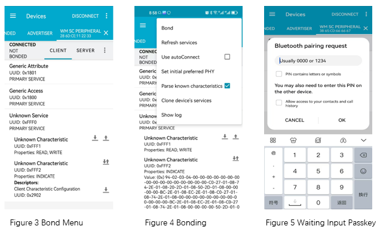
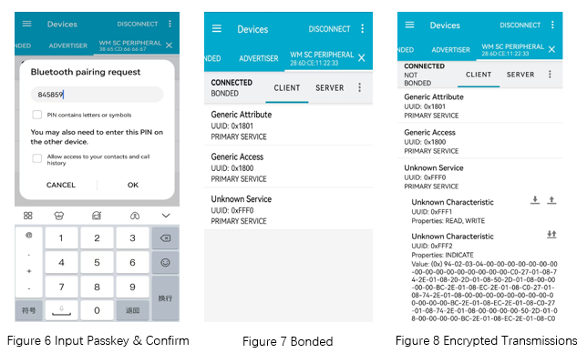

.. _ble_peripheral_sc_general_sample_en:

peripheral_sc_general
################################

Overview
********

Application demonstrating the BLE Peripheral role. Similar to the :ref:`Peripheral <ble_peripheral_general_sample_en>` sample, except that this
application supporting security feature. After establishing the connection, several cli commands help to finish pairing procedure. 

.. csv-table:: Service table
    :header: "description", "UUID", "property and permission"
    :widths: 25, 20, 55

    "Primary service", "0xFFF0", " "
    "Characteristic ", "0xFFF1", "BT_GATT_CHRC_READ|BT_GATT_PERM_READ|BT_GATT_CHRC_WRITE|BT_GATT_PERM_WRITE"
    "Characteristic ", "0xFFF2", "BT_GATT_CHRC_NOTIFY（ ``menuconfig -> Example configuration -> selectable item peripheral example`` ）"
	"Characteristic ", "0xFFF3", "BT_GATT_CHRC_INDICATE（ ``menuconfig -> Example configuration -> selectable item peripheral example`` ）default"

User interface (cli commands)
******************************

security:
   * Enable security (encryption) for current connection

auth_method:
   * Setting security IO capability, it supports display, display and yes/no, input, no-input-no-output, display and input

auth_passkey:
   * Response the passkey

auth_cancel:
   * Cancel the pairing request

auth_passkey_confirm:
   * Confirm the passkey value

auth_pairing_confirm
	* Confirm the pairing request

Requirements
************

* A board with Bluetooth Low Energy support
* Development board A, which supports BLE functionality, can run the  :ref:`central_sc_general <ble_central_sc_general_sample_en>`  sample or be tested using the nRF Connect app.

Building and Running
********************

Example Location：``examples/bluetooth/peripheral_sc_general``

compile, burn, and more, see：`Quick Start Guide <https://doc.winnermicro.net/w800/en/2.2-beta.2/get_started/index.html>`_

Running Result (Development board A and Development board B)
**************************************************************

1. Successfully running will output the following logs

.. code-block:: console

	[I] (2) main: ver: 0.9.0 build at Sep 12 2024 16:01:42
	[I] (24) bt: LE SC enabled
	[I] (150) bt: No ID address. App must call settings_load()
	[I] (168) bt: Identity: 28:6D:CD:68:D7:99 (public)
	[I] (168) bt: HCI: version 4.2 (0x08) revision 0x0709, manufacturer 0x070c
	[I] (168) bt: LMP: version 4.2 (0x08) subver 0x0709
	[I] (204) sc_peripheral: peripheral indicate service ready

2. Waiting for development board A to be flashed with the :ref:`central_sc_general <ble_central_sc_general_sample_en>` sample firmware

3. Upon receiving a connection request from development board A, development board B automatically performs MTU update and connection parameter update.

.. code-block:: console

	[I] (828) sc_peripheral: Updated MTU: TX: 23 RX: 23 bytes
	[I] (830) sc_peripheral: Connected 28:6D:CD:55:E4:57 (public)
	[I] (830) sc_peripheral: mtu_exchange: Current MTU = 0
	[I] (830) sc_peripheral: mtu_exchange: Exchange MTU...
	[E] (830) sc_peripheral: mtu_exchange: MTU exchange failed (err -128)
	[I] (1118) sc_peripheral: Updated MTU: TX: 247 RX: 247 bytes
	[I] (1120) sc_peripheral: Remote pairing features: IO: 0x04, OOB: 0, AUTH: 0x0d, Key: 16, Init Kdist: 0x05, Resp Kdist: 0x07

4. After receiving a pairing request, development board B outputs a pairing code **764892** .Enter this pairing code on development board A to complete the pairing process.

.. code-block:: console

	[I] (1270) sc_peripheral: passkey for 28:6D:CD:55:E4:57 (public): 764892, please confirm it on remote device

5. Upon successful pairing, development board B outputs the following logs.

.. code-block:: console

	[I] (1818) sc_peripheral: LE conn param updated: 28:6D:CD:55:E4:57 (public) int 0x0014 lat 0 to 500
	[W] (20600) bt: chan 0x20004128 conn 0x20003c9c handle 0 encrypt 0x01 hci status 0x00
	[I] (20602) sc_peripheral: Security changed: 28:6D:CD:55:E4:57 (public) level 4
	[I] (20666) sc_peripheral: BONDED with 28:6D:CD:55:E4:57 (public)
	
6. After receiving a subscription message from development board A, development board B periodically sends data to development board A using either Indicate or Notify. Simultaneously, it receives write operation data from development board A and outputs the following logs.

.. code-block:: console

	[I] (19296) sc_peripheral: recv(240):
	[I] (19297) sc_peripheral: dump [content]
	0x0000   25 00 00 00 00 00 00 00  00 00 00 00 00 00 00 00  %...............
	0x0010   00 00 00 00 00 00 00 00  00 00 00 00 00 00 00 00  ................
	0x0020   00 00 00 00 00 00 00 00  00 00 00 00 00 00 00 00  ................
	0x0030   00 00 00 00 00 00 00 00  00 00 00 00 00 00 00 00  ................
	0x0040   00 00 00 00 00 00 00 00  00 00 00 00 00 00 00 00  ................
	0x0050   00 00 00 00 00 00 00 00  00 00 00 00 00 00 00 00  ................
	0x0060   00 00 00 00 00 00 00 00  00 00 00 00 00 00 00 00  ................
	0x0070   00 00 00 00 00 00 00 00  00 00 00 00 00 00 00 00  ................
	0x0080   00 00 00 00 00 00 00 00  00 00 00 00 00 00 00 00  ................
	0x0090   00 00 00 00 00 00 00 00  00 00 00 00 00 00 00 00  ................
	0x00a0   00 00 00 00 00 00 00 00  00 00 00 00 00 00 00 00  ................
	0x00b0   00 00 00 00 00 00 00 00  00 00 00 00 00 00 00 00  ................
	0x00c0   00 00 00 00 00 00 00 00  00 00 00 00 00 00 00 00  ................
	0x00d0   00 00 00 00 00 00 00 00  00 00 00 00 00 00 00 00  ................
	0x00e0   00 00 00 00 00 00 00 00  00 00 00 00 00 00 00 00  ................

Running Result (nRF Connect APP and Development board B)
**************************************************************

1. Upon successful execution, development board B will output the following logs.

.. code-block:: console

	[I] (2) main: ver: 0.9.0 build at Sep 12 2024 16:01:42
	[I] (24) bt: LE SC enabled
	[I] (150) bt: No ID address. App must call settings_load()
	[I] (168) bt: Identity: 28:6D:CD:68:D7:99 (public)
	[I] (168) bt: HCI: version 4.2 (0x08) revision 0x0709, manufacturer 0x070c
	[I] (168) bt: LMP: version 4.2 (0x08) subver 0x0709
	[I] (204) sc_peripheral: peripheral indicate service ready
	
2. Run the nRF Connect APP, perform a scan, discover the **WM SC Peripheral** device, and establish a connection.

.. figure:: assert/peripheral_sc_general_scan_connect.svg
    :align: center
	
3. Upon receiving a connection request, development board B outputs the following logs.

.. code-block:: console

	[I] (62602) sc_peripheral: Connected 79:43:31:D9:97:99 (random)
	[I] (63312) sc_peripheral: LE conn param updated: 79:43:31:D9:97:99 (random) int 0x0006 lat 0 to 500
	[I] (63632) sc_peripheral: LE conn param updated: 79:43:31:D9:97:99 (random) int 0x0014 lat 0 to 500
	
4. Perform ``BOND`` on nRF Connect APP

	
5. Upon receiving a bonding request, development board B outputs the pairing code **158833** with the following log information.

.. code-block:: console

	[I] (494595) sc_peripheral: Remote pairing features: IO: 0x04, OOB: 0, AUTH: 0x0d, Key: 16, Init Kdist: 0x0f, Resp Kdist: 0x0f
	[I] (494646) sc_peripheral: passkey for 79:43:31:D9:97:99 (random): 158833, please confirm it on remote device

6. Input the **passkey** and confirm it, nRF Connect APP will shows ``BONDED``

7. Simultaneously, development board B indicates successful pairing and outputs the following logs.
::

	[I] (522821) sc_peripheral: Security changed: 79:43:31:D9:97:99 (random) level 4
	[W] (522875) bt: Set privacy mode command is not supported
	[I] (522891) sc_peripheral: BONDED with 1C:13:86:59:2D:FD (public) 
	
8. By now, the data transmission between kit and nRF Connect APP is encrypted

.. note::

   This example can work together with :ref:`peripheral_sc_general <ble_central_sc_general_sample_en>` 