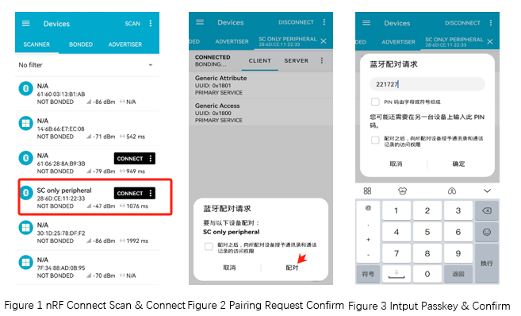

.. _peripheral_sc_only_sample_en:

peripheral_sc_only
#############################

Overview
********

Similar to the :ref:`Peripheral <ble_peripheral_sample_en>` sample, except that this
application enables the Secure Connections Only mode.

Requirements
************

* A board with BLE support
* nRF Connect APP

Building and Running
********************

Example Location：``examples/bluetooth/peripheral_sc_only``

compile, burn, and more, see：`Quick Start Guide <https://doc.winnermicro.net/w800/en/latest/get_started/index.html>`_

Running Result
**************

1. Successfully running will output the following logs

.. code-block:: console

	I/bt_smp          [0.078] LE SC enabled
	I/bt_hci_core     [0.208] No ID address. App must call settings_load()
	I/sc_only         [0.214] Bluetooth initialized
	I/bt_hci_core     [0.220] Identity: 28:6D:CE:01:02:03 (public)
	I/bt_hci_core     [0.226] HCI: version 4.2 (0x08) revision 0x0709, manufacturer 0x070c
	I/bt_hci_core     [0.234] LMP: version 4.2 (0x08) subver 0x0709
	I/sc_only         [0.300] Advertising successfully started

2. Run nRF Connect APP, perform ``scan`` . Connect it after and you find **SC only peripheral** is discovered, proceed with the connection.  
   After a successful connection, when the nRF Connect APP prompts for a pairing request, confirm it. Following confirmation, a dialog box will pop up for entering the pairing code.

3. The development board receives a connection request from the nRF Connect APP and initiates the pairing process with a security level of ``BT_SECURITY_L4`` .It then prints the pairing code **221727** and outputs the following log:

.. code-block:: console

	[I] (9854) sc_only: Connected 45:8B:76:3F:1D:E8 (random)
	[I] (15454) sc_only: Passkey for 45:8B:76:3F:1D:E8 (random): 221727	

4. Enter the pairing code in the nRF Connect APP and confirm. The development board indicates a successful pairing and outputs the following log

.. code-block:: console

	[I] (31048) sc_only: Pairing Complete

	
