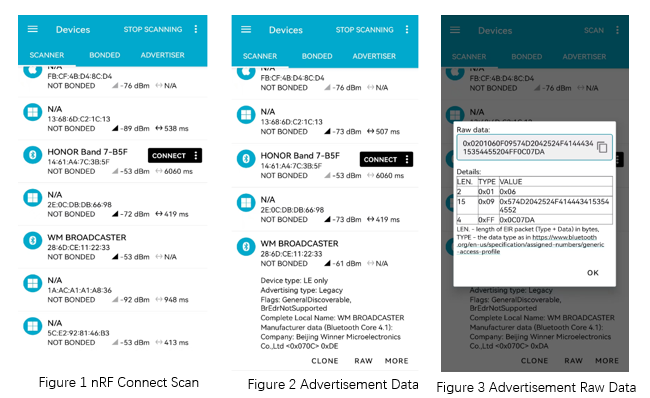

.. _ble_scan_adv_sample:

scan_adv
###########################

功能概述
*********

本示例演示了 如何同时使能 BLE 的 **不可连接广播** 功能和扫描功能。

环境要求
************

* 支持 BLE 功能的开发板
* 测试软件 nRF Connect APP

编译和烧录
********************

示例位置：``examples/bluetooth/scan_adv``   

编译、烧录等操作请参考：`快速入门 <https://doc.winnermicro.net/w800/zh_CN/latest/get_started/index.html>`_

运行结果
************

1. 成功运行将输出如下日志

.. code-block:: console

	[I] (2) main: ver: 2.0.6dev build at Oct 24 2024 08:04:19
	[I] (3) scan_adv: Starting Scanner/Advertiser Demo
	[I] (22) bt: Identity: 28:6D:CE:11:22:33 (public)
	[I] (23) bt: HCI: version 4.2 (0x08) revision 0x0709, manufacturer 0x070c
	[I] (23) bt: LMP: version 4.2 (0x08) subver 0x0709
	[I] (23) scan_adv: Bluetooth initialized

2. 运行 nRF Connect APP 后执行扫描操作，可以发现 **WM BROADCASTER** 的设备。查看广播信息 ``Manufacturer data`` 字段，最后一个字节代表扫描功能接收到广播信息的次数

	
.. tip::

   本示例发送广播为不可连接广播，动态广播内容可以在 APP 端刷新扫描结果查看	