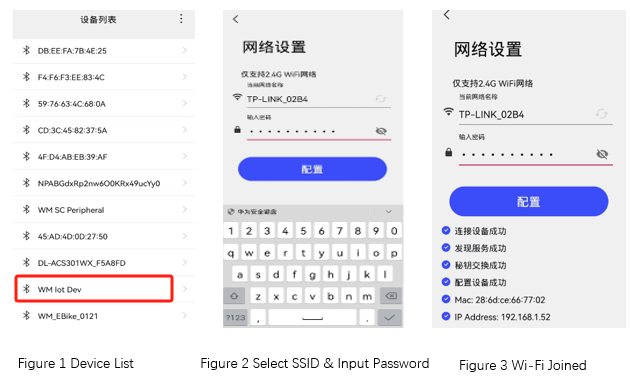

.. _ble_wifi_provision:

wifi_prov
###########################

功能概述
*********

本示例演示了 BLE 辅助 Wi-Fi 快速连接 AP 功能。示例运行后，启动自定义的服务并开始广播，等待连接。
手机端安装并运行 `WMBleWiFi <https://www.winnermicro.com/upload/1/editor/1715418917695.rar>`_ 配网工具，通过扫描可以发现 **wm-iot-dev** 设备。连接后，输入设备需要连
接 AP 的用户名和密码。点击配置，示例程序将连接 AP 并会上报连接结果。
需要说明的是通过 BLE 传输的用户信息是加密的，具体参考 :ref:`Wi-Fi 配网协议 <bluetooth-wifiprov-proto>` 。

环境要求
********

* 支持 BLE 功能的开发板
* BLE 配网工具  `WMBleWiFi <https://www.winnermicro.com/upload/1/editor/1715418917695.rar>`_ 或在手机微信公众号中关注"联盛德微电子"使用"产品应用"->"蓝牙配网小程序"。

编译和烧录
********************

示例位置：``examples/bluetooth/wifi_prov``     

编译、烧录等操作请参考：`快速入门 <https://doc.winnermicro.net/w800/zh_CN/latest/get_started/index.html>`_

运行结果
************

1. 成功运行将输出如下日志

.. code-block:: console

	I/bt_hci_core     [0.110] Identity: 28:6D:CE:01:02:03 (public)
	I/bt_hci_core     [0.116] HCI: version 4.2 (0x08) revision 0x0709, manufacturer 0x070c
	I/bt_hci_core     [0.126] LMP: version 4.2 (0x08) subver 0x0709
	I/wifi_prov       [0.134] WiFi provision by BLE ready
	I/wifi_prov       [224.184] Connected 5E:C0:7C:15:1F:10 (random)
	I/wifi_prov       [224.190] wps service connected
	D/wifi_prov       [225.168] Received data from: 5E:C0:7C:15:1F:10 (random)
	D/wifi_prov       [225.482] Received data from: 5E:C0:7C:15:1F:10 (random)
	D/HEX SSID:: 0000-000F: 54 50 2D 4C 49 4E 4B 5F  43 30 36 32                TP-LINK_C062
	D/HEX PASS:: 0000-000F: 31 32 33 34 35 36 37 38  39 30                      1234567890
	I/wifi_prov       [225.506] connecting to ap SSID:TP-LINK_C062 password:1234567890 (225504)
	I/wifi_prov       [226.340] wifi_init_sta finished (226340).
	D/wifi            [227.998] distribution event 1
	D/wifi            [228.002] sta connected 64-6E-97-07-C0-62 channel 6 authmode 3
	D/wifi            [231.470] distribution event 0
	D/wifi            [231.474] sta got ip 192.168.1.131
	I/wifi_prov       [231.478] got ip: 192.168.1.131

2. WMBleWiFi APP 操作流程如下列图所示

