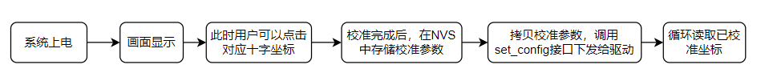

# touch_panel_calibration

## 功能概述

启动一个 FreeRTOS 任务，初始化触摸驱动芯片，配置触摸芯片基本参数时选择开启校准以及校准方法，校准过程中根据校准状态切换 LCD 显示。
校准完成后，系统会循环侦测屏幕触摸行为，当有正常到触摸时，系统会将获取原始数据转换成校准后的坐标点，并通过串口显示该坐标点信息。

**说明：**  
   - a).电阻屏才需要执行校准，电容屏不需要。因为电阻屏通过电压变化定位，易受硬件误差和机械形变影响，需校准补偿；电容屏直接检测电容变化，由控制器精确计算坐标，硬件一致性高，无需校准。  
   - b).若选择了电容屏并且开启了校准，不会产生任何效果。  
   - c).示例程序流程：
     - 根据示例中定义的校准点数据量，会在LCD屏幕上依次显示出 "+" 符号。每显示一个 "+" 符号，用户需要触摸其所显示的位置。
     - 程序会读取到触摸点原始数据，不再出现 " + " 表示读取完所有校准点。然后进行校准参数计算，并得到原始数据与像素坐标之间进行转换的校准参数（比例、斜率和偏移）。
     - 当前示例默认，会将校准参数存储在 NVS 中。用户也可以客制化定义存储到其他地方。
     - 校准完成后，调用 set_config 接口下发给驱动。
     - 程序循环侦测触摸行为，若用户有触摸，会将触摸的像素点坐标在 log 日志打印出来。
     
   - d).示例中的宏定义 “#define LCD_CAL_DISPLAY_OFFSET 20” 的作用如下图
      

**注意：**
   这只是一个示例仅供参考。用户可以根据自己需求进行修改。
   - 用户可以使用自己的校准算法，但注意需要屏幕配合进行显示 " + " 或其他符号。tp_cali_on_lcd.c 中简单的显示十字和清屏函数可供参考。用户也可以用自己的方法如 lvgl 进行显示。
   - 使用其它芯片请修改 prj.config 文件中的宏 CONFIG_BUILD_TYPE_W80x 。
   - 使用其它 GPIO 请修改 build/device_table.toml 中 spim_soft GPIO 定义，或修改 wm_iot_sdk/components/wm_dt/config 中对应芯片的 pim_soft GPIO 定义。建议修改 build 下的，避免影响其它使用 spim_soft 。

## 环境要求

1. 触摸驱动芯片：
    - 型号：xpt2046
    通过 menuconfig -> PERIPHERALS -> Touch driver -> touch Device 中选择 xpt2046 这款触摸驱动控制器。

2. 引脚连接：
   xpt2046 触摸驱动控制器的硬件配置在 wm_dt_hw.c 文件中进行（默认使用 W802 芯片）

   |    GPIO序号    | 引脚编号 | 连接描述  | xpt2046 PIN |
   | -------------- |-------- | -------- | ----------- |
   | WM_GPIO_NUM_24 |   PB8   | CLK      | 16          |
   | WM_GPIO_NUM_25 |   PB9   | CS       | 15          |
   | WM_GPIO_NUM_28 |   PB12  | MOSI     | 14          |
   | WM_GPIO_NUM_29 |   PB13  | MISO     | 12          |
   | WM_GPIO_NUM_30 |   PB14  | IRQ      | 11          |

## 编译和烧录

示例位置：`examples/peripheral/touch_panel/touch_panel_calibration`

编译、烧录等操作请参考：[快速入门](https://doc.winnermicro.net/w800/zh_CN/latest/get_started/index.html)

## 运行结果

成功运行将输出如下日志

```
[I] (98) main: ver: 2.3-beta.2 build at Apr 29 2025 10:12:32
[I] (99) main: boot reason 0
[I] (99) main: heap size 271592(265.23KB)
[I] (100) main: flash size 0x800000(8MB)
[I] (760) example: start calibration
[I] (7585) example: Calibration parameters: ax = -0.1263, bx = -0.0004, cx = 494.5495, ay = 0.0001, by = 0.0751, cy = -16.3981
[I] (7589) example: LCD coordinates(x=19,y=252) after calibration.
[I] (7690) example: LCD coordinates(x=19,y=251) after calibration.
[I] (9691) example: LCD coordinates(x=49,y=56) after calibration.
[I] (9792) example: LCD coordinates(x=49,y=57) after calibration.
[I] (9893) example: LCD coordinates(x=48,y=58) after calibration.
[I] (10393) example: LCD coordinates(x=192,y=88) after calibration.
[I] (10495) example: LCD coordinates(x=192,y=87) after calibration.
[I] (10596) example: LCD coordinates(x=192,y=87) after calibration.
[I] (11496) example: LCD coordinates(x=372,y=38) after calibration.
[I] (11598) example: LCD coordinates(x=372,y=37) after calibration.
[I] (12198) example: LCD coordinates(x=393,y=134) after calibration.
[I] (12300) example: LCD coordinates(x=393,y=135) after calibration.
[I] (12401) example: LCD coordinates(x=393,y=135) after calibration.
[I] (13401) example: LCD coordinates(x=214,y=144) after calibration.
```