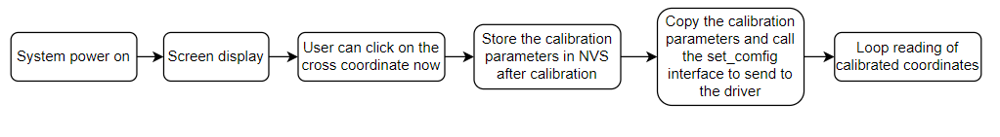
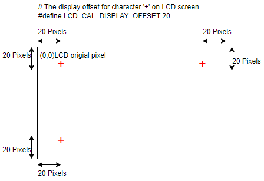

# Touch Panel Calibration

## Functional Overview

Launches a FreeRTOS task to:
- Initialize the touch driver chip
- Configure basic parameters with calibration options and methods
- Switch LCD display according to calibration state during the process
- Continuously obtain calibrated coordinates after completion and display via serial output

Important Notes:  
   - a) Calibration is only required for resistive touchscreens, not capacitive ones.  
      - Resistive screens determine position through voltage changes and require calibration to compensate for hardware deviations and mechanical deformation.  
      - Capacitive screens detect capacitance changes directly, with coordinates precisely calculated by the controller, ensuring high hardware consistency without calibration.  
   - b) Enabling calibration for capacitive screens will have no effect.  
   - c) Enter the calibration process:
      - According to the calibration point data defined in the example, the "+" symbol will be displayed sequentially on the LCD screen. Every time a "+" symbol is displayed, the user needs to touch its displayed position.
      - The program will read the raw data of the touch points, and after reading all the calibration points, it will calculate the calibration parameters and obtain the calibration parameters (scale, slope, and offset) for converting the raw data to pixel coordinates.
      - The current example defaults to storing calibration parameters in NVS. Users can also customize storage to other locations.
      - After calibration, call the set_config interface and send it to the driver.
      - The program loop detects touch behavior, and if the user touches, the coordinates of the touched pixels will be printed out in the log.
      
   - d) The function of the macro definition "# define LCD_AL-DISPLAY_SFFSET 20" in the example is shown in the following figure
      
   - e) This is just an example for reference only. Users can make modifications according to their own needs.
      - Users can use their own calibration algorithms, but require screen coordination to display the "+" symbol or other symbols. The simple display cross and screen clearing functions in tp_cali_on_lcd. c are available for reference. Users can also use their own methods such as lvgl for display.
      - To use other chips, please modify the macro VNet BUILD_TYPE-W80x in the prj.config file.
      - To use other GPIO, please modify the definition of the spic_Soft GPIO in build/vice_table.toml, or modify the definition of the pim_Soft GPIO for the corresponding chip in wm_iot_stdk/components/wm.dt/config. Suggest modifying under build to avoid affecting other uses of spim_soft.

<div style="clear: both;"></div>

## System Requirements

1. Touch Driver Chip:
   - Model: XPT2046  
   Selection path: `menuconfig -> PERIPHERALS -> Touch driver -> touch Device`

2. Pin Connections:
   Hardware configuration for XPT2046 is defined in `wm_dt_hw.c` (default uses W802 chip)

   |    GPIO Number    | Pin Label | Connection  | XPT2046 PIN |
   | ----------------- | -------- | ----------- | ----------- |
   | WM_GPIO_NUM_24    |   PB8    | CLK         | 16          |
   | WM_GPIO_NUM_25    |   PB9    | CS          | 15          |
   | WM_GPIO_NUM_28    |   PB12   | MOSI        | 14          |
   | WM_GPIO_NUM_29    |   PB13   | MISO        | 12          |
   | WM_GPIO_NUM_30    |   PB14   | IRQ         | 11          |

## Compilation and Flashing

Example location: `examples/peripheral/touch_panel/touch_panel_calibration`

For compilation, flashing, and related operations, refer to:  
[Quick Start Guide](https://doc.winnermicro.net/w800/zh_CN/latest/get_started/index.html)

## Expected Output

Successful execution will generate the following log:

```
[I] (98) main: ver: 2.3-beta.2 build at Apr 29 2025 10:12:32
[I] (99) main: boot reason 0
[I] (99) main: heap size 271592(265.23KB)
[I] (100) main: flash size 0x800000(8MB)
[I] (760) example: start calibration
[I] (7585) example: Calibration parameters: ax = -0.1263, bx = -0.0004, cx = 494.5495, ay = 0.0001, by = 0.0751, cy = -16.3981
[I] (7589) example: LCD coordinates(x=19,y=252) after calibration.
[I] (7690) example: LCD coordinates(x=19,y=251) after calibration.
[I] (9691) example: LCD coordinates(x=49,y=56) after calibration.
[I] (9792) example: LCD coordinates(x=49,y=57) after calibration.
[I] (9893) example: LCD coordinates(x=48,y=58) after calibration.
[I] (10393) example: LCD coordinates(x=192,y=88) after calibration.
[I] (10495) example: LCD coordinates(x=192,y=87) after calibration.
[I] (10596) example: LCD coordinates(x=192,y=87) after calibration.
[I] (11496) example: LCD coordinates(x=372,y=38) after calibration.
[I] (11598) example: LCD coordinates(x=372,y=37) after calibration.
[I] (12198) example: LCD coordinates(x=393,y=134) after calibration.
[I] (12300) example: LCD coordinates(x=393,y=135) after calibration.
[I] (12401) example: LCD coordinates(x=393,y=135) after calibration.
[I] (13401) example: LCD coordinates(x=214,y=144) after calibration.
```